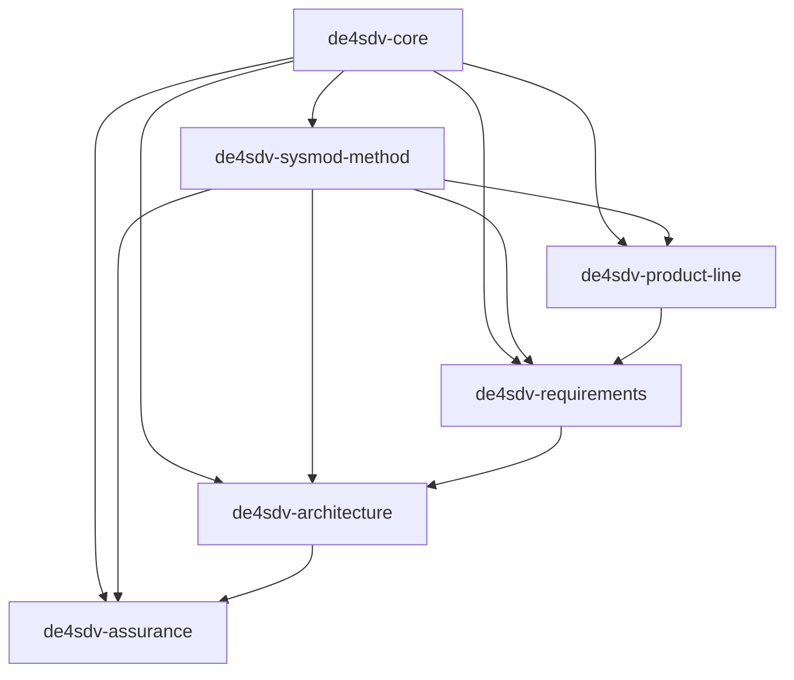
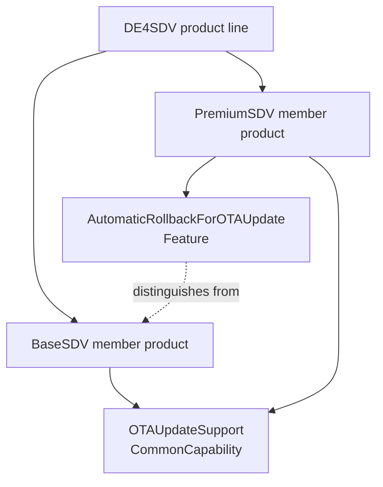
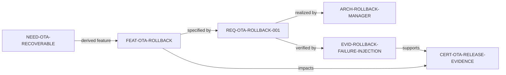
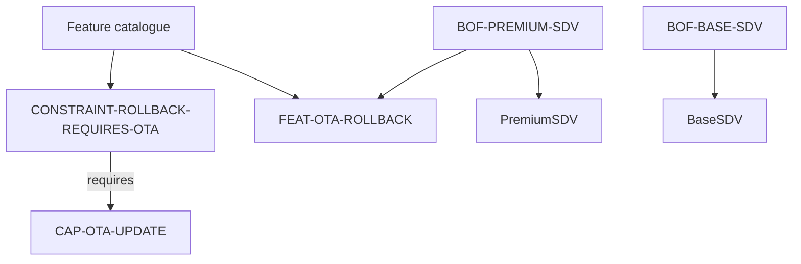
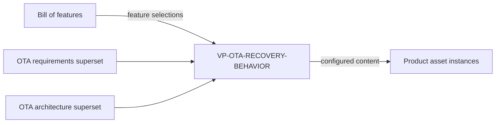
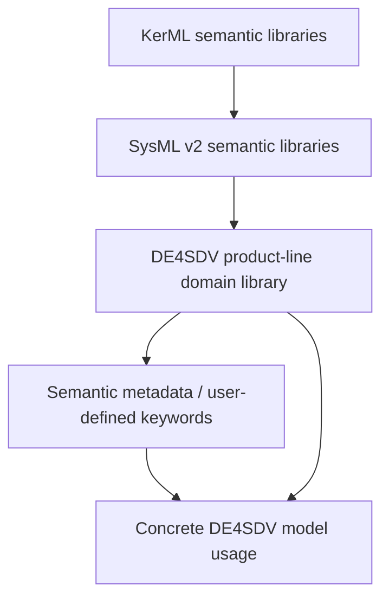
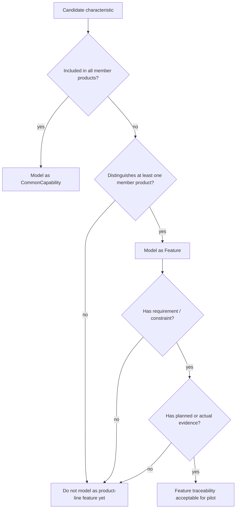

# Ontology Pilot Diagrams

These Mermaid diagrams are intentionally lightweight. They are review artifacts,
not generated ontology output.

## Basic ontology modules

## SYSMOD-style modeling chain

```mermaid
flowchart LR
    P[ProblemStatement]
    I[SystemIdea]
    O[SystemObjective]
    S[Stakeholder / Concern]
    R[Requirement / Constraint]
    C[ContextBoundary / ExternalActor]
    U[UseCase / Scenario]
    B[Process / Function]
    A[ArchitectureElement]
    E[VerificationCase / EvidenceArtifact]

    P --> I --> O --> S --> R --> C --> U --> B --> A --> E
```

## Feature vs common capability

## OTA rollback traceability slice

## Feature catalogue and bills-of-features

## Shared asset superset and variation point

## Future SysML v2 semantic stack

Metadata and user-defined keywords are shown as shorthand over the domain
library, not as the source of semantics.

## Pilot quality gates

