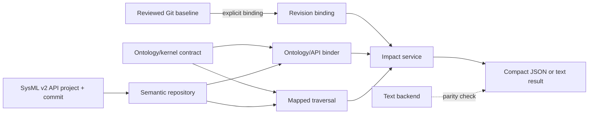

# ADR 0010: Bind semantic impact queries to SysML API revisions

## Status

Proposed

## Context

DE4SDV already has a reviewed SysML textual baseline, a merged ontology/kernel
contract, and a repository-file impact query for AEBS. Those assets answer
useful local questions, but they do not yet prove that automation can query a
stored SysML semantic graph without treating a custom text parser as the model
repository.

The first API milestone needs one bounded answer:

> If requirement X changes, what architecture, verification, evidence, and
> product-line elements are affected?

That answer is unsafe unless the query states which Git revision and which
SysML API project/commit it used. It is also unsafe to merge elements by simple
name or to promote a generic dependency into a verification, satisfaction, or
compliance claim.

## Decision

DE4SDV will expose semantic impact through a revision-scoped SysML API layer.
The layer consists of:

- a standard HTTP client and semantic repository interface;
- an explicit binding record from one reviewed Git commit to one SysML API
  project/commit;
- ambiguity-safe element identity resolution;
- ontology-class binding through the merged kernel contract;
- ontology-defined relationship traversal strategies; and
- a compact impact subgraph with source URIs, API UUIDs, relationship objects,
  revision metadata, claim boundaries, and explicit gaps.

The existing textual impact backend remains available for offline use and
parity checks. It is not the authoritative semantic backend for API-mode
queries.

## Source authority by concern

| Concern | Authority |
| --- | --- |
| Reviewed public baseline and contribution history | Git repository and pull requests |
| Live semantic objects and native relationships for an API query | Bound SysML API project/commit |
| Shared DE4SDV concepts and allowed traversal interpretations | Ontology/kernel contract |
| Query subgraph, grouping, and gap report | Derived output; never an independent source of truth |
| Evidence binaries and retained observations | External evidence stores; outside this milestone |

A query may claim that it represents the current reviewed baseline only when
its binding is validated and its Git SHA matches the requested Git revision.
Otherwise it must report `stale` or `unvalidated` and refuse the stronger claim.

## Architecture

The API service is accessed behind a client/repository abstraction so a
conforming deployment can change without changing impact semantics.

## Identity strategy

Resolution is ordered and revision-scoped:

1. exact API UUID;
2. stable explicit identifier or alias;
3. qualified name;
4. constrained structural match.

A simple-name structural match is accepted only when exactly one candidate
remains. Zero candidates fail as not found. Multiple candidates fail as
ambiguous. The implementation does not silently choose one.

Ontology classes mapped to kernel declarations resolve using declaration name
and compatible API metatype in the bound revision. The file/declaration pair
remains provenance. Zero or multiple API matches fail.

## Relationship semantics

The ontology records executable `sysml_mapping` strategies. The first
milestone supports:

- `allocation` for requirement-to-architecture traversal;
- `verification` for native verification-case references;
- `property-reference` for requirement subjects; and
- `dependency` for evidence-contract relevance.

Dependency traversal is explicitly `relevance` strength. It does not mean
verified, satisfied, compliant, certified, safe, or released.

The AEBS pilot currently has API-backed product-line subject, evidence-contract,
and verification-case paths for `reqCommandEmergencyBraking`. It has no modeled
allocation from that requirement to an architecture element, so the API result
reports an architecture trace gap rather than inventing one. Evidence artifacts
are external to the API-resident pilot and are also reported as a gap.

## Revision binding

A binding records at least:

- Git repository and full Git commit SHA;
- SysML project UUID and commit UUID;
- import timestamp and importer identity;
- semantic validation status; and
- import scope.

The bounded AEBS integration fixture validates its written API graph by reading
back exact semantic objects and references before it emits a `passed` binding.
The fixture is test infrastructure for this pilot; it is not a parser and does
not claim that the full repository model was imported.

## Consequences

- Automation can return a small, auditable semantic subgraph instead of a raw
  repository dump.
- Results remain reproducible against exact API and Git revisions.
- Existing textual behavior can be compared with the API result during the
  transition.
- Missing architecture traceability is visible as model debt instead of being
  hidden by name matching or inference.
- Adding a new semantic traversal requires an ontology mapping and tests.
- A deployment still needs a controlled full-model import/export path before
  the entire baseline can be treated as live API state.

## Non-goals

This decision does not:

- replace the SysML API with a custom parser;
- introduce a graph database, federated knowledge graph, or required cache;
- import requirement management or evidence repositories;
- define write-back or model-editing semantics for Hermes;
- assign durable cross-repository identifiers for every artifact; or
- make verification, compliance, certification, or homologation claims.

## Links

- [SysML API integration guide](../../sysmlv2-api/README.md)
- [Live model store decision](0005-use-sysml-v2-api-repository-as-live-model-store.md)
