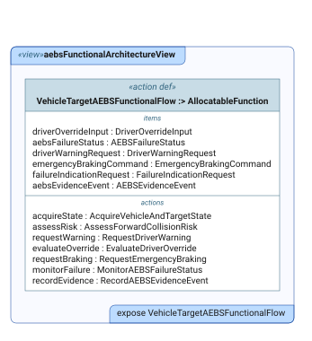

# DE4SDV through one case study

DE4SDV helps engineers build software-defined vehicles from interchangeable
open-source parts and keep the design, configuration choices, tests, and
evidence connected while those parts change. We build an open engineering
reference, not a production car or a certificate.

Start with the story below. Then follow the engineering workflow or pick a
small contribution. You do not need to know SysML or install tools to read it.

## 1. The problem, the case, and the solution

### The problem: many stacks, many combinations, one question

A software-defined vehicle runs a layered software stack. For almost every
layer, several open-source options exist. Picking one per layer gives many
possible vehicles, and each change raises the same questions: **which
combinations actually work together, which vehicle versions are affected, and
what must be checked again?**

DE4SDV's answer is to model the stack and its options explicitly, choose
between them through governed decisions, and keep requirements, design,
implementation, and test evidence connected to each choice. A missing test or
unresolved assumption should be visible, not mistaken for proof.

### The case: a configurable SDV stack

The [platform stack model](../../textual-notation-of-model/packages/architecture/sdv_platform_stack.sysml)
describes six layers. Each layer has a defined boundary to its neighbors, and
most layers have several candidate implementations:

| Layer | What it does | Candidates in the model |
|---|---|---|
| Vehicle application | Domain functions such as driver assistance (perception, planning, control) | Autoware, Openpilot, Apollo |
| Application–middleware adapter | Translates between the application's internal messaging and the vehicle middleware | Derived from the two choices around it, never picked by hand |
| Middleware | Vehicle-level communication, lifecycle, service discovery, diagnostics | Eclipse S-CORE, Android SDV, AUTOSAR Adaptive, or none |
| Operating system | Scheduling, memory, drivers | Linux, Android, QNX |
| Hypervisor | Isolates several operating systems on one chip | KVM, QNX QVM, ACRN, or none |
| Hardware | The compute platform the stack runs on | Kept abstract |

Not every combination is valid. The
[feature catalogue](../../model-based-product-line-engineering/feature-models/sdv_product_line.yaml)
records compatibility rules. For example, rule C001 rejects Eclipse S-CORE on
Android because S-CORE targets Linux and QNX.

### The product line: what the stack can express versus what we govern

A **product line** is a family of related vehicle versions whose shared design
is managed together. Two levels matter, and it is easy to confuse them:

- **What the stack can express.** The catalogue above lists every candidate
  so alternatives can be compared and kept in view.
- **What DE4SDV currently governs.** A
  [reviewed scope decision](../architecture-decisions/0014-ratify-initial-aebs-product-line-scope.md)
  admits exactly two planned reference members. Apollo, Openpilot, Eclipse
  S-CORE, AUTOSAR Adaptive, QNX/QVM, ACRN, and similar options remain
  reference-only or deferred until a future reviewed decision admits a member
  that needs them.

The two governed members differ in one product decision, **Vehicle Platform
Integration Mode**, and that one decision drives several layer choices:

| Layer | Standalone member | AAOS-integrated member |
|---|---|---|
| Vehicle application | Autoware | Autoware |
| Middleware | none | Android SDV |
| Operating system (platform domain) | Linux | Android¹ |
| Hypervisor | none | KVM |
| Adapter | none (derived) | Autoware→AAOS SDV (derived) |

¹ Autoware keeps its own Linux/ROS 2 runtime; the Android Automotive OS (AAOS)
domain is added beside it. In the AAOS member's
[configuration](../../model-based-product-line-engineering/feature-configurations/middleware-autoware-aaos-sdv-reference.yaml),
cross-domain deployment and transport remain unresolved and the evidence
status is `planned`.

Two lessons sit in this table. First, the adapter is **derived** from the
application and middleware choices, never selected on its own. Second,
emergency braking, Autoware, and the sensing baseline are **common** to both
members. A characteristic is a product feature only when it distinguishes one
member from another. Planned membership also does not mean both members have
the same implementation or test maturity.

### The capability that exercises it: emergency braking

To test whether the stack and product line hold together, we follow one
vehicle capability through them. A vehicle is traveling in the same lane
behind another vehicle. The distance closes and a collision becomes imminent.
The intended behavior is to detect the risk, warn the driver when required,
and request emergency braking when the activation conditions are met. Driver
override and failure handling are separate paths that also need defined
conditions and evidence.

This is the vehicle-target **Advanced Emergency Braking System (AEBS)** case.
The [operational story](../../methodologies/sysmod-sysmlv2/pilots/aebs-operational-story.md)
records the situation; it is not a report that a real vehicle passed a test.

The case tests whether we can follow one connected thread:

**Road-user need → requirement → design → configured member → implementation
→ verification case and evidence.**

One concrete example is the emergency-braking request:

| Step | What to look for |
|---|---|
| Need | `N-AEBS-001`: road users and occupants need reduced vehicle-target collision risk. |
| Candidate requirement | `REQ-AEBS-003`: command emergency braking under defined activation and override conditions. |
| Modeled responsibility | `requestBraking`: the functional action to which that candidate requirement traces. |

Read the [needs and requirements](../../methodologies/sysmod-sysmlv2/pilots/aebs-needs-requirements.md),
then find `reqCommandEmergencyBraking` and its candidate trace in the
[requirements model](../../textual-notation-of-model/packages/features/aebs/aebs_needs_requirements.sysml).
The [functional model](../../textual-notation-of-model/packages/features/aebs/aebs_functional_architecture.sysml)
defines `requestBraking`. This trace records design intent, not requirement
satisfaction or verification; the candidate's verification status is
`NotStarted`.

The
[nominal moving-target bench](../../implementation/aebs-autoware-nominal-vehicle-target-bench/README.md)
provides bounded, replayable evidence for a configured simulation chain on the
standalone path. These are connected engineering artifacts, not proof that the
candidate product requirement is satisfied.

The vehicle versions are what we study (**System 1**). The models, tools,
processes, and evidence workflow we build are the engineering system
(**System 2**). Contributors, maintainers, and upstream communities evolve it
(**System 3**). The [project charter](../project-goals/project-charter.md)
defines the broader mission.

### What is demonstrated, and what is not

The repository contains models, configurations, reference implementations,
automated checks, and retained evidence with different maturity levels. The
moving-target bench supports a narrow simulation claim; its evidence boundary
excludes conscious driver override, false-reaction and degraded-operation
matrices, pedestrian and bicycle behavior, and real-vehicle brake performance.
A valid configuration proves only that the selected options satisfy the
catalogue's rules, not that the configured stack has been built or run. Other
increments must be judged by their own evidence.

No example establishes vehicle safety, regulatory compliance, certification,
homologation, or type approval. Check the owning artifact's status and
[evidence rules](../evidence-management.md), not just whether a file exists.
The [roadmap](../../ROADMAP.md) separates active work from broader ambitions.

## 2. How a change travels through the engineering workflow

SysML v2 is the modeling language used to record the system's requirements,
structure, behavior, and relationships. The model is the design reference;
implementation should reflect it, not quietly define a different system.

1. **Frame the change.** State the user problem, affected member, operating
   conditions, and what is outside scope. For AEBS, a moving vehicle target is
   not interchangeable with a pedestrian or bicycle target.
2. **Update the connected artifacts.** Keep the story, requirements, model,
   configuration, implementation, and verification plan consistent. Record
   missing criteria as gaps rather than inventing thresholds or pass results.
3. **Submit a focused pull request (PR).** A PR is a proposed change for review,
   not an accepted baseline. Link the issue and explain the intended result.
4. **Run automated checks and obtain the relevant validation.** Fix failures;
   keep model validation and runtime evidence separate, as described below.
5. **Review and baseline.** An independent reviewer checks the change and its
   claim boundaries; maintainers decide whether to merge it. Preserve the
   exact revision and evidence needed to reproduce a result.
6. **Publish separately.** Viewer/API publication makes a revision inspectable.
   It does not approve the vehicle design or turn a simulation into road-test
   evidence.

### Configuring a member

Choosing layer options is done with files, not by editing the model by hand:

1. The **feature catalogue** lists the options and compatibility rules.
2. A **bill of features** records one member's selections, for example the
   [standalone member's](../../model-based-product-line-engineering/feature-configurations/aebs-autoware-linux-lidar-camera.yaml).
3. The **configurator** checks the selections against the rules and derives
   dependent choices such as the adapter.
4. It generates a SysML **product model** for that member. Generated product
   models are marked do-not-edit; change the selections instead.

You can try the check yourself:

```bash
python tools/configure_variant.py \
  --feature-model model-based-product-line-engineering/feature-models/sdv_product_line.yaml \
  --bof model-based-product-line-engineering/feature-configurations/aebs-autoware-linux-lidar-camera.yaml \
  --check-only
```

Swap in `feature-configurations/fixtures/invalid-score-android.yaml` to watch
rule C001 reject an incompatible combination. See the
[product-line engineering guide](../../model-based-product-line-engineering/README.md)
for the full chain and its validation boundary.

### A first look at the model

**Question: which responsibilities does the vehicle-target AEBS model name?**



Look for `assessRisk` (assess collision risk), `requestWarning` (request a
driver warning), and `requestBraking` (request emergency braking). This existing
SysIDE view lists responsibilities and information items; it does not show
their execution order or prove their implementation. Open the
[original SVG](../../textual-notation-of-model/packages/features/aebs/diagrams/diagram-aebsFunctionalArchitectureView.svg)
at full size.

For the stack itself, open the
[platform stack structure view](../../textual-notation-of-model/packages/architecture/diagrams/diagram-sdvPlatformStackStructureView.svg)
(a dense reference diagram; view it at full size) and the
[standalone member's product structure view](../../model-based-product-line-engineering/product-models/diagrams/diagram-productStructureView.svg).
The [AEBS view index](../../textual-notation-of-model/packages/features/aebs/VIEWS.md)
covers structure, exchanges, and evidence separately.

### CI/CD in plain language

**Continuous integration (CI)** automatically checks a proposed repository
change. The [public CI workflow](../../.github/workflows/ci.yml) checks repository
consistency and local documentation links, restores pinned model dependencies,
runs the complete project test
suite, runs bench unit/contract tests in separate processes, and runs smoke
tests. Bench unit tests do **not** build and execute the vehicle simulation.

For changed SysML models, syntax and semantic validation is a separate gate:
contributors with Syside access can validate locally; otherwise maintainers
run licensed validation after initial review. See the
[contribution guide](../../CONTRIBUTING.md#sysml-v2-validation-gate).
A valid model is not a successfully executed implementation.

**Delivery/deployment (CD)** makes selected outputs available to readers and
tools. The [Pages workflow](../../.github/workflows/deploy-viewer.yml) publishes
the browse-only engineering mirror. The
[public viewer deployment](../../.github/workflows/deploy-public-ask-viewer.yml)
and [API deployment](../../.github/workflows/deploy-public-sysml-api.yml) are
separate, maintainer-triggered workflows bound to exact revisions. A green PR
is not automatically the deployed public baseline.

For diagrams, use the [model viewer](https://viewer.de4sdv.org), following the
[viewer guide](../guides/model-viewer.md). Those diagrams are rendered from the
model with SysIDE, not a parallel hand-drawn architecture.

## 3. Pick a bounded contribution

These are small task proposals, not assignments or a second ticket tracker.
Check [open issues](https://github.com/de4sdv/DE4SDV/issues) and existing PRs
first. Continue an existing issue where it fits; otherwise agree the scope in
an issue before starting. Each task below names a starting point and a result
that can be reviewed.

| Task | Start here | Reviewable result / done when |
|---|---|---|
| Try the newcomer path (documentation) | This page and [#300](https://github.com/de4sdv/DE4SDV/issues/300) | Report confusing passages and propose one focused correction. A reader can answer the four questions below without private project context. |
| Help a first-time GitHub contributor (community/docs) | [#37: GitHub onboarding](https://github.com/de4sdv/DE4SDV/issues/37) and [CONTRIBUTING](../../CONTRIBUTING.md) | Test or improve one step of the issue-to-PR walkthrough; record where a newcomer got stuck and verify the corrected step. Do not duplicate the existing guide proposal. |
| Configure both reference members (product line) | The two bills of features named above and the [configurator](../../tools/configure_variant.py) | Run the check-only command for both members and the invalid fixture. Record the revision, commands, results, and the derived adapter for each member. Report any mismatch with the member table on this page. |
| Follow one requirement (systems/traceability) | `REQ-AEBS-003` in the [requirements baseline](../../methodologies/sysmod-sysmlv2/pilots/aebs-needs-requirements.md) and the example above | Review its need, design, verification-plan, and evidence links at one revision. Report a specific broken/missing link or confirm the bounded chain, keeping candidate status and open gaps visible. |
| Check one bench's evidence boundary (verification/software) | [Moving-target bench](../../implementation/aebs-autoware-nominal-vehicle-target-bench/README.md) | Run its documented validator against retained evidence and record revision, command, result, and exclusions. Replaying retained evidence is not a new simulation or vehicle test. |
| Reconcile one evidence-status summary (docs/QA) | [Implementation index](../../implementation/README.md) and [AAOS visualization campaign dispositions](../../implementation/aebs-aaos-sdv-visualization-bench/evidence/010/VIDEO-EVIDENCE-DISPOSITION.md) | Review the index's blanket runtime-pending wording against retained campaign records. Propose one small correction that links the bounded observations while preserving the deferred safety outcome and non-public media limitations. |

You can begin with reading and feedback; coding is not required. For a change,
follow [CONTRIBUTING](../../CONTRIBUTING.md). The
[getting started guide](README.md) covers repository layout, setup, and checks.

### Does this page work for a newcomer?

After reading it, can you explain:

1. What problem DE4SDV helps engineers solve?
2. What the stack layers are, how the two governed members differ, and why the adapter is derived rather than chosen?
3. Why a valid configuration, passing CI, or a replayed simulation does not mean a vehicle is certified?
4. Which small task you could take, what you would produce, and how it is checked?

If not, point out the missing explanation in
[#300](https://github.com/de4sdv/DE4SDV/issues/300). Newcomer feedback is part of
validating this guide, not something automated repository tests can prove.
