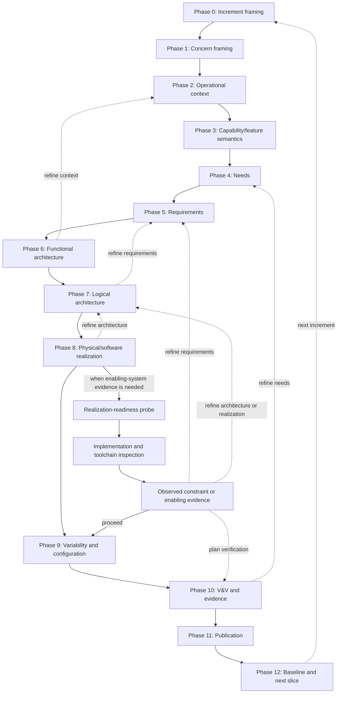

# DE4SDV Method Process

The process sequence for DE4SDV's incremental SysML v2 workflow.
Focuses on the **logical order of work** — not on method details, role
assignments, or product templates.

DE4SDV selectively adapts external MBSE process patterns through its
own method packages under
`textual-notation-of-model/packages/methods/de4sdv/`. It does not
implement any external methodology wholesale.

## Process correspondence

DE4SDV organizes work across three ASELCM system layers plus a
12-phase increment workflow:

| Process area | DE4SDV system layer | DE4SDV phases |
|---|---|---|
| Methodology and infrastructure setup | System 3 (governance) | outside increment |
| Methodology evolution and feedback | System 3 (methodology evolution) | outside increment |
| Problem analysis and requirements | System 2 (engineering) | 0–5, 10 |
| Architecture and realization | System 2 (engineering) | 6–9, 10–12 |

Structural notes:

- DE4SDV expresses all model semantics in SysML v2 (packages, metadata,
  concern/view, textual notation). External profile stereotypes are not
  carried forward; equivalent semantics are expressed as SysML v2
  metadata features, package-level definitions, or enumeration literals.
- DE4SDV adds product-line variability, evidence/continuous
  homologation, and open-source PR review as first-class process steps.

## System 3 setup (before any increment)

Do this once, then revisit when the method itself evolves.

1. **Tailor the methodology** — confirm the DE4SDV tailoring policy
   ([`de4sdv-tailoring.md`](de4sdv-tailoring.md)). Select which
   patterns to adapt vs skip for this project cycle.
2. **Set up the modeling environment** — the SysML v2 textual notation
   toolchain plus GitHub PR review. No proprietary tool license
   required.
3. **Deploy and train** — ensure contributors read the
   [increment workflow](increment-workflow.md) and tailoring docs.
   Keep onboarding lightweight.
4. **Methodology feedback** — use DE4SDV increments to evaluate
   whether the tailored method works, and feed lessons back into
   System 3 ADRs and methodology docs.

## System 2 increment iteration (the main loop)

Each increment walks phases 0–12 from the
[increment workflow](increment-workflow.md).

**The phase numbers describe logical dependency, not a rigid timeline.**

Phase 5 logically needs phase 4 to exist first — but that does not mean
you must fully finish phase 4, lock it, and never return. In practice you
do a rough pass through early phases, start later phases, learn
something new, and loop back to refine. For example, you might be
working on phase 7 (logical architecture) and discover a missing or
wrong requirement in phase 5. You go back, fix the requirement, then
continue. This is expected and normal.



Solid arrows show the forward logical sequence. Dashed arrows show
typical feedback loops — going back to refine earlier phases is
expected, not a failure.

### Cross-phase realization-readiness control

A realization-readiness probe is a control around Phase 8, not a new phase.
Use it when the selected software or physical realization depends on an
enabling system such as a build host, toolchain, hypervisor, runtime,
simulator, or verification environment.

Run the probe before source synchronization, large builds, deployment, or
runtime evidence collection. The probe should:

1. state the realization question;
2. compare the candidate enabling system with the required capability envelope;
3. perform a bounded implementation, toolchain, or environment inspection;
4. retain the observed constraint or enabling evidence;
5. update SysML assumptions, constraints, allocations, or gaps;
6. update YAML planning/index metadata; and
7. record a disposition: proceed, re-scope, or defer.

A probe can return to requirements, logical architecture, physical/software
realization, or V&V planning. A passing host probe only establishes enabling
system readiness for the stated scope; it does not prove target-runtime
interoperability, product acceptance, safety, certification, or production
readiness.

### Phase 0 — Increment framing

Frame the increment scope, owner, engineering question, and
assumptions. Produce an increment charter YAML + SysML v2 package.

### Phase 1 — Concern framing

Identify stakeholders, concerns, and risks. Select SAF viewpoints.
Stakeholder definitions use SysML v2 metadata features and DE4SDV
method package part definitions.

### Phase 2 — Operational context

Define system boundary, actors, interfaces, and operational scenarios.
Expressed as a SysML v2 package with part definitions, connections, and
flows in textual notation. Actor kinds become enumeration literals in a
DE4SDV method package.

### Phase 3 — Capability/feature semantics

Classify each capability as a feature or a common capability per the
feature/common-capability rule in the
[increment workflow](increment-workflow.md#featurecommon-capability-rule).
This classification is a DE4SDV-specific step.

### Phase 4 — Needs

Derive stakeholder needs from concerns. Keep needs separate from
requirements. Need metadata (obligation, stability, motivation) is
expressed as SysML v2 metadata features on requirement definitions.

### Phase 5 — Requirements

Derive verifiable design-input requirements with verification methods
and trace links. Add product-line variability constraints. Verification
relationships are expressed as SysML v2 satisfaction or verification
metadata links.

### Phase 6 — Functional architecture

Functional breakdown, flows, interfaces, and behavior slices.
Activities become SysML v2 action/flow definitions in textual notation.
State machines for system processes become SysML v2 state definition
constructs.

### Phase 7 — Logical architecture

Logical structure, exchanges, and allocation/mapping from functions to
logical elements. Expressed as SysML v2 part/connection/flow
definitions. Allocation becomes explicit metadata, not a diagram
annotation.

### Phase 8 — Physical/software realization

Concrete software, hardware, deployment, and tool elements. Include
adapter layer between application and middleware. Concrete part
definitions carry vendor/size/interface properties as SysML v2
attributes.

### Phase 9 — Variability and configuration

Variation points, feature configurations, and product-model
applicability. Feature models become SysML v2 packages with variation
points and configuration expressions. This is a significant DE4SDV
extension.

### Phase 10 — V&V and evidence

Verification cases, validation scenarios, acceptance criteria, and
evidence records with explicit
[evidence status vocabulary](increment-workflow.md#evidence-status-vocabulary).
Connect to the
[continuous-homologation evidence register](../../continuous-homologation/evidence-register.md).
Verification cases are SysML v2 case definitions with verification
metadata.

### Phase 11 — Publication

Produce reviewable SysML v2 textual notation, Markdown, YAML, and open
a GitHub PR.

### Phase 12 — Baseline and next slice

Baseline decision, open issues, next increment scope. Feed lessons
back to System 3.

## Viewpoint flow per phase

Each phase produces DE4SDV artifacts that are expressed through SAF or
DE4SDV method viewpoints. The table below shows which viewpoints are
typically produced at each phase. It is a guide, not a checklist — not
every viewpoint is needed in every increment. See
[`saf-viewpoint-map.md`](saf-viewpoint-map.md) for viewpoint definitions,
domain mapping, and selection guidance.

| Phase | Typical viewpoints produced | Variability concerns |
|---|---|---|
| 0 — Increment framing | IncrementFramingViewpoint, ProductLineClassificationViewpoint, RegulatoryScopeViewpoint, Common Terms Definition, Common Standards Definition, EA Traceability | Product-line scope and feature/common-capability classification are recorded here |
| 1 — Concern framing | Stakeholder Identification Viewpoint | — |
| 2 — Operational context | Operational Context Definition, Operational Story, Operational Capability Definition, Operational Process | Operational capabilities may vary by variant |
| 3 — Capability/feature semantics | ProductLineClassificationViewpoint (DE4SDV method viewpoint) | Core variability decision: feature vs common capability per the feature/common-capability rule |
| 4 — Needs | Stakeholder Requirement Definition Viewpoint | Needs may be variant-specific |
| 5 — Requirements | System Context Definition, System Use Case, System Capability Definition, System Process, System Requirement Definition, System Interface Definition, System Requirement Traceability | Requirements can carry variant-specific constraints and applicability |
| 6 — Functional architecture | System Functional Breakdown Structure | Functional structure may contain variation points |
| 7 — Logical architecture | Logical Structure Definition, Logical Internal Exchange, Logical Functional Mapping | Logical elements may vary by configuration (sensor suites, compute platform) |
| 8 — Physical/software realization | Physical Context Definition, Physical Structure Definition, Physical Interface Definition, Physical Functional Mapping, Physical Logical Mapping | Physical/software realization contains explicit variation points (platform stack, middleware, sensing) |
| 9 — Variability and configuration | ProductLineConfigurationViewpoint, ProductModelAssemblyViewpoint (DE4SDV method viewpoints) | Explicit configuration and product-model assembly — consolidates variability decisions from earlier phases |
| 10 — V&V and evidence | Argumentation Assurance, Asset Identification, Security Risk Analysis (when safety/security-relevant) | Verification must cover configured variants |
| 11 — Publication | EA Traceability (final trace review before PR) | — |
| 12 — Baseline and next slice | EA Traceability (baseline decision record) | — |

Variability is not confined to Phase 9. It is a cross-cutting concern that
starts at Phase 3 (feature vs common capability classification), runs
through requirements and architecture (variant-specific constraints and
variation points), and is consolidated in Phase 9 where feature models,
configurations, and product models are assembled. Phase 9 is where
variability is explicitly configured — but the decisions that feed it
are made throughout the earlier phases.

Phase 3 and Phase 9 are sequential, not redundant. Phase 3 labels each
capability as a feature or common capability — a per-capability
classification decision made before requirements and architecture. Phase
9 takes the variation points that accumulated through phases 5–8
(variant-specific requirements, sensor suite options, middleware
alternatives, platform stack choices) and assembles them into configured
product models. A capability classified as a feature in Phase 3 becomes
a variation point in Phase 9; a common capability becomes a shared asset.

Each phase consumes the viewpoints produced by earlier phases. For
example, phase 5 (requirements) consumes the operational context views
from phase 2 and the stakeholder needs from phase 4 to produce
verifiable requirements with trace links back to both. Phase 10 (V&V)
consumes requirements from phase 5 and architecture from phases 6–8 to
produce verification cases and evidence records.

## Required trace chain

Every substantial increment should try to establish this chain, even if
some links are draft:

```text
Stakeholder concern
  -> Need
  -> Requirement / constraint
  -> Feature or common capability
  -> Architecture element / function / interface
  -> Verification case and validation scenario
  -> Acceptance criterion
  -> Evidence artifact and evidence status
  -> Baseline or release decision
```

If a link is intentionally missing, record the gap instead of hiding
it.

## Pitfalls

- **Waterfall assumption**: the phase numbering is logical order, not
  mandatory sequential execution.
- **Overmodeling**: default to increment size S. Less is more.
- **Collapsing needs and requirements**: DE4SDV requires explicit
  separation across phases 4 and 5.
- **Skipping evidence**: a planned verification record is acceptable;
  hiding that it is only planned is not.
- **Claiming compliance**: DE4SDV prohibits `certified` or `compliant`
  status unless the responsible authority and scope are explicit.
- **Wholesale external adoption**: DE4SDV selectively adapts, not
  implements. Do not vendor or import a full external library without
  an explicit dependency and validation decision (see
  [upstream](upstream.md)).
