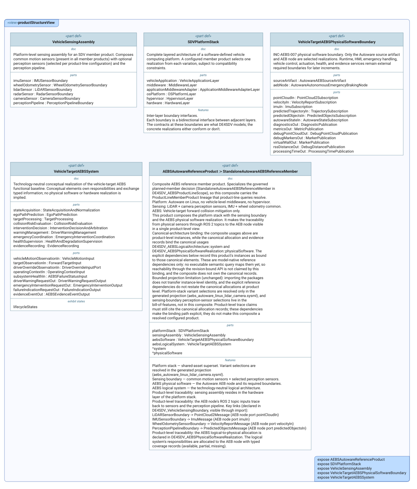
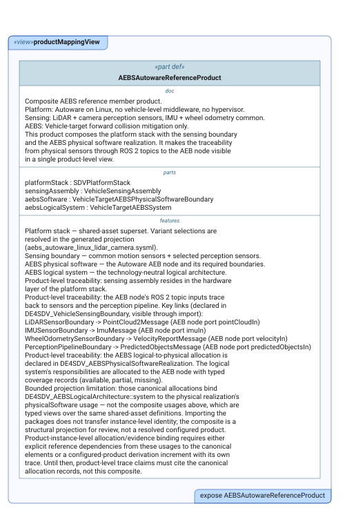

# Product Model Views

This index lists every SysML v2 `view` declared in the `.sysml` files of
this first-level model area. Each entry explains the reviewer question in
plain language and embeds the committed diagram SysIDE renders from the
view (`syside viz view`, run by the Privileged Syside Validation workflow).
The SVGs live in [`diagrams/`](diagrams/) beside the model files.

Generated by `scripts/generate_view_index.py` — do not edit by hand.

**1 file, 2 views, 2 published diagrams.**

## `aebs_autoware_reference_product.sysml`

### `productStructureView`

Reviewers need the product-level composition visible: platform stack, sensing boundary, AEBS physical software, and their structural relationships.

- **Source:** `aebs_autoware_reference_product.sysml`
- **Viewpoint:** `selectedPhysicalStructureViewpoint` (`PhysicalStructureDefinitionViewpoint`)
- **Concern:** `productStructureConcern`
- **Exposes:** `AEBSAutowareReferenceProduct`, `SDVPlatformStack`, `VehicleSensingAssembly`, `VehicleTargetAEBSPhysicalSoftwareBoundary`, `VehicleTargetAEBSSystem`
- **Render:** `asTreeDiagram`

- **Diagram status:** Published from the committed SysIDE SVG.
- **Presentation note:** This is a dense review artifact; open the SVG at full size rather than reading it from the page thumbnail.

### `productMappingView`

Reviewers need the product-level traceability visible: which physical elements (sensors, AEB node, required boundaries) realize which logical responsibilities, and where the gaps are.

- **Source:** `aebs_autoware_reference_product.sysml`
- **Viewpoint:** `selectedPhysicalLogicalMappingViewpoint` (`PhysicalLogicalMappingViewpoint`)
- **Concern:** `productMappingConcern`
- **Exposes:** `AEBSAutowareReferenceProduct`
- **Render:** `asTreeDiagram`

- **Diagram status:** Published from the committed SysIDE SVG.

