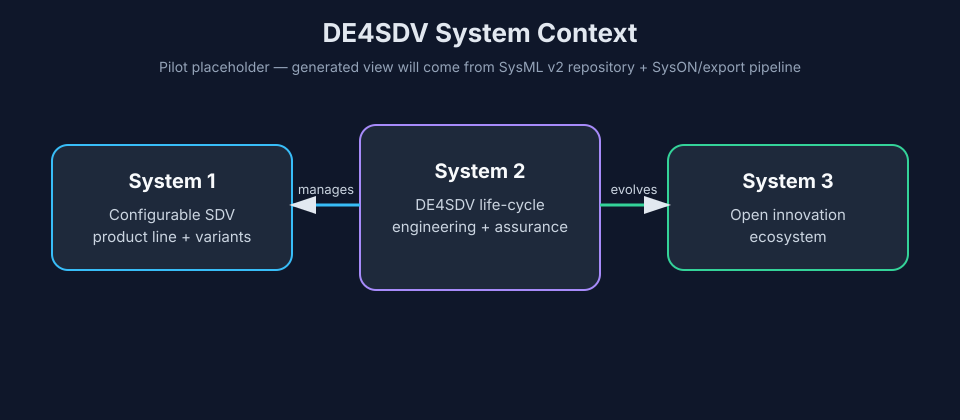
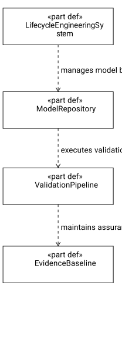

# Model

SysML v2 and related model assets. Keep examples small and traceable.

## Method alignment

DE4SDV SysML v2 artifacts should align with the methodology guidance in
[`../methodologies/sysmod-sysmlv2/`](../methodologies/sysmod-sysmlv2/). The
current adoption step documents the upstream SYSMOD SysML v2 reference and
tailoring approach; future increments may add local packages such as a DE4SDV
tailoring package and context model.

## Method packages

DE4SDV method packages reuse external method patterns selectively. They are not
full implementations of upstream methods; each package should state the source
pattern it adapts and the DE4SDV-specific tailoring.

- [`packages/methods/de4sdv/de4sdv_method_context.sysml`](packages/methods/de4sdv/de4sdv_method_context.sysml)
  adapts the SYSMOD/SysML v2 problem-statement pattern for DE4SDV. It defines a
  small `DE4SDV_MethodContext` package with `ProblemStatement` and
  `SystemContext` concepts used to anchor increments before needs and
  requirements. It deliberately avoids a generic `ProjectContext` abstraction.
  It is not a vendored upstream `SYSMOD.sysml` implementation.
- [`packages/methods/de4sdv/de4sdv_stakeholders.sysml`](packages/methods/de4sdv/de4sdv_stakeholders.sysml)
  defines reusable DE4SDV stakeholder role definitions and lightweight
  risk/effort/category metadata for native SysML v2 `stakeholder` parameters.
- [`packages/methods/de4sdv/de4sdv_product_line.sysml`](packages/methods/de4sdv/de4sdv_product_line.sysml)
  defines reusable product-line semantics such as `SDVProductLine`,
  `ProductLineMemberProduct`, `CommonProductLineCapability`, and native SysML v2
  `variation` / `variant` patterns for deferred product-line choices. Feature
  packages should import these rather than redefining product-line/common-
  capability vocabulary locally or inventing generic variation-point part definitions.
- [`packages/methods/de4sdv/de4sdv_operational_context.sysml`](packages/methods/de4sdv/de4sdv_operational_context.sysml)
  defines reusable operational context entities such as `SubjectVehicle`,
  `Driver`, `RoadEnvironment`, `VehicleTarget`, and `DE4SDVEvidenceBaseline`
  for feature operational-context slices.
- [`packages/methods/de4sdv/de4sdv_method_concerns_and_viewpoints.sysml`](packages/methods/de4sdv/de4sdv_method_concerns_and_viewpoints.sysml)
  defines the DE4SDV method-governance viewpoint kernel as the top-level
  `DE4SDV_MethodViewpoints` package. It contains DE4SDV-specific viewpoints
  that do not map to any published SAF viewpoint: increment framing,
  product-line classification, and regulatory scope without compliance claim.
- [`packages/methods/saf/SAF_Viewpoints.sysml`](packages/methods/saf/SAF_Viewpoints.sysml)
  defines the SAF viewpoint kernel as the top-level `SAF_Viewpoints` package.
  It contains GfSE SAF viewpoint and concern definitions that DE4SDV has
  actually used in the AEBS pilot, with names matching the published SAF
  documentation. New SAF viewpoints are added incrementally as DE4SDV
  increments need them.

Feature packages should import from both packages, select the relevant
`viewpoint def` elements, then add feature-specific concern usages inside
the feature package and view-local viewpoint usages inside concrete views.
Reusable `view def` elements are deferred until DE4SDV has cross-feature
view construction recipes with real filters/rendering/composition logic.

## Context modeling scope

Future context models should preserve the ASELCM-aligned DE4SDV scope:

- System 1: configurable SDV product line and configured vehicle/software
  variants.
- System 2: DE4SDV life-cycle engineering and assurance system.
- System 3: DE4SDV open innovation ecosystem.

A later small example may add
`textual-notation-of-model/context/de4sdv_aselcm_context.sysml` to capture this
framing in SysML v2 textual notation.

## Live repository and generated views

DE4SDV is piloting a SysML v2 API repository as the live model store. Eclipse
SysON is the preferred GUI tool for the initial graphical modeling path.
GitHub remains the reviewed publication baseline for textual snapshots,
generated views, documentation, and validation evidence.

The initial pilot views are bootstrap placeholders until the SysML v2 API
repository, SysON editing path, and view renderer/exporter are connected:

### System context



Source metadata:
[`views/system-context/manifest.json`](views/system-context/manifest.json)

### Life-cycle engineering system



Source metadata:
[`views/lifecycle-engineering-system/manifest.json`](views/lifecycle-engineering-system/manifest.json)

## Validation

Do not treat local SysML validation as a routine contributor or agent gate for
DE4SDV. Repository work should separate:

1. **Public repository checks** that contributors and agents can run without
   privileged secrets:

```bash
python scripts/check_repo.py
python scripts/smoke_test.py
git diff --check
```

2. **Semantic review** against the SysML v2 specification, DE4SDV ontology, and
   project modeling rules.

3. **Privileged SysML validation evidence**, when available from GitHub Actions
   or a maintainer-run environment. Report this evidence separately from
   semantic quality.

The repository root is also a Sysand project. `sysand-lock.toml` pins the
SysIDE grid-view definitions used for requirement tables and allocation
matrices. On a supported host, resolve the lock before validation or rendering:

```bash
python -m pip install sysand==0.1.0
sysand sync
```

The privileged workflow validates the textual model, renders topology and
behavior diagrams, exports grid views as CSV, and generates reviewer-facing
SVG tables/matrices from those CSV files. The SysML view and SysIDE CSV remain
the semantic source; `scripts/render_grid_csv.py` only formats the exported
grid.

Local SysML validation with Sensmetry SysIDE/SysML tooling may still be useful
for a maintainer on a supported host, but Hermes should not run local SysML
validation unless explicitly asked.

## Libraries

- [`libraries/covesa-vss-sysmlv2`](libraries/covesa-vss-sysmlv2/) — draft
  Sysand-managed SysML v2 interchange project for COVESA VSS leaf signals.
  The generated package uses SysML v2 standard quantity/unit library references
  instead of copying the VSS unit and quantity YAML definitions. The adjacent
  `DE4SDV_VSS_Extensions` package contains DE4SDV candidate extension signals
  for reviewed gaps such as AEBS-specific override, command, failure, and
  evidence-event semantics; keep those separate from the generated upstream
  snapshot until they are reviewed and, where appropriate, proposed upstream.
