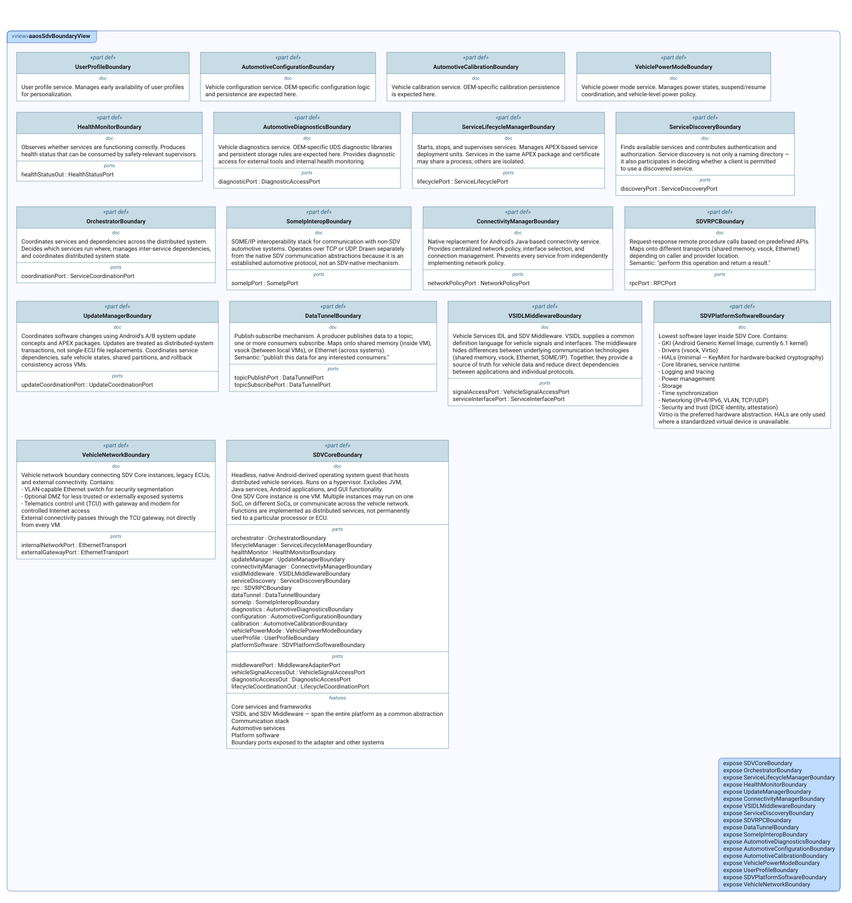
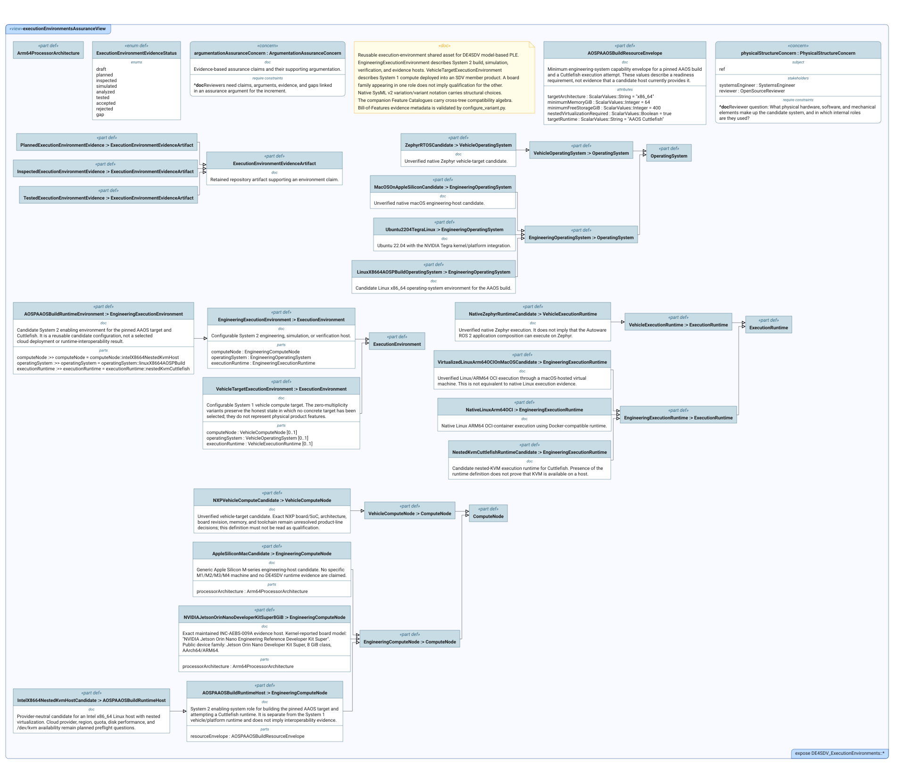
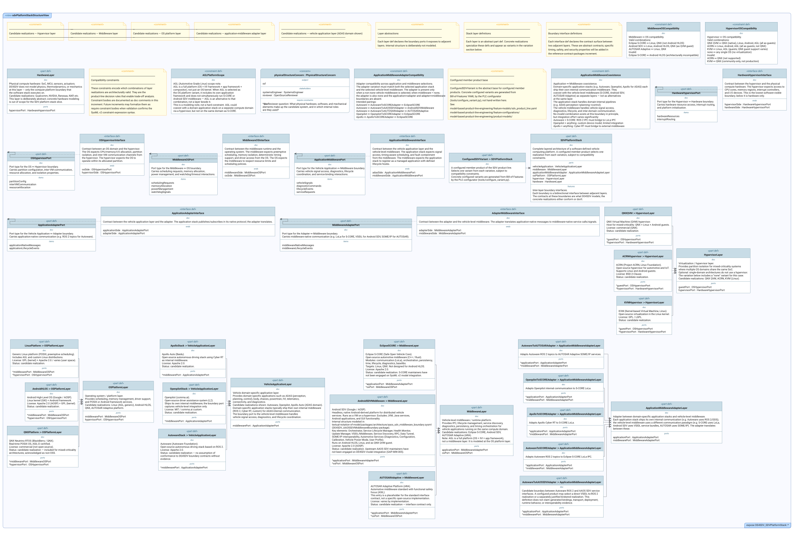
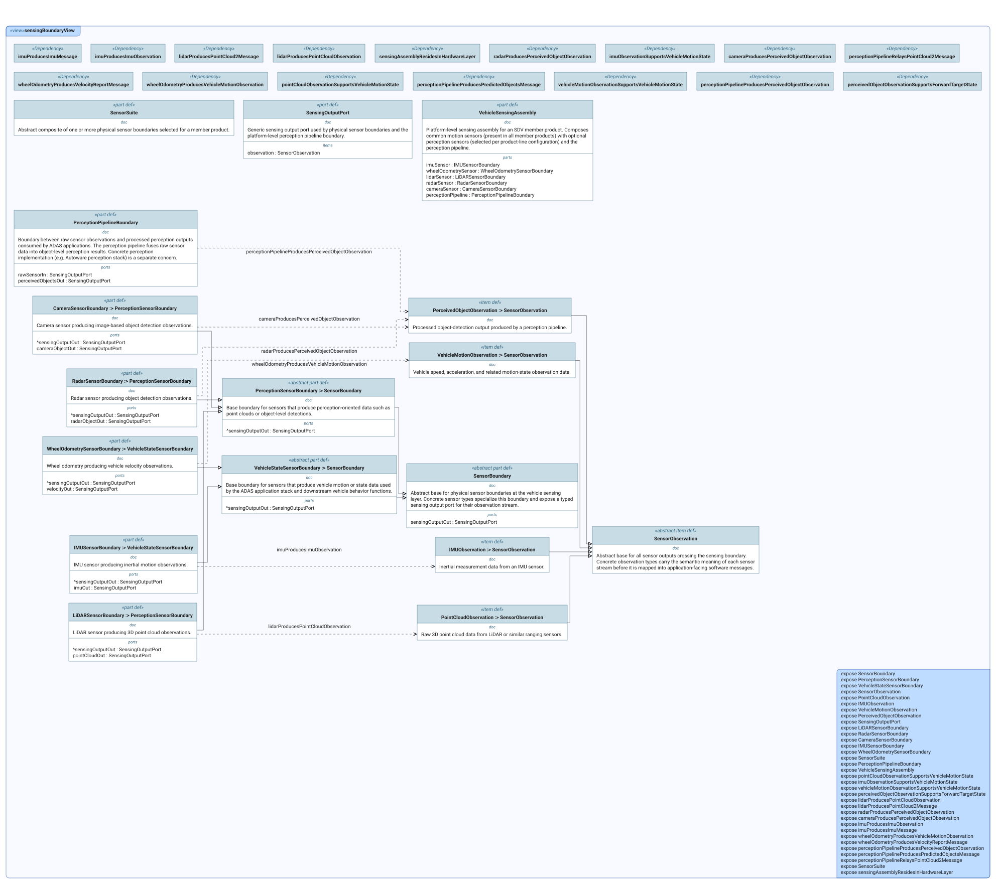

# Architecture Views

This index lists every SysML v2 `view` declared in the `.sysml` files of
this first-level model area. Each entry explains the reviewer question in
plain language and embeds the committed diagram SysIDE renders from the
view (`syside viz view`, run by the Privileged Syside Validation workflow).
The SVGs live in [`diagrams/`](diagrams/) beside the model files.

Generated by `scripts/generate_view_index.py` — do not edit by hand.

**4 files, 4 views, 4 published diagrams.**

## `aaos_sdv_middleware_boundary.sysml`

### `aaosSdvBoundaryView`

Reviewers need the AAOS SDV middleware internal structure visible for the middleware integration increment: core services, communication stack, automotive services, platform software, and network topology.

- **Source:** `aaos_sdv_middleware_boundary.sysml`
- **Viewpoint:** `selectedPhysicalStructureViewpoint` (`PhysicalStructureDefinitionViewpoint`)
- **Concern:** `aaosSdvStructureConcern`
- **Exposes:** `SDVCoreBoundary`, `OrchestratorBoundary`, `ServiceLifecycleManagerBoundary`, `HealthMonitorBoundary`, `UpdateManagerBoundary`, `ConnectivityManagerBoundary`, `VSIDLMiddlewareBoundary`, `ServiceDiscoveryBoundary`, `SDVRPCBoundary`, `DataTunnelBoundary`, `SomeIpInteropBoundary`, `AutomotiveDiagnosticsBoundary`, `AutomotiveConfigurationBoundary`, `AutomotiveCalibrationBoundary`, `VehiclePowerModeBoundary`, `UserProfileBoundary`, `SDVPlatformSoftwareBoundary`, `VehicleNetworkBoundary`
- **Render:** `asTreeDiagram`

- **Diagram status:** Published from the committed SysIDE SVG.
- **Presentation note:** This is a dense review artifact; open the SVG at full size rather than reading it from the page thumbnail.

## `execution_environments.sysml`

### `executionEnvironmentsAssuranceView`

Evidence-based assurance claims and their supporting argumentation.

- **Source:** `execution_environments.sysml`
- **Viewpoint:** `selectedArgumentationAssuranceViewpoint` (`ArgumentationAssuranceViewpoint`)
- **Concern:** `argumentationAssuranceConcern`
- **Exposes:** `DE4SDV_ExecutionEnvironments::*`
- **Render:** `asTreeDiagram`

- **Diagram status:** Published from the committed SysIDE SVG.
- **Presentation note:** This is a dense review artifact; open the SVG at full size rather than reading it from the page thumbnail.

## `sdv_platform_stack.sysml`

### `sdvPlatformStackStructureView`

Shows the selected physical or software parts and their structural decomposition.

- **Source:** `sdv_platform_stack.sysml`
- **Viewpoint:** `selectedPhysicalStructureViewpoint` (`PhysicalStructureDefinitionViewpoint`)
- **Concern:** `physicalStructureConcern`
- **Exposes:** `DE4SDV_SDVPlatformStack::*`
- **Render:** `asTreeDiagram`

- **Diagram status:** Published from the committed SysIDE SVG.
- **Presentation note:** This is a dense review artifact; open the SVG at full size rather than reading it from the page thumbnail.

## `vehicle_sensing_boundary.sysml`

### `sensingBoundaryView`

Reviewers need the sensor-to-application traceability boundary to be visible: which physical sensors produce the observations that feed the ADAS application stack.

- **Source:** `vehicle_sensing_boundary.sysml`
- **Viewpoint:** `selectedPhysicalStructureViewpoint` (`PhysicalStructureDefinitionViewpoint`)
- **Concern:** `sensingBoundaryStructureConcern`
- **Exposes:** `SensorBoundary`, `PerceptionSensorBoundary`, `VehicleStateSensorBoundary`, `SensorObservation`, `PointCloudObservation`, `IMUObservation`, `VehicleMotionObservation`, `PerceivedObjectObservation`, `SensingOutputPort`, `LiDARSensorBoundary`, `RadarSensorBoundary`, `CameraSensorBoundary`, `IMUSensorBoundary`, `WheelOdometrySensorBoundary`, `SensorSuite`, `PerceptionPipelineBoundary`, `VehicleSensingAssembly`, `pointCloudObservationSupportsVehicleMotionState`, `imuObservationSupportsVehicleMotionState`, `vehicleMotionObservationSupportsVehicleMotionState`, `perceivedObjectObservationSupportsForwardTargetState`, `lidarProducesPointCloudObservation`, `lidarProducesPointCloud2Message`, `radarProducesPerceivedObjectObservation`, `cameraProducesPerceivedObjectObservation`, `imuProducesImuObservation`, `imuProducesImuMessage`, `wheelOdometryProducesVehicleMotionObservation`, `wheelOdometryProducesVelocityReportMessage`, `perceptionPipelineProducesPerceivedObjectObservation`, `perceptionPipelineProducesPredictedObjectsMessage`, `perceptionPipelineRelaysPointCloud2Message`, `SensorSuite`, `sensingAssemblyResidesInHardwareLayer`
- **Render:** `asTreeDiagram`

- **Diagram status:** Published from the committed SysIDE SVG.
- **Presentation note:** This is a dense review artifact; open the SVG at full size rather than reading it from the page thumbnail.

