# AEBS Views

This index lists every SysML v2 `view` declared in the `.sysml` files of
this first-level model area. Each entry explains the reviewer question in
plain language and embeds the committed diagram SysIDE renders from the
view (`syside viz view`, run by the Privileged Syside Validation workflow).
The SVGs live in [`diagrams/`](diagrams/) beside the model files.

Generated by `scripts/generate_view_index.py` — do not edit by hand.

**22 files, 43 views, 27 published diagrams.**

## `aebs_bicycle_verification.sysml`

### `aebs009HVerificationAssuranceView`

Evidence-based assurance claims and their supporting argumentation.

- **Source:** `aebs_bicycle_verification.sysml`
- **Viewpoint:** `selectedArgumentationAssuranceViewpoint` (`ArgumentationAssuranceViewpoint`)
- **Concern:** `argumentationAssuranceConcern`
- **Exposes:** `DE4SDV_AEBS009HVerification::*`
- **Render:** `asTreeDiagram`

- **Diagram status:** Published from the committed SysIDE SVG.

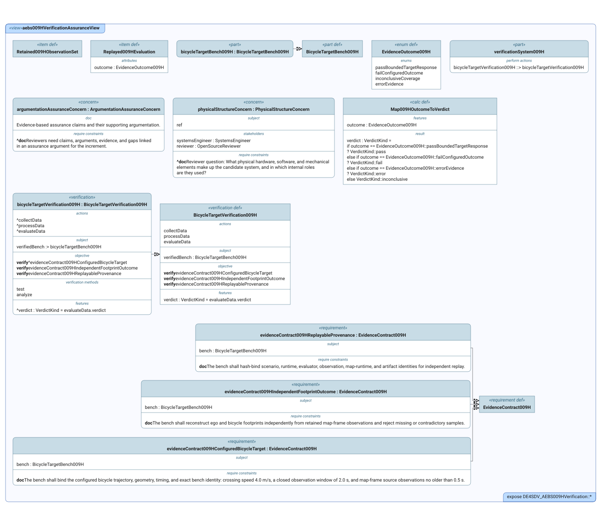

## `aebs_degraded_input_verification.sysml`

### `aebs009FVerificationAssuranceView`

Evidence-based assurance claims and their supporting argumentation.

- **Source:** `aebs_degraded_input_verification.sysml`
- **Viewpoint:** `selectedArgumentationAssuranceViewpoint` (`ArgumentationAssuranceViewpoint`)
- **Concern:** `argumentationAssuranceConcern`
- **Exposes:** `DE4SDV_AEBS009FVerification::*`
- **Render:** `asTreeDiagram`

- **Diagram status:** Published from the committed SysIDE SVG.
- **Presentation note:** This is a dense review artifact; open the SVG at full size rather than reading it from the page thumbnail.

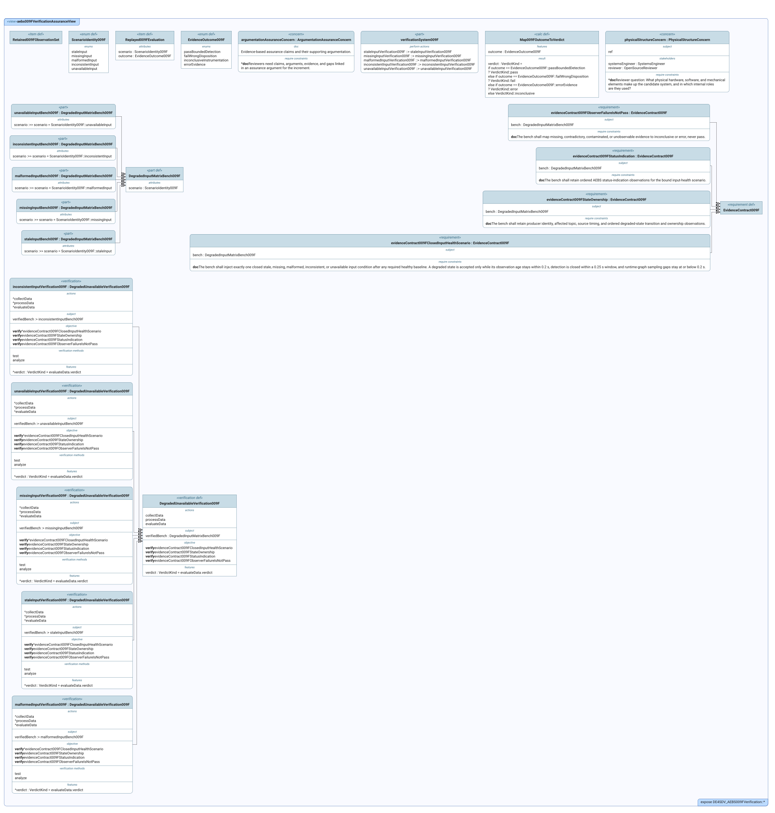

## `aebs_evidence.sysml`

### `aebs009BNominalEvidenceAssuranceView`

Evidence-based assurance claims and their supporting argumentation.

- **Source:** `aebs_evidence.sysml`
- **Viewpoint:** `selectedArgumentationAssuranceViewpoint` (`ArgumentationAssuranceViewpoint`)
- **Concern:** `argumentationAssuranceConcern`
- **Exposes:** `DE4SDV_AEBS009BNominalEvidence::*`
- **Render:** `asTreeDiagram`

- **Diagram status:** Published from the committed SysIDE SVG.
- **Presentation note:** This is a dense review artifact; open the SVG at full size rather than reading it from the page thumbnail.

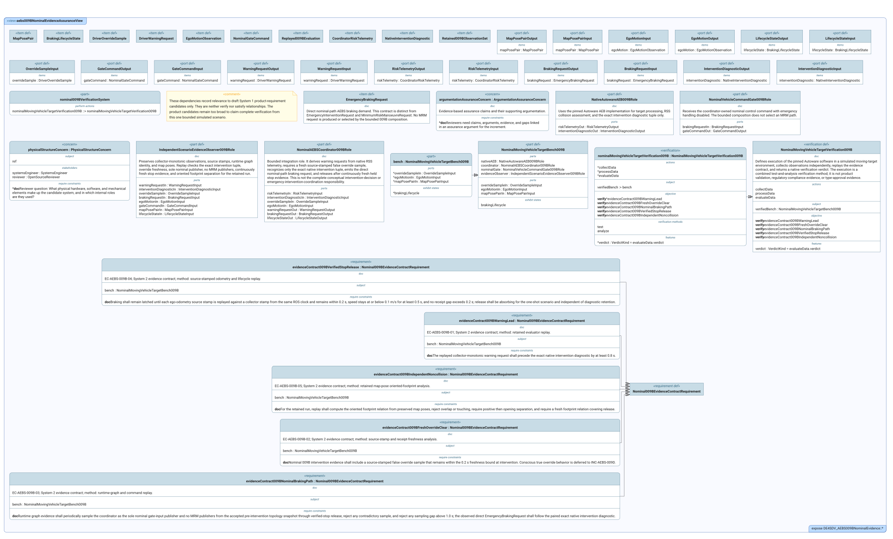

## `aebs_execution_environment.sysml`

### `aebs009AExecutionEnvironmentAssuranceView`

Evidence-based assurance claims and their supporting argumentation.

- **Source:** `aebs_execution_environment.sysml`
- **Viewpoint:** `selectedArgumentationAssuranceViewpoint` (`ArgumentationAssuranceViewpoint`)
- **Concern:** `argumentationAssuranceConcern`
- **Exposes:** `DE4SDV_AEBS009AExecutionEnvironment::*`
- **Render:** `asTreeDiagram`

- **Diagram status:** Published from the committed SysIDE SVG.

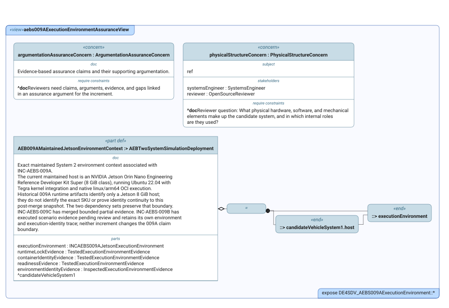

## `aebs_functional_architecture.sysml`

### `aebsFunctionalArchitectureView`

Reviewers need the AEBS functional responsibilities, information items, flows, and sequencing visible with requirement trace.

- **Source:** `aebs_functional_architecture.sysml`
- **Viewpoint:** `selectedFunctionalBehaviorViewpoint` (`SystemFunctionalBreakdownStructureViewpoint`)
- **Concern:** `functionalBehaviorConcern`
- **Exposes:** `VehicleTargetAEBSFunctionalFlow`
- **Render:** `asTreeDiagram`

- **Diagram status:** Published from the committed SysIDE SVG.

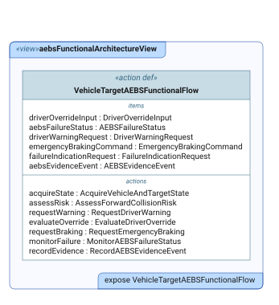

### `aebsFunctionalInterfaceView`

Reviewers need the AEBS functional boundary ports, signal character, direction, and the functional chain that owns them.

- **Source:** `aebs_functional_architecture.sysml`
- **Viewpoint:** `selectedFunctionalInterfaceViewpoint` (`SystemInterfaceDefinitionViewpoint`)
- **Concern:** `functionalInterfaceConcern`
- **Exposes:** `VehicleTargetAEBSFunctionalChain`
- **Render:** `asTreeDiagram`

- **Diagram status:** Published from the committed SysIDE SVG.

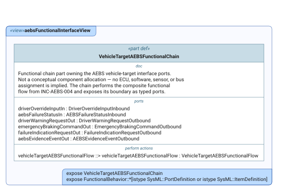

## `aebs_increment_framing.sysml`

### `aebsIncrementFramingView`

Reviewers need AEBS scope elements to distinguish common product-line capabilities from candidate features and later variability decisions.

- **Source:** `aebs_increment_framing.sysml`
- **Viewpoint:** `selectedIncrementFramingViewpoint` (`IncrementFramingViewpoint`)
- **Concern:** `productLineCapabilityClassificationConcern`
- **Exposes:** `IncrementFraming::*`
- **Render:** `asTreeDiagram`

- **Diagram status:** Published from the committed SysIDE SVG.
- **Presentation note:** This is a dense review artifact; open the SVG at full size rather than reading it from the page thumbnail.

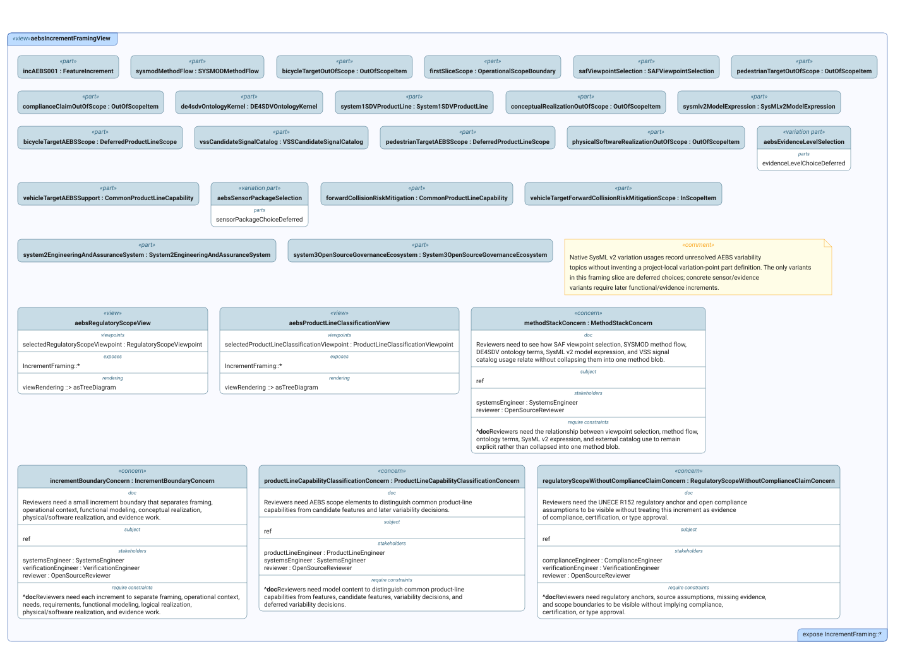

### `aebsProductLineClassificationView`

Reviewers need AEBS scope elements to distinguish common product-line capabilities from candidate features and later variability decisions.

- **Source:** `aebs_increment_framing.sysml`
- **Viewpoint:** `selectedProductLineClassificationViewpoint` (`ProductLineClassificationViewpoint`)
- **Concern:** `productLineCapabilityClassificationConcern`
- **Exposes:** `IncrementFraming::*`
- **Render:** `asTreeDiagram`

- **Diagram status:** Published from the committed SysIDE SVG.
- **Presentation note:** This is a dense review artifact; open the SVG at full size rather than reading it from the page thumbnail.

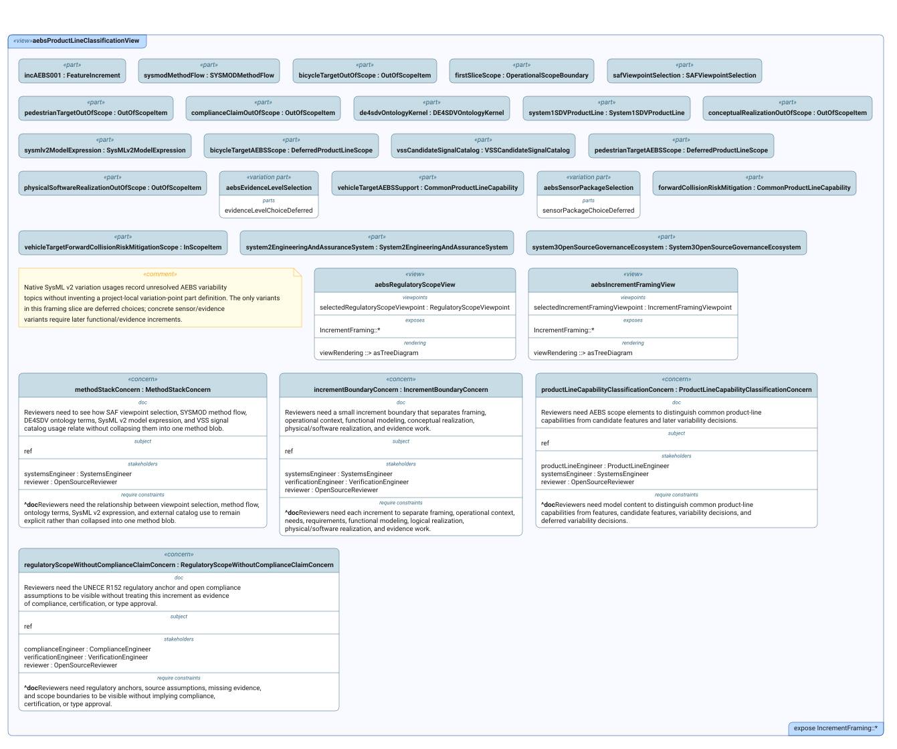

### `aebsRegulatoryScopeView`

Reviewers need the UNECE R152 regulatory anchor and open compliance assumptions to be visible without treating this increment as evidence of compliance, certification, or type approval.

- **Source:** `aebs_increment_framing.sysml`
- **Viewpoint:** `selectedRegulatoryScopeViewpoint` (`RegulatoryScopeViewpoint`)
- **Concern:** `regulatoryScopeWithoutComplianceClaimConcern`
- **Exposes:** `IncrementFraming::*`
- **Render:** `asTreeDiagram`

- **Diagram status:** Published from the committed SysIDE SVG.
- **Presentation note:** This is a dense review artifact; open the SVG at full size rather than reading it from the page thumbnail.

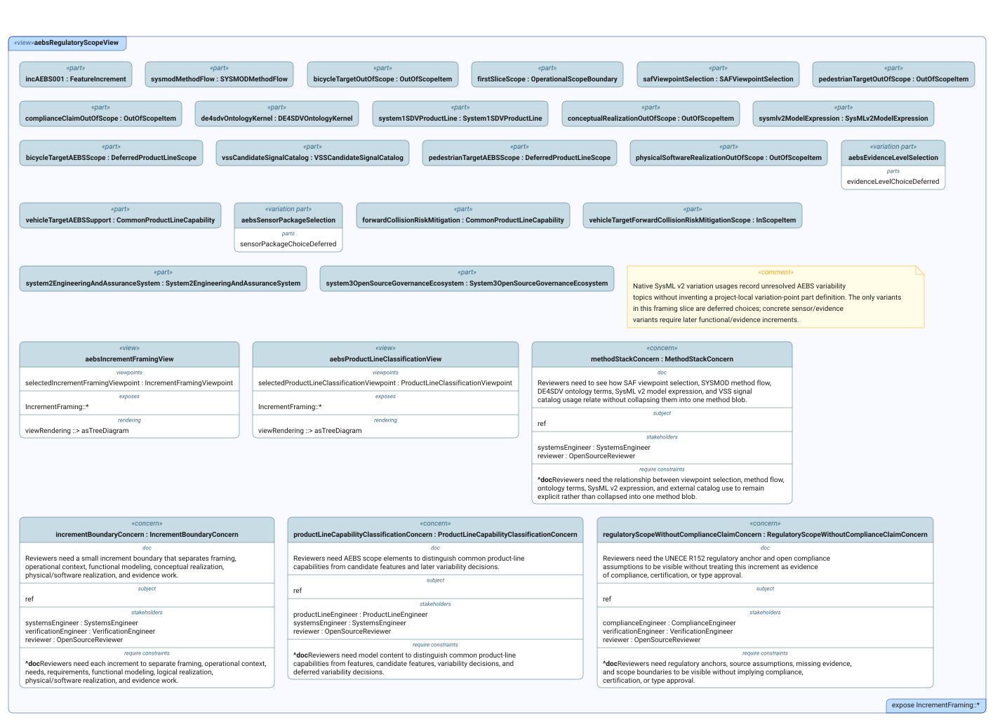

## `aebs_logical_architecture.sysml`

### `aebsSystemStructureView`

Reviewers need the conceptual AEBS boundary, decomposition, responsibility ownership, and conceptual/physical separation to be explicit.

- **Source:** `aebs_logical_architecture.sysml`
- **Viewpoint:** `selectedSystemStructureViewpoint` (`SystemStructureDefinitionViewpoint`)
- **Concern:** `conceptualStructureConcern`
- **Exposes:** `system`, `system::stateAcquisition`, `system::egoPathPrediction`, `system::targetProcessing`, `system::collisionRiskEvaluation`, `system::interventionDecision`, `system::warningManagement`, `system::emergencyCoordination`, `system::healthSupervision`, `system::evidenceRecording`
- **Render:** `asTreeDiagram`

- **Diagram status:** Published from the committed SysIDE SVG.

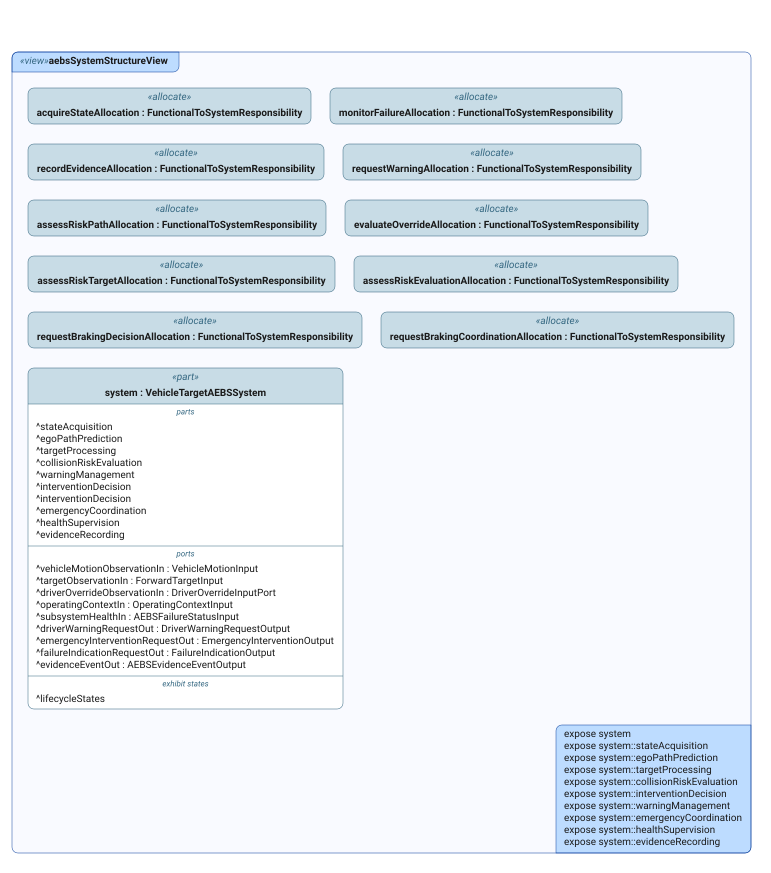

### `aebsSystemInternalExchangeView`

Reviewers need typed boundary and internal exchanges, direction, and delegation to conceptual owners without middleware leakage.

- **Source:** `aebs_logical_architecture.sysml`
- **Viewpoint:** `selectedSystemInternalExchangeViewpoint` (`SystemInternalExchangeViewpoint`)
- **Concern:** `conceptualInternalExchangeConcern`
- **Exposes:** `system`, `system::**`
- **Depth:** `-1`
- **Render:** `asInterconnectionDiagram`

- **Diagram status:** Published from the committed SysIDE SVG.

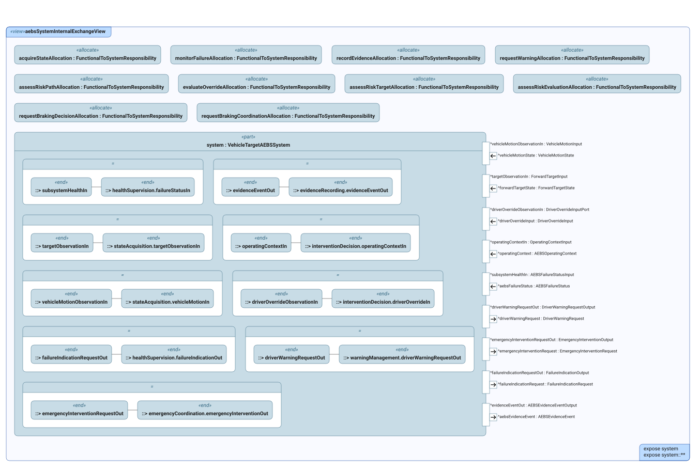

### `aebsSystemFunctionMappingView`

Reviewers need every AEBS functional action allocated to one or more conceptual elements without implying physical realization.

- **Source:** `aebs_logical_architecture.sysml`
- **Viewpoint:** `selectedSystemFunctionMappingViewpoint` (`SystemFunctionMappingViewpoint`)
- **View type:** `MVD::MatrixView`
- **Concern:** `conceptualFunctionMappingConcern`
- **Exposes:** `functionalFlow::acquireState`, `functionalFlow::assessRisk`, `functionalFlow::requestWarning`, `functionalFlow::evaluateOverride`, `functionalFlow::requestBraking`, `functionalFlow::monitorFailure`, `functionalFlow::recordEvidence`, `system::stateAcquisition`, `system::egoPathPrediction`, `system::targetProcessing`, `system::collisionRiskEvaluation`, `system::interventionDecision`, `system::warningManagement`, `system::emergencyCoordination`, `system::healthSupervision`, `system::evidenceRecording`, `DE4SDV_AEBSLogicalArchitecture::*`

- **Diagram status:** Published from the committed SysIDE SVG.

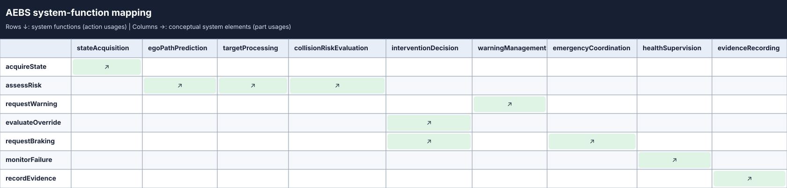

## `aebs_needs_requirements.sysml`

### `aebsStakeholderNeedsView`

Lists the stakeholder needs that frame the feature and its engineering obligations.

- **Source:** `aebs_needs_requirements.sysml`
- **Viewpoint:** `selectedStakeholderNeedsViewpoint` (`StakeholderRequirementDefinitionViewpoint`)
- **View type:** `TVD::TableView`
- **Concern:** `stakeholderNeedsConcern`
- **Exposes:** `System1Product::*`, `System2EngineeringAssurance::*`

- **Diagram status:** Published from the committed SysIDE SVG.

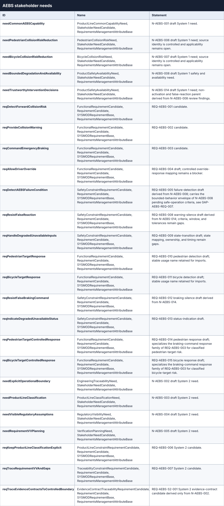

### `aebsRequirementTraceView`

Shows the requirement set and its trace links to needs, behavior, or architecture.

- **Source:** `aebs_needs_requirements.sysml`
- **Viewpoint:** `selectedRequirementTraceViewpoint` (`SystemRequirementTraceabilityViewpoint`)
- **Concern:** `requirementTraceConcern`
- **Exposes:** `System1Product::*`, `System2EngineeringAssurance::*`
- **Render:** `asTreeDiagram`

- **Diagram status:** Published from the committed SysIDE SVG.
- **Presentation note:** This is a dense review artifact; open the SVG at full size rather than reading it from the page thumbnail.

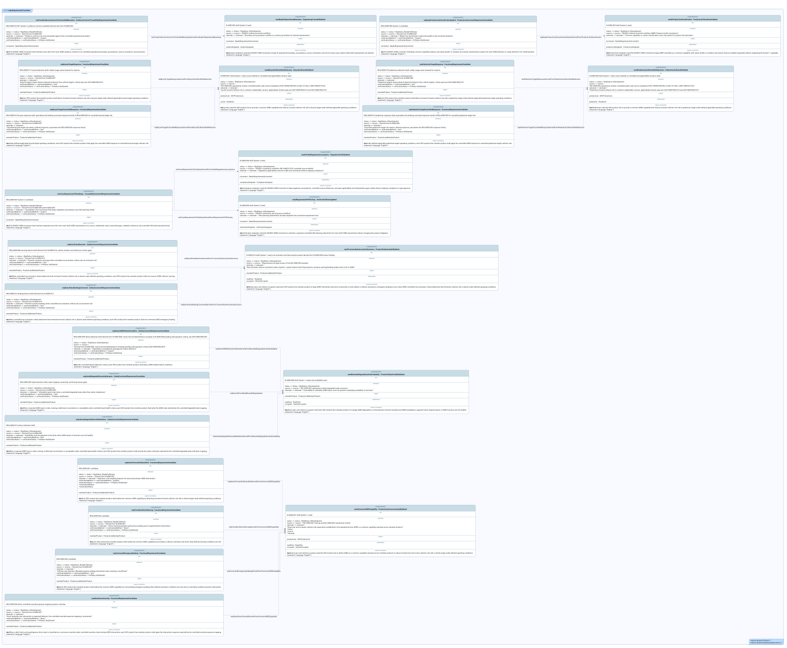

## `aebs_non_activation_verification.sysml`

### `aebs009EVerificationAssuranceView`

Evidence-based assurance claims and their supporting argumentation.

- **Source:** `aebs_non_activation_verification.sysml`
- **Viewpoint:** `selectedArgumentationAssuranceViewpoint` (`ArgumentationAssuranceViewpoint`)
- **Concern:** `argumentationAssuranceConcern`
- **Exposes:** `DE4SDV_AEBS009EVerification::*`
- **Render:** `asTreeDiagram`

- **Diagram status:** Published from the committed SysIDE SVG.
- **Presentation note:** This is a dense review artifact; open the SVG at full size rather than reading it from the page thumbnail.

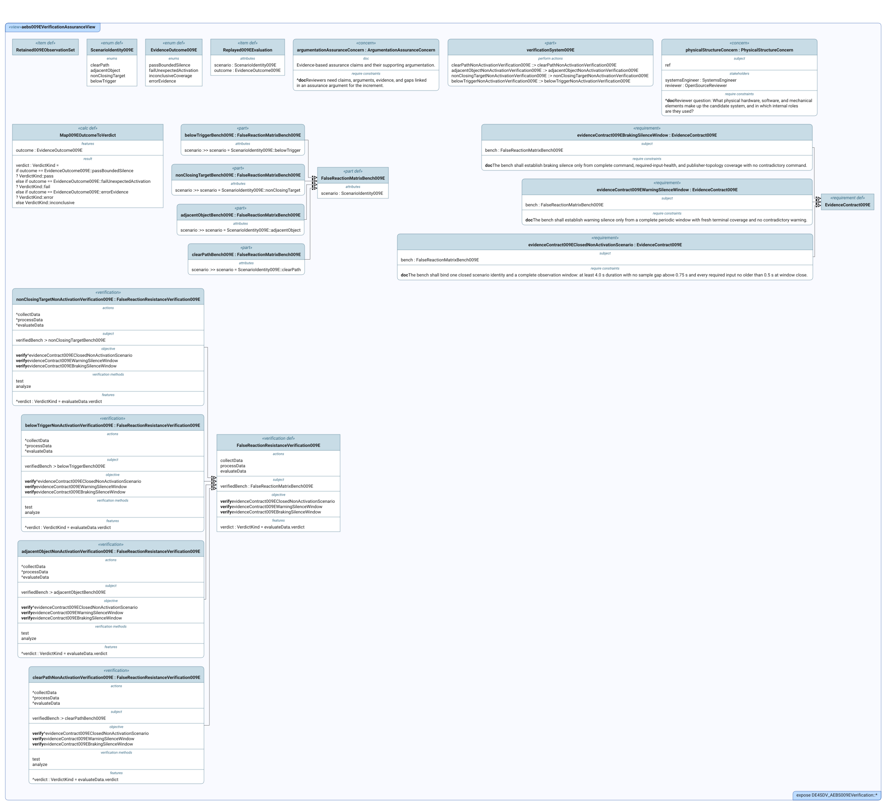

## `aebs_operational_context.sysml`

### `aebsOperationalContextView`

Reviewers need the AEBS operational actors, context boundary, and operational story to be visible for this increment.

- **Source:** `aebs_operational_context.sysml`
- **Viewpoint:** `selectedOperationalContextViewpoint` (`OperationalContextDefinitionViewpoint`)
- **Concern:** `operationalContextConcern`
- **Exposes:** `OperationalContext::vehicleTargetForwardCollisionStory`
- **Depth:** `1`
- **Render:** `asTreeDiagram`

- **Diagram status:** Published from the committed SysIDE SVG.

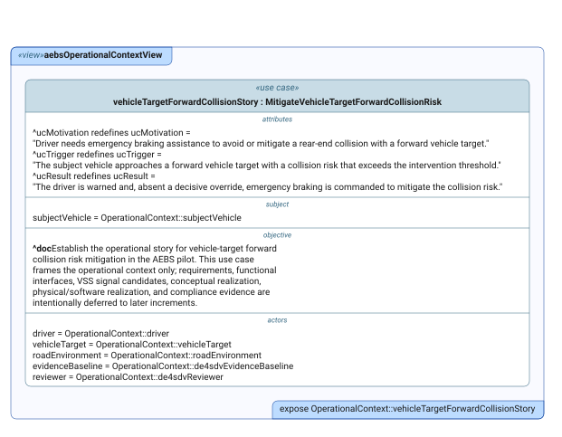

## `aebs_partial_intervention_verification.sysml`

### `aebs009CVerificationAssuranceView`

Evidence-based assurance claims and their supporting argumentation.

- **Source:** `aebs_partial_intervention_verification.sysml`
- **Viewpoint:** `selectedArgumentationAssuranceViewpoint` (`ArgumentationAssuranceViewpoint`)
- **Concern:** `argumentationAssuranceConcern`
- **Exposes:** `DE4SDV_AEBS009CVerification::*`
- **Render:** `asTreeDiagram`

- **Diagram status:** Published from the committed SysIDE SVG.

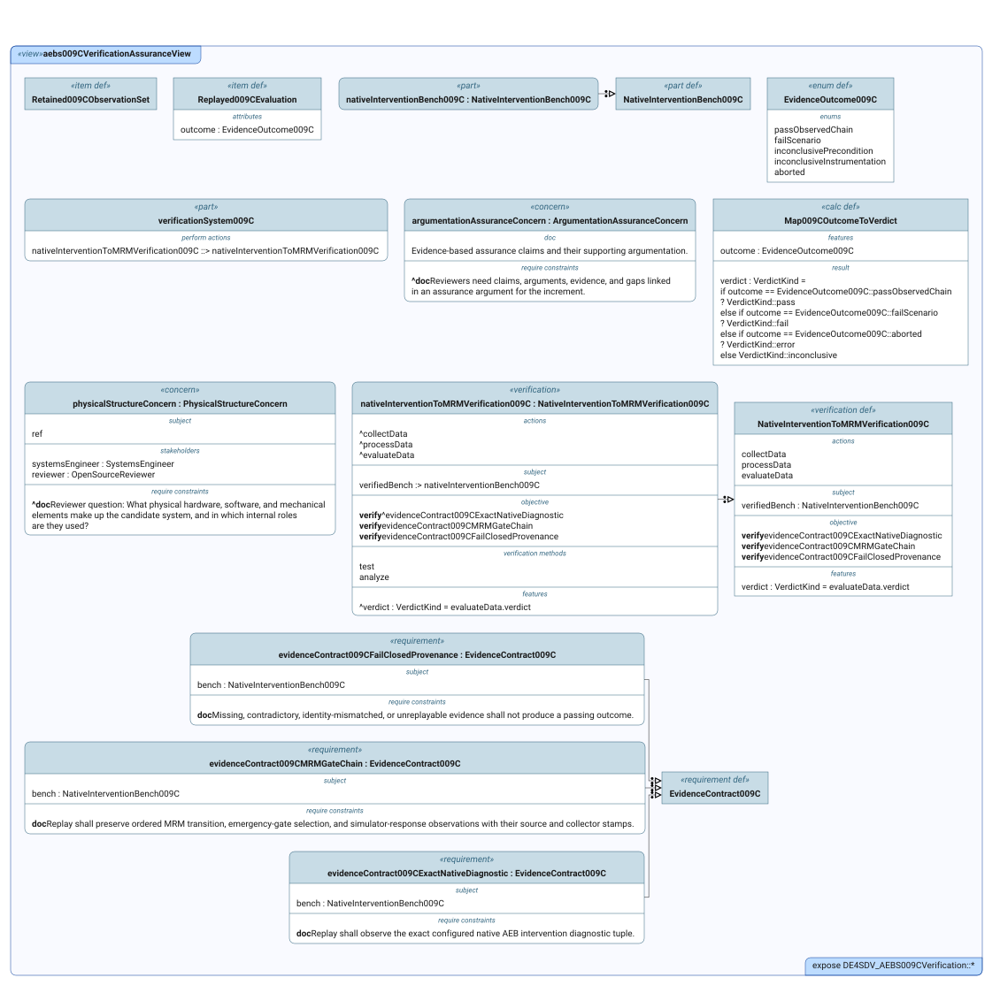

## `aebs_pedestrian_verification.sysml`

### `aebs009GVerificationAssuranceView`

Evidence-based assurance claims and their supporting argumentation.

- **Source:** `aebs_pedestrian_verification.sysml`
- **Viewpoint:** `selectedArgumentationAssuranceViewpoint` (`ArgumentationAssuranceViewpoint`)
- **Concern:** `argumentationAssuranceConcern`
- **Exposes:** `DE4SDV_AEBS009GVerification::*`
- **Render:** `asTreeDiagram`

- **Diagram status:** Published from the committed SysIDE SVG.

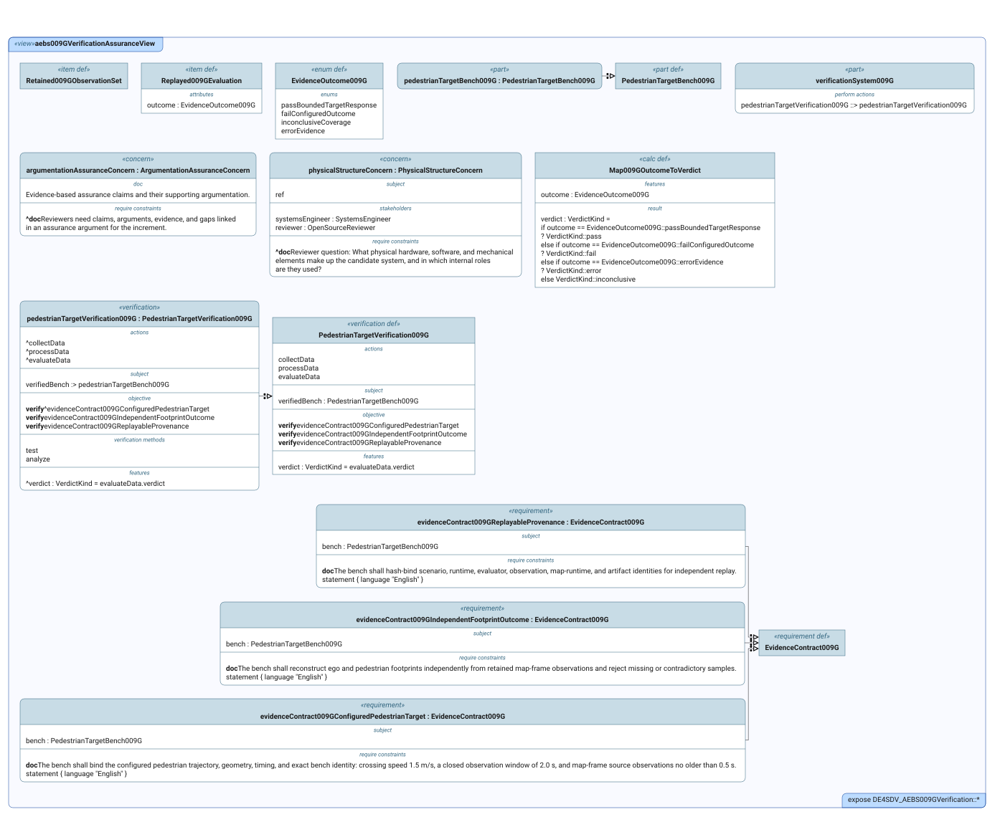

## `aebs_physical_software_realization.sysml`

### `aebsPhysicalSoftwareStructureView`

Reviewers need the selected Autoware software elements and every required external physical boundary to be visible without implying deployment.

- **Source:** `aebs_physical_software_realization.sysml`
- **Viewpoint:** `selectedPhysicalStructureViewpoint` (`PhysicalStructureDefinitionViewpoint`)
- **Concern:** `physicalStructureConcern`
- **Exposes:** `physicalSoftware`, `physicalSoftware::sourceArtifact`, `physicalSoftware::aebNode`, `requiredRuntime`, `requiredWarningProvider`, `requiredDiagnosticBridge`, `requiredEmergencyHandler`, `requiredCommandGate`, `requiredVehicleInterface`, `requiredBrakeActuation`, `requiredHealthSupervisor`, `requiredEvidenceService`
- **Render:** `asTreeDiagram`

- **Diagram status:** Published from the committed SysIDE SVG.
- **Presentation note:** This is a dense review artifact; open the SVG at full size rather than reading it from the page thumbnail.

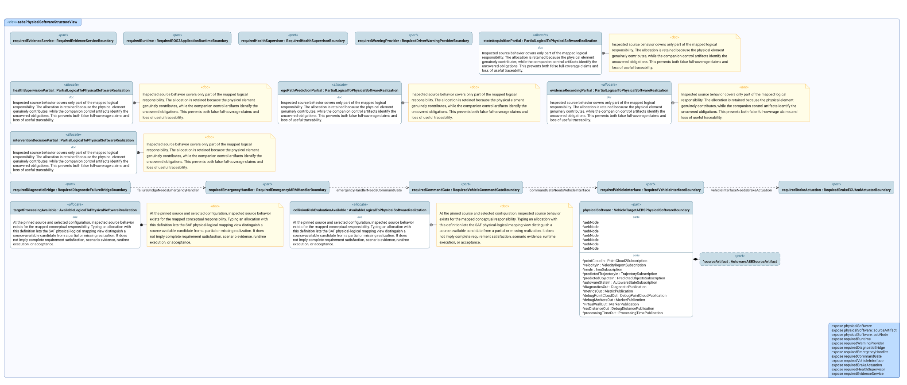

### `aebsPhysicalSoftwareInterfaceView`

Reviewers need the reusable ROS 2 message and port definitions plus the exact typed topic usages on the pinned Autoware AEB node.

- **Source:** `aebs_physical_software_realization.sysml`
- **Viewpoint:** `selectedPhysicalInterfaceViewpoint` (`PhysicalInterfaceDefinitionViewpoint`)
- **Concern:** `physicalInterfaceConcern`
- **Exposes:** `PointCloud2Message`, `VelocityReportMessage`, `ImuMessage`, `TrajectoryMessage`, `PredictedObjectsMessage`, `AutowareStateMessage`, `DiagnosticArrayMessage`, `MetricArrayMessage`, `DebugPointCloudMessage`, `MarkerArrayMessage`, `Float32StampedMessage`, `ProcessingTimeDetailMessage`, `ROS2TopicEndpoint`, `ROS2TopicSubscription`, `ROS2TopicPublication`, `ROS2PublishSubscribeTopicInterface`, `PointCloud2Subscription`, `VelocityReportSubscription`, `ImuSubscription`, `TrajectorySubscription`, `PredictedObjectsSubscription`, `AutowareStateSubscription`, `DiagnosticPublication`, `MetricPublication`, `DebugPointCloudPublication`, `MarkerPublication`, `DebugDistancePublication`, `ProcessingTimePublication`, `physicalSoftware::*`, `physicalSoftware::aebNode::*`, `requiredRuntime`
- **Render:** `asTreeDiagram`

- **Diagram status:** Published from the committed SysIDE SVG.
- **Presentation note:** This is a dense review artifact; open the SVG at full size rather than reading it from the page thumbnail.

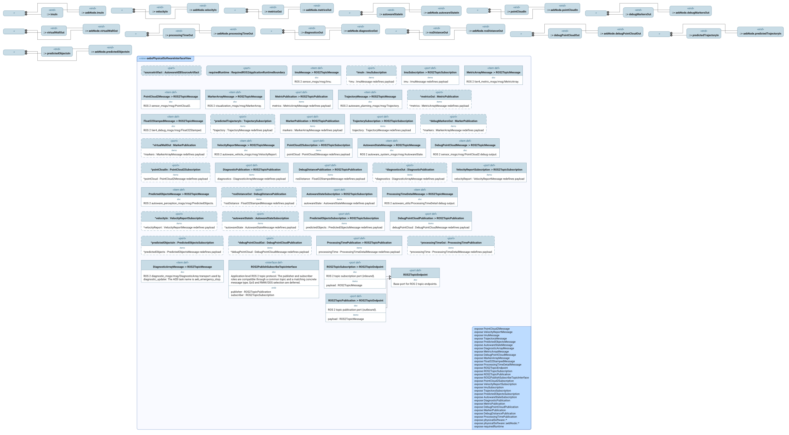

### `aebsPhysicalLogicalMappingView`

Reviewers need available and partial mappings separated from blocked and missing responsibilities; no mapping may imply requirement satisfaction.

- **Source:** `aebs_physical_software_realization.sysml`
- **Viewpoint:** `selectedPhysicalLogicalMappingViewpoint` (`PhysicalLogicalMappingViewpoint`)
- **View type:** `MVD::MatrixView`
- **Concern:** `physicalLogicalMappingConcern`
- **Exposes:** `system::stateAcquisition`, `system::egoPathPrediction`, `system::targetProcessing`, `system::collisionRiskEvaluation`, `system::interventionDecision`, `system::warningManagement`, `system::emergencyCoordination`, `system::healthSupervision`, `system::evidenceRecording`, `physicalSoftware::aebNode`, `requiredWarningProvider`, `requiredDiagnosticBridge`, `requiredEmergencyHandler`, `requiredCommandGate`, `requiredVehicleInterface`, `requiredBrakeActuation`, `requiredHealthSupervisor`, `requiredEvidenceService`, `DE4SDV_AEBSPhysicalSoftwareRealization::*`

- **Diagram status:** Published from the committed SysIDE SVG.
- **Presentation note:** The single-column grid is narrower than its title; the mapping cells remain readable at full size.

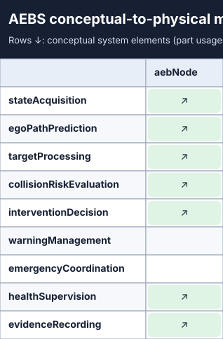

## `aebs_regulatory_criterion_verification.sysml`

### `aebs009IVerificationAssuranceView`

Evidence-based assurance claims and their supporting argumentation.

- **Source:** `aebs_regulatory_criterion_verification.sysml`
- **Viewpoint:** `selectedArgumentationAssuranceViewpoint` (`ArgumentationAssuranceViewpoint`)
- **Concern:** `argumentationAssuranceConcern`
- **Exposes:** `DE4SDV_AEBS009IVerification::*`
- **Render:** `asTreeDiagram`

- **Diagram status:** Published from the committed SysIDE SVG.
- **Presentation note:** This is a dense review artifact; open the SVG at full size rather than reading it from the page thumbnail.

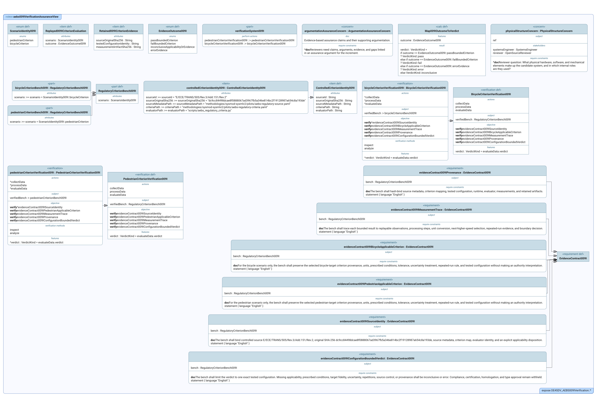

## `aebs_simulation_deployment.sysml`

### `aebsSimulationPhysicalContextView`

Shows the physical system of interest together with the external context used for this engineering slice.

- **Source:** `aebs_simulation_deployment.sysml`
- **Viewpoint:** `selected` (`PhysicalContextDefinitionViewpoint`)
- **Concern:** `physicalContextConcern`
- **Exposes:** `deployment::candidateVehicleSystem1`, `deployment::simulationEvidenceSystem2`
- **Render:** `asTreeDiagram`

- **Diagram status:** Published from the committed SysIDE SVG.
- **Presentation note:** This is a dense review artifact; open the SVG at full size rather than reading it from the page thumbnail.

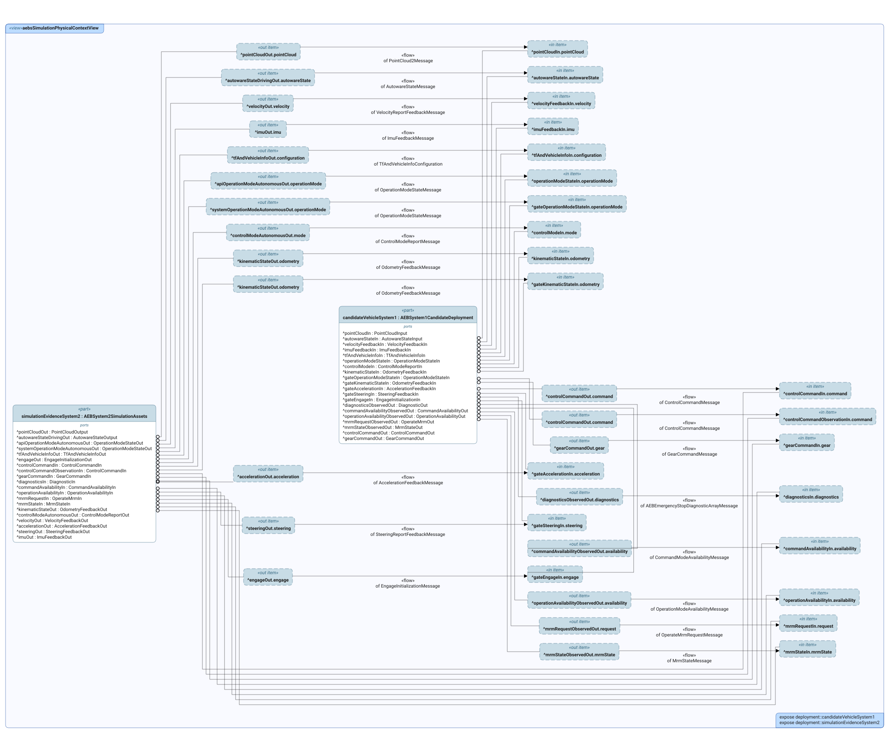

### `aebsSimulationPhysicalContextExchangeView`

The candidate vehicle deployment is System 1.

- **Source:** `aebs_simulation_deployment.sysml`
- **Viewpoint:** `selected` (`PhysicalContextExchangeViewpoint`)
- **Concern:** `physicalContextExchangeConcern`
- **Exposes:** `deployment::candidateVehicleSystem1`, `deployment::simulationEvidenceSystem2`, `deployment::candidateVehicleSystem1::*[istype SysML::PortUsage]`, `deployment::simulationEvidenceSystem2::*[istype SysML::PortUsage]`, `deployment::*[istype SysML::FlowUsage]`
- **Depth:** `-1`
- **Render:** `asInterconnectionDiagram`

- **Diagram status:** Published from the committed SysIDE SVG.

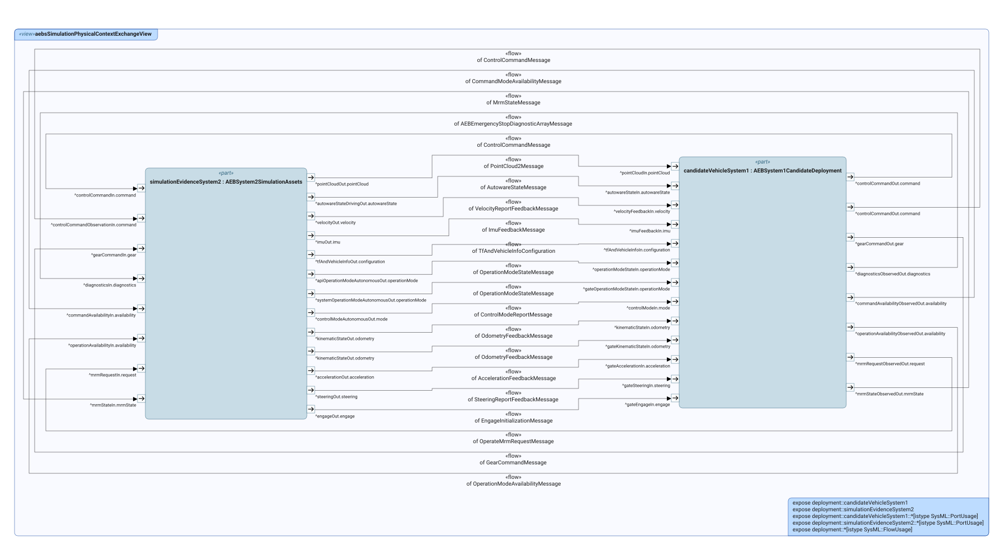

### `aebsSimulationPhysicalExchangeTypeView`

Catalogues the physical exchange types used at the modeled boundary.

- **Source:** `aebs_simulation_deployment.sysml`
- **Viewpoint:** `selected` (`PhysicalInterfaceDefinitionViewpoint`)
- **Concern:** `physicalExchangeTypeConcern`
- **Exposes:** `DE4SDV_AEBSSimulationDeployment::*`
- **Render:** `asTreeDiagram`

- **Diagram status:** Not yet published in this folder.

_Diagram not present: `diagrams/diagram-aebsSimulationPhysicalExchangeTypeView.svg` (regenerate via the Privileged Syside Validation workflow)._

### `aebsSimulationPhysicalStructureView`

Shows the selected physical or software parts and their structural decomposition.

- **Source:** `aebs_simulation_deployment.sysml`
- **Viewpoint:** `selected` (`PhysicalStructureDefinitionViewpoint`)
- **Concern:** `physicalStructureConcern`
- **Exposes:** `deployment`, `deployment::candidateVehicleSystem1::*`, `deployment::simulationEvidenceSystem2::*`
- **Render:** `asTreeDiagram`

- **Diagram status:** Not yet published in this folder.

_Diagram not present: `diagrams/diagram-aebsSimulationPhysicalStructureView.svg` (regenerate via the Privileged Syside Validation workflow)._

### `aebsSimulationPhysicalInterfaceView`

Shows the physical interfaces and typed items used by the selected realization.

- **Source:** `aebs_simulation_deployment.sysml`
- **Viewpoint:** `selected` (`PhysicalInterfaceDefinitionViewpoint`)
- **Concern:** `physicalInterfaceConcern`
- **Exposes:** `ROS2TopicMessage`, `ROS2TopicSubscription`, `ROS2TopicPublication`, `ROS2PublishSubscribeTopicInterface`, `DiagnosticIn`, `DiagnosticOut`, `PointCloudInput`, `PointCloudOutput`, `AutowareStateInput`, `AutowareStateOutput`, `CommandAvailabilityIn`, `CommandAvailabilityOut`, `OperationAvailabilityIn`, `OperationAvailabilityOut`, `OperationModeStateIn`, `OperationModeStateOut`, `ControlModeReportIn`, `ControlModeReportOut`, `GearCommandIn`, `GearCommandOut`, `OperateMrmIn`, `OperateMrmOut`, `MrmStateIn`, `MrmStateOut`, `EmergencyStopOperatorStatusIn`, `EmergencyStopOperatorStatusOut`, `ControlCommandIn`, `ControlCommandOut`, `ScenarioControlIn`, `ScenarioControlOut`, `VectorMapInitializationIn`, `VectorMapInitializationOut`, `InitialPoseIn`, `InitialPoseOut`, `PlannedTrajectoryIn`, `PlannedTrajectoryOut`, `EngageInitializationIn`, `EngageInitializationOut`, `TfAndVehicleInfoIn`, `TfAndVehicleInfoOut`, `OdometryFeedbackIn`, `OdometryFeedbackOut`, `VelocityFeedbackIn`, `VelocityFeedbackOut`, `AccelerationFeedbackIn`, `AccelerationFeedbackOut`, `SteeringFeedbackIn`, `SteeringFeedbackOut`, `ImuFeedbackIn`, `ImuFeedbackOut`, `VehicleStatusFeedbackIn`, `VehicleStatusFeedbackOut`, `EvidenceObservationOut`
- **Render:** `asTreeDiagram`

- **Diagram status:** Published from the committed SysIDE SVG.
- **Presentation note:** This is a dense review artifact; open the SVG at full size rather than reading it from the page thumbnail.

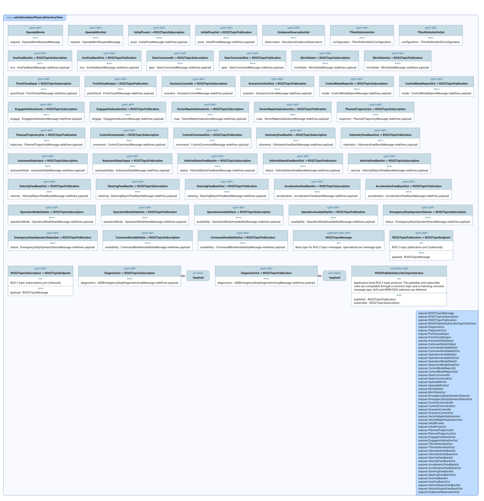

### `aebsSimulationPhysicalLogicalMappingView`

Maps logical responsibilities to the physical elements selected to realize them.

- **Source:** `aebs_simulation_deployment.sysml`
- **Viewpoint:** `selected` (`PhysicalLogicalMappingViewpoint`)
- **View type:** `MVD::MatrixView`
- **Concern:** `physicalLogicalMappingConcern`
- **Exposes:** `system::stateAcquisition`, `system::interventionDecision`, `system::emergencyCoordination`, `deployment::candidateVehicleSystem1::aeb`, `deployment::candidateVehicleSystem1::aggregator`, `deployment::candidateVehicleSystem1::commandModeToOperationModeAvailabilityConverter`, `deployment::candidateVehicleSystem1::mrmHandler`, `deployment::candidateVehicleSystem1::emergencyStopOperator`, `deployment::candidateVehicleSystem1::legacyVehicleCommandGate`, `DE4SDV_AEBSSimulationDeployment::*`

- **Diagram status:** Published from the committed SysIDE SVG.

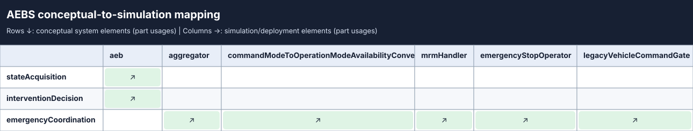

### `aebsSimulationPhysicalLogicalItemMappingView`

Maps logical information items to the physical exchange items that carry them.

- **Source:** `aebs_simulation_deployment.sysml`
- **Viewpoint:** `selected` (`PhysicalLogicalMappingViewpoint`)
- **View type:** `MVD::MatrixView`
- **Concern:** `physicalLogicalItemMappingConcern`
- **Exposes:** `system::emergencyInterventionRequestOut::emergencyInterventionRequest`, `system::vehicleMotionObservationIn::vehicleMotionState`, `deployment::candidateVehicleSystem1::mrmHandler::operateMrmOut::request`, `deployment::candidateVehicleSystem1::legacyVehicleCommandGate::emergencyControlCommandIn::command`, `deployment::candidateVehicleSystem1::velocityFeedbackIn::velocity`, `deployment::candidateVehicleSystem1::kinematicStateIn::odometry`, `DE4SDV_AEBSSimulationDeployment::*`

- **Diagram status:** Published from the committed SysIDE SVG.

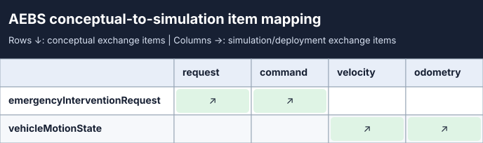

## `aebs_visualization_framing.sysml`

### `aebsVisualizationFramingView`

Reviewers need the visualization classified as System 2 engineering and evidence instrumentation, not as a product feature or production HMI.

- **Source:** `aebs_visualization_framing.sysml`
- **Viewpoint:** `selectedFramingViewpoint` (`IncrementFramingViewpoint`)
- **Concern:** `visualizationProvenanceConcern`
- **Exposes:** `VisualizationIncrement::*`
- **Render:** `asTreeDiagram`

- **Diagram status:** Withheld because the validated SVG contains only the view frame and expose row; no model elements materialized.

_Diagram not present: `diagrams/diagram-aebsVisualizationFramingView.svg` (regenerate via the Privileged Syside Validation workflow)._

## `aebs_visualization_functional_architecture.sysml`

### `aebsVisualizationFunctionStructureView`

Shows the functional decomposition of the engineering visualization chain.

- **Source:** `aebs_visualization_functional_architecture.sysml`
- **Viewpoint:** `selectedFunctionStructureViewpoint` (`SystemStructureDefinitionViewpoint`)
- **Concern:** `visualizationFunctionStructureConcern`
- **Exposes:** `aebsVisualizationFunctionalFlow`
- **Render:** `asTreeDiagram`

- **Diagram status:** Not yet published in this folder.

_Diagram not present: `diagrams/diagram-aebsVisualizationFunctionStructureView.svg` (regenerate via the Privileged Syside Validation workflow)._

### `aebsVisualizationFunctionInternalExchangeView`

Shows how visualization functions exchange observation and evidence information.

- **Source:** `aebs_visualization_functional_architecture.sysml`
- **Viewpoint:** `selectedFunctionExchangeViewpoint` (`SystemInternalExchangeViewpoint`)
- **Concern:** `visualizationFunctionExchangeConcern`
- **Exposes:** `aebsVisualizationFunctionalFlow`, `aebsVisualizationFunctionalFlow::**`
- **Depth:** `-1`
- **Render:** `asInterconnectionDiagram`

- **Diagram status:** Withheld because the validated SVG contains only the view frame and expose rows; no exchange topology or endpoints materialized.

_Diagram not present: `diagrams/diagram-aebsVisualizationFunctionInternalExchangeView.svg` (regenerate via the Privileged Syside Validation workflow)._

### `aebsVisualizationFunctionRequirementMappingView`

Maps visualization requirements to the functions that address them.

- **Source:** `aebs_visualization_functional_architecture.sysml`
- **Viewpoint:** `selectedFunctionMappingViewpoint` (`SystemFunctionMappingViewpoint`)
- **View type:** `MVD::MatrixView`
- **Concern:** `visualizationFunctionMappingConcern`
- **Exposes:** `DE4SDV_AEBSVisualizationNeedsRequirements::reqSourceFidelity`, `DE4SDV_AEBSVisualizationNeedsRequirements::reqNativeParticipation`, `DE4SDV_AEBSVisualizationNeedsRequirements::reqDe4sdvParticipation`, `DE4SDV_AEBSVisualizationNeedsRequirements::reqNonInterference`, `DE4SDV_AEBSVisualizationNeedsRequirements::reqFailClosedFreshness`, `DE4SDV_AEBSVisualizationNeedsRequirements::reqAvailabilityDisposition`, `DE4SDV_AEBSVisualizationNeedsRequirements::reqInvalidRejection`, `DE4SDV_AEBSVisualizationNeedsRequirements::reqRestorationBehavior`, `DE4SDV_AEBSVisualizationNeedsRequirements::reqRealAAOSRendering`, `DE4SDV_AEBSVisualizationNeedsRequirements::reqEvidenceCorrelation`, `AebsVisualizationFunctionalFlow::observe`, `AebsVisualizationFunctionalFlow::assemble`, `AebsVisualizationFunctionalFlow::validate`, `AebsVisualizationFunctionalFlow::supervise`, `AebsVisualizationFunctionalFlow::transport`, `AebsVisualizationFunctionalFlow::publish`, `AebsVisualizationFunctionalFlow::present`, `AebsVisualizationFunctionalFlow::record`, `DE4SDV_AEBSVisualizationFunctionalArchitecture::*`

- **Diagram status:** Withheld because the validated native grid export reported no rows or columns. The model view remains authoritative, but the native diagram frame is not a usable mapping matrix.

_Diagram not present: `diagrams/diagram-matrix-aebsVisualizationFunctionRequirementMappingView.svg` (regenerate via the Privileged Syside Validation workflow)._

## `aebs_visualization_logical_architecture.sysml`

### `aebsVisualizationLogicalStructureView`

Shows the logical roles that collect, transport, present, and retain visualization evidence.

- **Source:** `aebs_visualization_logical_architecture.sysml`
- **Viewpoint:** `selectedLogicalStructureViewpoint` (`SystemStructureDefinitionViewpoint`)
- **Concern:** `visualizationLogicalStructureConcern`
- **Exposes:** `logicalSystem`, `logicalSystem::nativeAebSource`, `logicalSystem::coordinatorSource`, `logicalSystem::sourceAdapter`, `logicalSystem::transport`, `logicalSystem::ingress`, `logicalSystem::displayService`, `logicalSystem::application`, `logicalSystem::evidence`, `logicalSystem::healthSupervisor`
- **Render:** `asTreeDiagram`

- **Diagram status:** Not yet published in this folder.

_Diagram not present: `diagrams/diagram-aebsVisualizationLogicalStructureView.svg` (regenerate via the Privileged Syside Validation workflow)._

### `aebsVisualizationLogicalInternalExchangeView`

Shows the typed exchanges between the logical visualization roles.

- **Source:** `aebs_visualization_logical_architecture.sysml`
- **Viewpoint:** `selectedLogicalExchangeViewpoint` (`SystemInternalExchangeViewpoint`)
- **Concern:** `visualizationLogicalExchangeConcern`
- **Exposes:** `logicalSystem`, `logicalSystem::**`
- **Depth:** `-1`
- **Render:** `asInterconnectionDiagram`

- **Diagram status:** Not yet published in this folder.

_Diagram not present: `diagrams/diagram-aebsVisualizationLogicalInternalExchangeView.svg` (regenerate via the Privileged Syside Validation workflow)._

## `aebs_visualization_needs_requirements.sysml`

### `aebsVisualizationNeedsView`

Lists the stakeholder needs that justify the engineering visualization slice.

- **Source:** `aebs_visualization_needs_requirements.sysml`
- **Viewpoint:** `selectedNeedsViewpoint` (`StakeholderRequirementDefinitionViewpoint`)
- **View type:** `TVD::TableView`
- **Concern:** `visualizationNeedsConcern`
- **Exposes:** `VisualizationNeeds::*`

- **Diagram status:** Not yet published in this folder.

_Diagram not present: `diagrams/diagram-table-aebsVisualizationNeedsView.svg` (regenerate via the Privileged Syside Validation workflow)._

### `aebsVisualizationRequirementTraceView`

Shows how visualization requirements trace to needs and downstream architecture.

- **Source:** `aebs_visualization_needs_requirements.sysml`
- **Viewpoint:** `selectedTraceViewpoint` (`SystemRequirementTraceabilityViewpoint`)
- **Concern:** `visualizationRequirementTraceConcern`
- **Exposes:** `VisualizationNeeds::*`, `VisualizationRequirements::*`
- **Render:** `asTreeDiagram`

- **Diagram status:** Not yet published in this folder.

_Diagram not present: `diagrams/diagram-aebsVisualizationRequirementTraceView.svg` (regenerate via the Privileged Syside Validation workflow)._

## `aebs_visualization_operational_context.sysml`

### `aebsVisualizationOperationalContextView`

Reviewers need the visualization observation scenarios, their fail-closed dispositions, and their separation from the unchanged System 1 AEBS story to be visible.

- **Source:** `aebs_visualization_operational_context.sysml`
- **Viewpoint:** `selectedOperationalViewpoint` (`OperationalContextDefinitionViewpoint`)
- **Concern:** `visualizationScenarioConcern`
- **Exposes:** `aebsVisualizationStory`
- **Depth:** `1`
- **Render:** `asTreeDiagram`

- **Diagram status:** Not yet published in this folder.

_Diagram not present: `diagrams/diagram-aebsVisualizationOperationalContextView.svg` (regenerate via the Privileged Syside Validation workflow)._

## `aebs_visualization_physical_software_realization.sysml`

### `aebsVisualizationPhysicalStructureView`

Shows the deployed parts that implement the visualization evidence chain.

- **Source:** `aebs_visualization_physical_software_realization.sysml`
- **Viewpoint:** `selectedPhysicalStructureViewpoint` (`PhysicalStructureDefinitionViewpoint`)
- **Concern:** `visualizationPhysicalStructureConcern`
- **Exposes:** `physicalSystem`, `physicalSystem::pinnedAeb`, `physicalSystem::coordinator`, `physicalSystem::sourceAdapter`, `physicalSystem::transport`, `physicalSystem::iviGuest`, `physicalSystem::iviGuest::gatewayIngress`, `physicalSystem::iviGuest::dataTunnel`, `physicalSystem::iviGuest::displayApp`, `physicalSystem::evidenceRecorder`, `gateIviBuildBoot`, `gateFrameworkServices`, `gateGatewayJavaSample`, `gateNativeToJavaPayload`, `gateVmToVmConnectivity`, `gateNoUpstreamFork`, `realizationKillGate`
- **Render:** `asTreeDiagram`

- **Diagram status:** Not yet published in this folder.

_Diagram not present: `diagrams/diagram-aebsVisualizationPhysicalStructureView.svg` (regenerate via the Privileged Syside Validation workflow)._

### `aebsVisualizationPhysicalInternalExchangeView`

Shows the exchanges across the selected physical visualization realization.

- **Source:** `aebs_visualization_physical_software_realization.sysml`
- **Viewpoint:** `selectedPhysicalExchangeViewpoint` (`PhysicalInternalExchangeViewpoint`)
- **Concern:** `visualizationPhysicalExchangeConcern`
- **Exposes:** `physicalSystem`, `physicalSystem::**`
- **Depth:** `-1`
- **Render:** `asInterconnectionDiagram`

- **Diagram status:** Not yet published in this folder.

_Diagram not present: `diagrams/diagram-aebsVisualizationPhysicalInternalExchangeView.svg` (regenerate via the Privileged Syside Validation workflow)._

### `aebsVisualizationPhysicalLogicalMappingView`

Maps logical visualization responsibilities to their selected physical realization.

- **Source:** `aebs_visualization_physical_software_realization.sysml`
- **Viewpoint:** `selectedPhysicalLogicalViewpoint` (`PhysicalLogicalMappingViewpoint`)
- **View type:** `MVD::MatrixView`
- **Concern:** `visualizationProvenanceMappingConcern`
- **Exposes:** `logicalSystem::nativeAebSource`, `logicalSystem::coordinatorSource`, `logicalSystem::sourceAdapter`, `logicalSystem::transport`, `logicalSystem::ingress`, `logicalSystem::displayService`, `logicalSystem::application`, `logicalSystem::evidence`, `logicalSystem::healthSupervisor`, `physicalSystem::pinnedAeb`, `physicalSystem::coordinator`, `physicalSystem::sourceAdapter`, `physicalSystem::transport`, `physicalSystem::iviGuest::gatewayIngress`, `physicalSystem::iviGuest::dataTunnel`, `physicalSystem::iviGuest::displayApp`, `physicalSystem::evidenceRecorder`, `DE4SDV_AEBSVisualizationPhysicalSoftwareRealization::*`

- **Diagram status:** Not yet published in this folder.

_Diagram not present: `diagrams/diagram-matrix-aebsVisualizationPhysicalLogicalMappingView.svg` (regenerate via the Privileged Syside Validation workflow)._

## `aebs_visualization_variability_configuration.sysml`

### `aebsVisualizationProductLineConfigurationView`

Reviewers need the test article's inherited variant selections to be visible as unchanged reuse of the accepted reference member.

- **Source:** `aebs_visualization_variability_configuration.sysml`
- **Viewpoint:** `selectedConfigurationViewpoint` (`ProductLineConfigurationViewpoint`)
- **Concern:** `visualizationProductLineConfigurationConcern`
- **Exposes:** `MiddlewareAutowareAAOSSDVReference`, `inheritedPlatformStack`, `testArticle`, `reusedBoFSource`, `reusedProductProjection`
- **Render:** `asTreeDiagram`

- **Diagram status:** Not yet published in this folder.

_Diagram not present: `diagrams/diagram-aebsVisualizationProductLineConfigurationView.svg` (regenerate via the Privileged Syside Validation workflow)._

### `aebsVisualizationProductModelAssemblyView`

Reviewers need the instrumented test-article assembly — accepted platform stack plus the deployed visualization chain — to be visible.

- **Source:** `aebs_visualization_variability_configuration.sysml`
- **Viewpoint:** `selectedAssemblyViewpoint` (`ProductModelAssemblyViewpoint`)
- **Concern:** `visualizationProductModelAssemblyConcern`
- **Exposes:** `AEBSAutowareAAOSSDVVisualizationTestArticle`, `AEBSAutowareAAOSSDVVisualizationTestArticle::visualizationChain`, `AEBSAutowareAAOSSDVVisualizationTestArticle::aebsCapabilityBaseline`, `testArticle`
- **Render:** `asTreeDiagram`

- **Diagram status:** Not yet published in this folder.

_Diagram not present: `diagrams/diagram-aebsVisualizationProductModelAssemblyView.svg` (regenerate via the Privileged Syside Validation workflow)._
