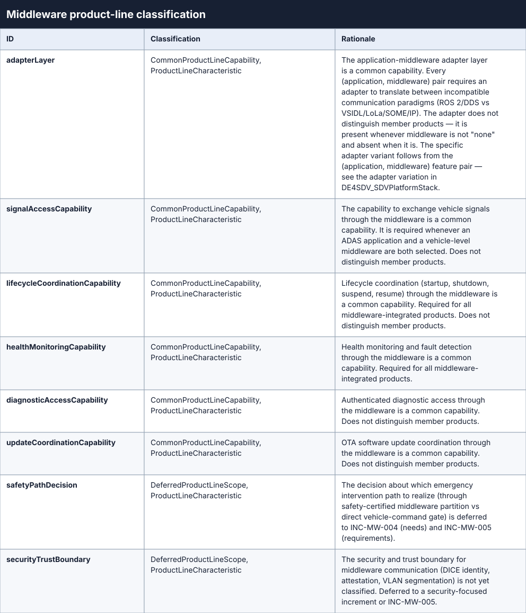
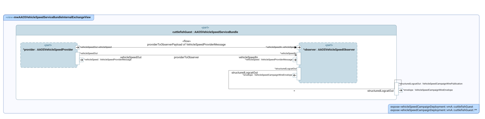
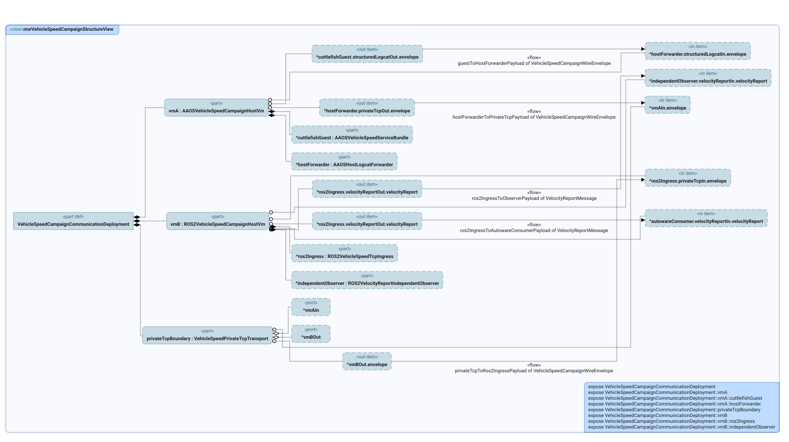
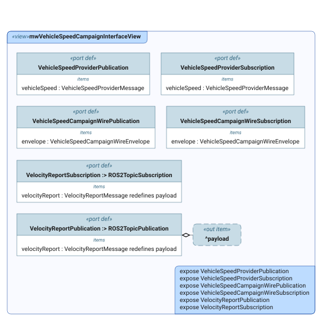
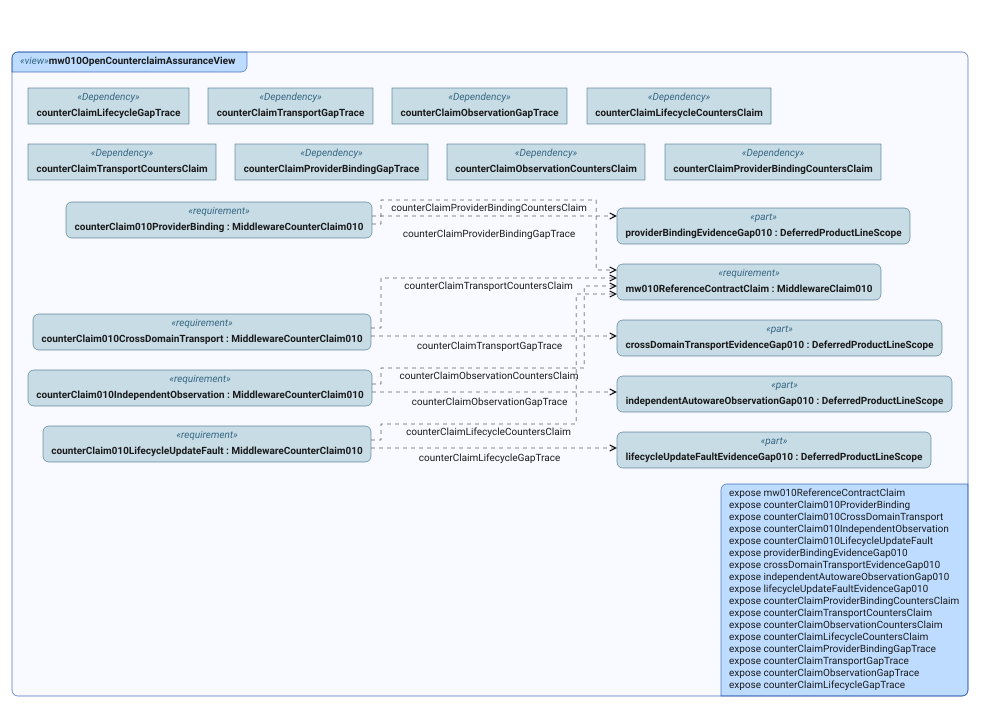

# Middleware Views

This index lists every SysML v2 `view` declared in the `.sysml` files of
this folder, with the diagram SysIDE renders from it (`syside viz view`,
run by the Privileged Syside Validation workflow). The SVGs live in
[`diagrams/`](diagrams/) beside the model files.

Generated by `scripts/generate_view_index.py` — do not edit by hand.

**10 files, 22 views.**

## `mw_feature_classification.sysml`

### `mwProductLineClassificationView`

- **Source:** `mw_feature_classification.sysml`
- **Viewpoint:** `selectedProductLineClassificationViewpoint` (`ProductLineClassificationViewpoint`)
- **View type:** `TVD::TableView`
- **Concern:** `productLineCapabilityClassificationConcern`
- **Exposes:** `FeatureClassification::adapterLayer`, `FeatureClassification::signalAccessCapability`, `FeatureClassification::lifecycleCoordinationCapability`, `FeatureClassification::healthMonitoringCapability`, `FeatureClassification::diagnosticAccessCapability`, `FeatureClassification::updateCoordinationCapability`, `FeatureClassification::safetyPathDecision`, `FeatureClassification::securityTrustBoundary`

## `mw_functional_architecture.sysml`

### `mwFunctionalBehaviorView`

- **Source:** `mw_functional_architecture.sysml`
- **Viewpoint:** `selectedFunctionalBehaviorViewpoint` (`SystemFunctionalBreakdownStructureViewpoint`)
- **Concern:** `functionalBehaviorConcern`
- **Exposes:** `MiddlewareIntegrationFunctionalFlow`, `MiddlewareIntegrationFunctionalFlow::translateSignal`, `MiddlewareIntegrationFunctionalFlow::proxyDiagnostics`, `MiddlewareIntegrationFunctionalFlow::coordinateLifecycle`, `MiddlewareIntegrationFunctionalFlow::forwardHealth`, `MiddlewareIntegrationFunctionalFlow::coordinateUpdate`, `MiddlewareIntegrationFunctionalFlow::bindService`, `MiddlewareIntegrationFunctionalFlow::protectSafetyPath`
- **Render:** `asTreeDiagram`

### `mwFunctionalInterfaceView`

- **Source:** `mw_functional_architecture.sysml`
- **Viewpoint:** `selectedFunctionalInterfaceViewpoint` (`SystemInterfaceDefinitionViewpoint`)
- **Concern:** `functionalInterfaceConcern`
- **Exposes:** `FunctionalArchitecture::VehicleSignalAccessInbound`, `FunctionalArchitecture::VehicleSignalAccessOutbound`, `FunctionalArchitecture::DiagnosticAccessInbound`, `FunctionalArchitecture::DiagnosticAccessOutbound`, `FunctionalArchitecture::LifecycleCoordinationInbound`, `FunctionalArchitecture::LifecycleCoordinationOutbound`, `FunctionalArchitecture::HealthStatusInbound`, `FunctionalArchitecture::HealthStatusOutbound`, `FunctionalArchitecture::UpdateCoordinationInbound`, `FunctionalArchitecture::UpdateCoordinationOutbound`, `FunctionalArchitecture::ServiceBindingInbound`, `FunctionalArchitecture::ServiceBindingOutbound`, `FunctionalArchitecture::SafetyPathStatusOutbound`
- **Render:** `asTreeDiagram`

## `mw_increment_framing.sysml`

### `mwIncrementAssuranceView`

- **Source:** `mw_increment_framing.sysml`
- **Viewpoint:** `selectedIncrementAssuranceViewpoint` (`ArgumentationAssuranceViewpoint`)
- **Concern:** `mwIncrementAssuranceConcern`
- **Exposes:** `IncrementFraming::*`
- **Render:** `asTreeDiagram`

## `mw_logical_architecture.sysml`

### `mwSystemStructureView`

- **Source:** `mw_logical_architecture.sysml`
- **Viewpoint:** `selectedSystemStructureViewpoint` (`SystemStructureDefinitionViewpoint`)
- **Concern:** `conceptualStructureConcern`
- **Exposes:** `MiddlewareSystem`
- **Depth:** `1`
- **Render:** `asTreeDiagram`

### `mwSystemFunctionMappingView`

- **Source:** `mw_logical_architecture.sysml`
- **Viewpoint:** `selectedSystemFunctionMappingViewpoint` (`SystemFunctionMappingViewpoint`)
- **View type:** `MVD::MatrixView`
- **Concern:** `conceptualFunctionMappingConcern`
- **Exposes:** `functionalFlow::translateSignal`, `functionalFlow::proxyDiagnostics`, `functionalFlow::coordinateLifecycle`, `functionalFlow::forwardHealth`, `functionalFlow::coordinateUpdate`, `functionalFlow::bindService`, `functionalFlow::protectSafetyPath`, `system::signalTranslator`, `system::diagnosticProxy`, `system::lifecycleBridge`, `system::healthProxy`, `system::updateCoordinator`, `system::serviceBindingManager`, `DE4SDV_MWLogicalArchitecture::*`

## `mw_operational_context.sysml`

### `mwOperationalContextView`

- **Source:** `mw_operational_context.sysml`
- **Viewpoint:** `selectedOperationalContextViewpoint` (`OperationalContextDefinitionViewpoint`)
- **Concern:** `operationalContextConcern`
- **Exposes:** `MiddlewareOperationalContext`
- **Depth:** `1`
- **Render:** `asTreeDiagram`

### `mwOperationalStoryView`

- **Source:** `mw_operational_context.sysml`
- **Viewpoint:** `selectedOperationalStoryViewpoint` (`OperationalStoryViewpoint`)
- **Concern:** `operationalStoryConcern`
- **Exposes:** `OperationalContext::'integrate ADAS with vehicle platform'`, `OperationalContext::'integrate ADAS with vehicle platform'::*`
- **Depth:** `1`
- **Render:** `asTreeDiagram`

### `mwOperationalCapabilityView`

- **Source:** `mw_operational_context.sysml`
- **Viewpoint:** `selectedOperationalCapabilityViewpoint` (`OperationalCapabilityDefinitionViewpoint`)
- **Concern:** `operationalCapabilityConcern`
- **Exposes:** `MiddlewareIntegrationOperationalCapability`
- **Depth:** `1`
- **Render:** `asTreeDiagram`

## `mw_physical_software_realization.sysml`

### `mwPhysicalStructureView`

- **Source:** `mw_physical_software_realization.sysml`
- **Viewpoint:** `selectedPhysicalStructureViewpoint` (`PhysicalStructureDefinitionViewpoint`)
- **Concern:** `physicalStructureConcern`
- **Exposes:** `MiddlewarePhysicalSoftwareBoundary`
- **Depth:** `1`
- **Render:** `asTreeDiagram`

### `mwAdapterBoundaryExchangeView`

- **Source:** `mw_physical_software_realization.sysml`
- **Viewpoint:** `selectedAdapterBoundaryExchangeViewpoint` (`PhysicalInternalExchangeViewpoint`)
- **Concern:** `adapterBoundaryExchangeConcern`
- **Exposes:** `MiddlewarePhysicalSoftwareBoundary::adapter`, `MiddlewarePhysicalSoftwareBoundary::adapter::**`, `MiddlewarePhysicalSoftwareBoundary::aaosSdvBoundary`, `MiddlewarePhysicalSoftwareBoundary::autowareRos2Boundary`, `MiddlewarePhysicalSoftwareBoundary::autowareRos2Boundary::*`
- **Depth:** `-1`
- **Render:** `asInterconnectionDiagram`

### `mwAAOSVehicleSpeedServiceBundleInternalExchangeView`

- **Source:** `mw_physical_software_realization.sysml`
- **Viewpoint:** `selectedAAOSVehicleSpeedServiceBundleInternalExchangeViewpoint` (`PhysicalInternalExchangeViewpoint`)
- **Concern:** `vehicleSpeedServiceBundleInternalExchangeConcern`
- **Exposes:** `vehicleSpeedCampaignDeployment::vmA::cuttlefishGuest`, `vehicleSpeedCampaignDeployment::vmA::cuttlefishGuest::**`
- **Depth:** `-1`
- **Render:** `asInterconnectionDiagram`

### `mwVehicleSpeedCampaignStructureView`

- **Source:** `mw_physical_software_realization.sysml`
- **Viewpoint:** `selectedVehicleSpeedCampaignStructureViewpoint` (`PhysicalStructureDefinitionViewpoint`)
- **Concern:** `vehicleSpeedCampaignStructureConcern`
- **Exposes:** `VehicleSpeedCampaignCommunicationDeployment`, `VehicleSpeedCampaignCommunicationDeployment::vmA`, `VehicleSpeedCampaignCommunicationDeployment::vmA::cuttlefishGuest`, `VehicleSpeedCampaignCommunicationDeployment::vmA::hostForwarder`, `VehicleSpeedCampaignCommunicationDeployment::privateTcpBoundary`, `VehicleSpeedCampaignCommunicationDeployment::vmB`, `VehicleSpeedCampaignCommunicationDeployment::vmB::ros2Ingress`, `VehicleSpeedCampaignCommunicationDeployment::vmB::independentObserver`
- **Render:** `asTreeDiagram`

### `mwVehicleSpeedCampaignInterfaceView`

- **Source:** `mw_physical_software_realization.sysml`
- **Viewpoint:** `selectedVehicleSpeedCampaignInterfaceViewpoint` (`PhysicalInterfaceDefinitionViewpoint`)
- **Concern:** `vehicleSpeedCampaignInterfaceConcern`
- **Exposes:** `VehicleSpeedProviderPublication`, `VehicleSpeedProviderSubscription`, `VehicleSpeedCampaignWirePublication`, `VehicleSpeedCampaignWireSubscription`, `VelocityReportPublication`, `VelocityReportSubscription`
- **Render:** `asTreeDiagram`

### `mwPhysicalLogicalMappingView`

- **Source:** `mw_physical_software_realization.sysml`
- **Viewpoint:** `selectedPhysicalLogicalMappingViewpoint` (`PhysicalLogicalMappingViewpoint`)
- **View type:** `MVD::MatrixView`
- **Concern:** `physicalLogicalMappingConcern`
- **Exposes:** `system::signalTranslator`, `system::diagnosticProxy`, `system::lifecycleBridge`, `system::healthProxy`, `system::updateCoordinator`, `system::serviceBindingManager`, `physicalSoftware::signalAccessClient`, `physicalSoftware::diagnosticAccessClient`, `physicalSoftware::lifecycleClient`, `physicalSoftware::healthClient`, `physicalSoftware::updateClient`, `physicalSoftware::serviceDiscoveryClient`, `physicalSoftware::adapter::aaosSignal::vehicleSpeed`, `DE4SDV_MWPhysicalSoftwareRealization::*`

## `mw_requirements.sysml`

### `mwSystemRequirementsView`

- **Source:** `mw_requirements.sysml`
- **Viewpoint:** `selectedSystemRequirementsViewpoint` (`SystemRequirementDefinitionViewpoint`)
- **View type:** `TVD::TableView`
- **Concern:** `requirementTraceConcern`
- **Exposes:** `System1Product::*`, `System2EngineeringAssurance::*`

### `mwRequirementTraceView`

- **Source:** `mw_requirements.sysml`
- **Viewpoint:** `selectedRequirementTraceViewpoint` (`SystemRequirementTraceabilityViewpoint`)
- **View type:** `GeneralView`
- **Concern:** `requirementTraceConcern`
- **Exposes:** `System1Product::*`, `System2EngineeringAssurance::*`, `DE4SDV_MWOperationalContext::Features::Middleware::OperationalContext::'exchange vehicle signals'`, `DE4SDV_MWOperationalContext::Features::Middleware::OperationalContext::'access diagnostics'`, `DE4SDV_MWOperationalContext::Features::Middleware::OperationalContext::'coordinate lifecycle'`, `DE4SDV_MWOperationalContext::Features::Middleware::OperationalContext::'monitor service health'`, `DE4SDV_MWOperationalContext::Features::Middleware::OperationalContext::'coordinate software update'`, `DE4SDV_MWOperationalContext::Features::Middleware::OperationalContext::'emergency intervention via safety path'`, `DE4SDV_MWFunctionalArchitecture::Features::Middleware::FunctionalArchitecture::middlewareIntegrationFunctionalFlow`
- **Depth:** `1`

## `mw_stakeholder_needs.sysml`

### `mwStakeholderNeedsView`

- **Source:** `mw_stakeholder_needs.sysml`
- **Viewpoint:** `selectedStakeholderNeedsViewpoint` (`StakeholderRequirementDefinitionViewpoint`)
- **View type:** `TVD::TableView`
- **Concern:** `stakeholderNeedsConcern`
- **Exposes:** `System1Product::*`, `System2EngineeringAssurance::*`

## `mw_variability_configuration.sysml`

### `mwProductLineConfigurationView`

- **Source:** `mw_variability_configuration.sysml`
- **Viewpoint:** `selectedProductLineConfigurationViewpoint` (`ProductLineConfigurationViewpoint`)
- **Concern:** `productLineConfigurationConcern`
- **Exposes:** `MWAutowareAAOSSDVReference`, `selectedVehicleApplication`, `selectedMiddleware`, `selectedOperatingSystem`, `selectedHypervisor`, `selectedApplicationMiddlewareAdapter`
- **Render:** `asTreeDiagram`

### `mwProductModelAssemblyView`

- **Source:** `mw_variability_configuration.sysml`
- **Viewpoint:** `selectedProductModelAssemblyViewpoint` (`ProductModelAssemblyViewpoint`)
- **Concern:** `productModelAssemblyConcern`
- **Exposes:** `MWAutowareAAOSSDVConfiguredMember`, `MWAutowareAAOSSDVConfiguredMember::platformStack`, `MWAutowareAAOSSDVConfiguredMember::middlewareBoundary`
- **Render:** `asTreeDiagram`

## `mw_verification_evidence.sysml`

### `mw010VerificationAssuranceView`

- **Source:** `mw_verification_evidence.sysml`
- **Viewpoint:** `selectedArgumentationAssuranceViewpoint` (`ArgumentationAssuranceViewpoint`)
- **Concern:** `argumentationAssuranceConcern`
- **Exposes:** `mw010ReferenceContractClaim`, `signalTranslationArgument010`, `vehicleStartupArgument010`, `faultDetectionArgument010`, `contractAndRehearsalEvidence010`, `boundedAAOSBootBaseline010`, `runtimeCampaignEvidence011`, `claimSupportedBySignalArgument`, `claimSupportedByStartupArgument`, `claimSupportedByFaultArgument`, `contractEvidenceReinforcesArgument`, `bootBaselineReinforcesArgument`, `runtimeCampaignReinforcesSignalArgument`, `runtimeCampaignReinforcesStartupArgument`, `runtimeCampaignReinforcesFaultArgument`, `runtimeCampaignTraceToClaim`
- **Render:** `asTreeDiagram`

### `mw010OpenCounterclaimAssuranceView`

- **Source:** `mw_verification_evidence.sysml`
- **Viewpoint:** `selectedOpenCounterclaimAssuranceViewpoint` (`ArgumentationAssuranceViewpoint`)
- **Concern:** `argumentationAssuranceConcern`
- **Exposes:** `mw010ReferenceContractClaim`, `counterClaim010ProviderBinding`, `counterClaim010CrossDomainTransport`, `counterClaim010IndependentObservation`, `counterClaim010LifecycleUpdateFault`, `providerBindingEvidenceGap010`, `crossDomainTransportEvidenceGap010`, `independentAutowareObservationGap010`, `lifecycleUpdateFaultEvidenceGap010`, `counterClaimProviderBindingCountersClaim`, `counterClaimTransportCountersClaim`, `counterClaimObservationCountersClaim`, `counterClaimLifecycleCountersClaim`, `counterClaimProviderBindingGapTrace`, `counterClaimTransportGapTrace`, `counterClaimObservationGapTrace`, `counterClaimLifecycleGapTrace`
- **Render:** `asTreeDiagram`

