# Middleware Views

This index lists every SysML v2 `view` declared in the `.sysml` files of
this first-level model area. Each entry explains the reviewer question in
plain language and embeds the committed diagram SysIDE renders from the
view (`syside viz view`, run by the Privileged Syside Validation workflow).
The SVGs live in [`diagrams/`](diagrams/) beside the model files.

Generated by `scripts/generate_view_index.py` — do not edit by hand.

**10 files, 22 views, 22 published diagrams.**

## `middleware_feature_classification.sysml`

### `middlewareProductLineClassificationView`

Reviewers need middleware scope elements to distinguish common product-line capabilities from features and variation points before downstream functional modeling starts.

- **Source:** `middleware_feature_classification.sysml`
- **Viewpoint:** `selectedProductLineClassificationViewpoint` (`ProductLineClassificationViewpoint`)
- **View type:** `TVD::TableView`
- **Concern:** `productLineCapabilityClassificationConcern`
- **Exposes:** `FeatureClassification::adapterLayer`, `FeatureClassification::signalAccessCapability`, `FeatureClassification::lifecycleCoordinationCapability`, `FeatureClassification::healthMonitoringCapability`, `FeatureClassification::diagnosticAccessCapability`, `FeatureClassification::updateCoordinationCapability`, `FeatureClassification::safetyPathDecision`, `FeatureClassification::securityTrustBoundary`

- **Diagram status:** Published from the committed SysIDE SVG.

## `middleware_functional_architecture.sysml`

### `middlewareFunctionalArchitectureView`

Shows the functional actions and the behavior chain used to realize the feature intent.

- **Source:** `middleware_functional_architecture.sysml`
- **Viewpoint:** `selectedFunctionalBehaviorViewpoint` (`SystemFunctionalBreakdownStructureViewpoint`)
- **Concern:** `functionalBehaviorConcern`
- **Exposes:** `MiddlewareIntegrationFunctionalFlow`, `MiddlewareIntegrationFunctionalFlow::translateSignal`, `MiddlewareIntegrationFunctionalFlow::proxyDiagnostics`, `MiddlewareIntegrationFunctionalFlow::coordinateLifecycle`, `MiddlewareIntegrationFunctionalFlow::forwardHealth`, `MiddlewareIntegrationFunctionalFlow::coordinateUpdate`, `MiddlewareIntegrationFunctionalFlow::bindService`, `MiddlewareIntegrationFunctionalFlow::protectSafetyPath`
- **Render:** `asTreeDiagram`

- **Diagram status:** Published from the committed SysIDE SVG.

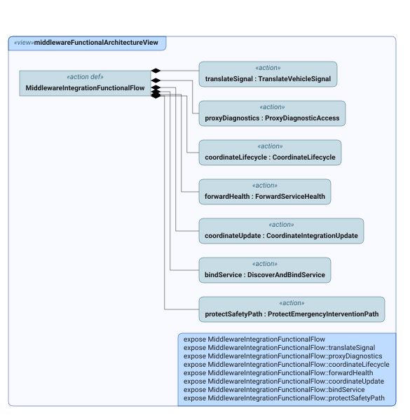

### `middlewareFunctionalInterfaceView`

Shows the functional boundary interfaces and the information items they exchange.

- **Source:** `middleware_functional_architecture.sysml`
- **Viewpoint:** `selectedFunctionalInterfaceViewpoint` (`SystemInterfaceDefinitionViewpoint`)
- **Concern:** `functionalInterfaceConcern`
- **Exposes:** `FunctionalArchitecture::VehicleSignalAccessInbound`, `FunctionalArchitecture::VehicleSignalAccessOutbound`, `FunctionalArchitecture::DiagnosticAccessInbound`, `FunctionalArchitecture::DiagnosticAccessOutbound`, `FunctionalArchitecture::LifecycleCoordinationInbound`, `FunctionalArchitecture::LifecycleCoordinationOutbound`, `FunctionalArchitecture::HealthStatusInbound`, `FunctionalArchitecture::HealthStatusOutbound`, `FunctionalArchitecture::UpdateCoordinationInbound`, `FunctionalArchitecture::UpdateCoordinationOutbound`, `FunctionalArchitecture::ServiceBindingInbound`, `FunctionalArchitecture::ServiceBindingOutbound`, `FunctionalArchitecture::SafetyPathStatusOutbound`
- **Render:** `asTreeDiagram`

- **Diagram status:** Published from the committed SysIDE SVG.

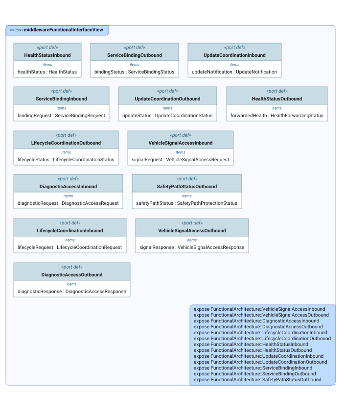

## `middleware_increment_framing.sysml`

### `middlewareIncrementAssuranceView`

Reviewers need the increment claim, scope, assumptions, gaps, and traceability shell linked in an assurance argument for this middleware framing slice.

- **Source:** `middleware_increment_framing.sysml`
- **Viewpoint:** `selectedIncrementAssuranceViewpoint` (`ArgumentationAssuranceViewpoint`)
- **Concern:** `middlewareIncrementAssuranceConcern`
- **Exposes:** `IncrementFraming::*`
- **Render:** `asTreeDiagram`

- **Diagram status:** Published from the committed SysIDE SVG.

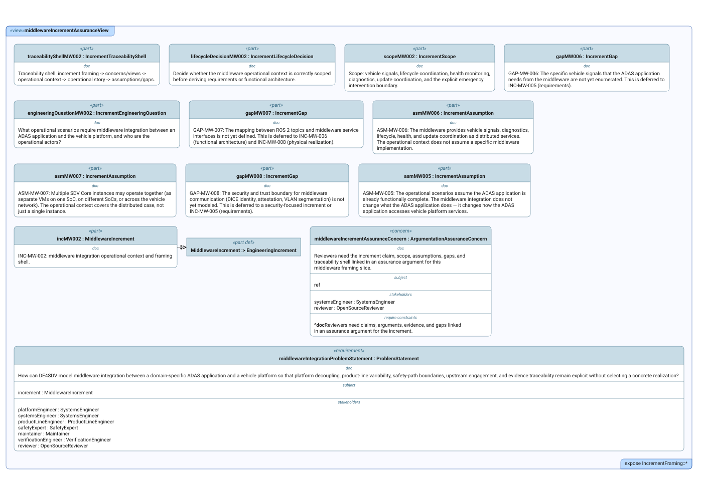

## `middleware_logical_architecture.sysml`

### `middlewareSystemStructureView`

Shows the conceptual system boundary, its responsibilities, and its internal decomposition.

- **Source:** `middleware_logical_architecture.sysml`
- **Viewpoint:** `selectedSystemStructureViewpoint` (`SystemStructureDefinitionViewpoint`)
- **Concern:** `conceptualStructureConcern`
- **Exposes:** `MiddlewareSystem`
- **Depth:** `1`
- **Render:** `asTreeDiagram`

- **Diagram status:** Published from the committed SysIDE SVG.
- **Presentation note:** The current SVG truncates at least one compartment with an ellipsis; use the linked source for the complete declaration.

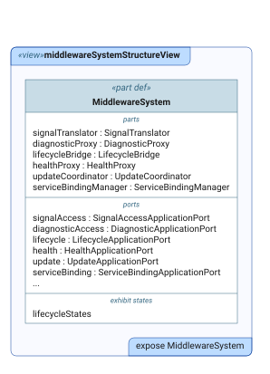

### `middlewareSystemFunctionMappingView`

Maps functional responsibilities to the conceptual system elements that perform them.

- **Source:** `middleware_logical_architecture.sysml`
- **Viewpoint:** `selectedSystemFunctionMappingViewpoint` (`SystemFunctionMappingViewpoint`)
- **View type:** `MVD::MatrixView`
- **Concern:** `conceptualFunctionMappingConcern`
- **Exposes:** `functionalFlow::translateSignal`, `functionalFlow::proxyDiagnostics`, `functionalFlow::coordinateLifecycle`, `functionalFlow::forwardHealth`, `functionalFlow::coordinateUpdate`, `functionalFlow::bindService`, `functionalFlow::protectSafetyPath`, `system::signalTranslator`, `system::diagnosticProxy`, `system::lifecycleBridge`, `system::healthProxy`, `system::updateCoordinator`, `system::serviceBindingManager`, `DE4SDV_MiddlewareLogicalArchitecture::*`

- **Diagram status:** Published from the committed SysIDE SVG.

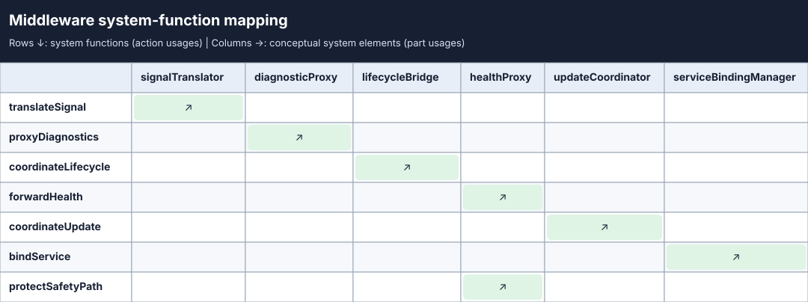

## `middleware_operational_context.sysml`

### `middlewareOperationalContextView`

Reviewers need the operational actors, context boundary, and both emergency path options visible for this increment.

- **Source:** `middleware_operational_context.sysml`
- **Viewpoint:** `selectedOperationalContextViewpoint` (`OperationalContextDefinitionViewpoint`)
- **Concern:** `operationalContextConcern`
- **Exposes:** `MiddlewareOperationalContext`
- **Depth:** `1`
- **Render:** `asTreeDiagram`

- **Diagram status:** Published from the committed SysIDE SVG.

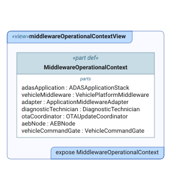

### `middlewareOperationalStoryView`

Reviewers need the operational story to show vehicle signal exchange, lifecycle, health, diagnostics, updates, and both emergency intervention options.

- **Source:** `middleware_operational_context.sysml`
- **Viewpoint:** `selectedOperationalStoryViewpoint` (`OperationalStoryViewpoint`)
- **Concern:** `operationalStoryConcern`
- **Exposes:** `OperationalContext::'integrate ADAS with vehicle platform'`, `OperationalContext::'integrate ADAS with vehicle platform'::*`
- **Depth:** `1`
- **Render:** `asTreeDiagram`

- **Diagram status:** Published from the committed SysIDE SVG.

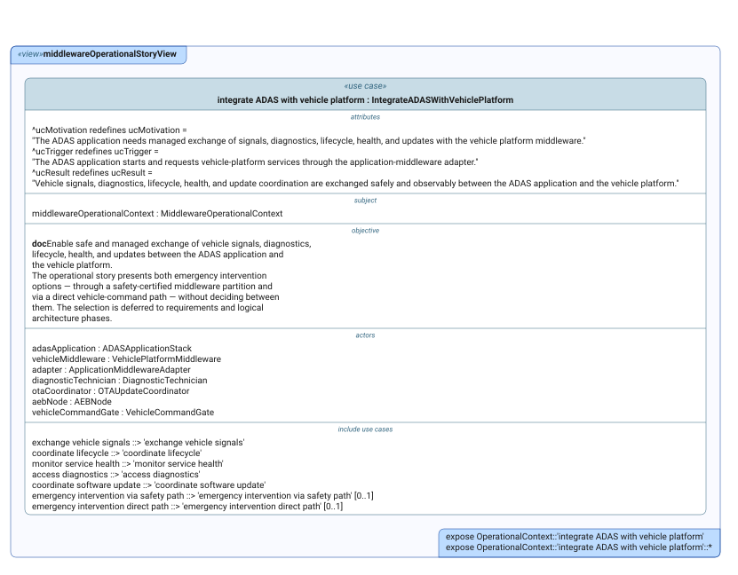

### `middlewareOperationalCapabilityView`

Reviewers need the operational capability expected from the middleware integration to be described: the system shall be able to exchange vehicle signals, diagnostics, lifecycle coordination, health status, and software updates between an ADAS application and a vehicle-level platform middleware, while presenting both emergency intervention options instead of pre-deciding the path.

- **Source:** `middleware_operational_context.sysml`
- **Viewpoint:** `selectedOperationalCapabilityViewpoint` (`OperationalCapabilityDefinitionViewpoint`)
- **Concern:** `operationalCapabilityConcern`
- **Exposes:** `MiddlewareIntegrationOperationalCapability`
- **Depth:** `1`
- **Render:** `asTreeDiagram`

- **Diagram status:** Published from the committed SysIDE SVG.

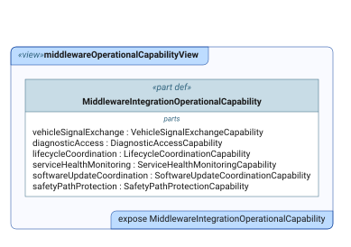

## `middleware_physical_software_realization.sysml`

### `middlewarePhysicalStructureView`

Review the System 1 candidate software boundary: adapter, AAOS SDV boundary, and application-side clients.

- **Source:** `middleware_physical_software_realization.sysml`
- **Viewpoint:** `selectedPhysicalStructureViewpoint` (`PhysicalStructureDefinitionViewpoint`)
- **Concern:** `physicalStructureConcern`
- **Exposes:** `MiddlewarePhysicalSoftwareBoundary`
- **Depth:** `1`
- **Render:** `asTreeDiagram`

- **Diagram status:** Published from the committed SysIDE SVG.

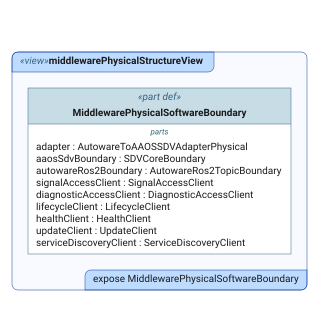

### `middlewareAdapterBoundaryExchangeView`

Which AAOS SDV VSIDL service access feeds the adapter, and which Autoware-facing ROS 2 velocity-report boundary does the adapter publish through, in which direction?

- **Source:** `middleware_physical_software_realization.sysml`
- **Viewpoint:** `selectedAdapterBoundaryExchangeViewpoint` (`PhysicalInternalExchangeViewpoint`)
- **Concern:** `adapterBoundaryExchangeConcern`
- **Exposes:** `MiddlewarePhysicalSoftwareBoundary::adapter`, `MiddlewarePhysicalSoftwareBoundary::adapter::**`, `MiddlewarePhysicalSoftwareBoundary::aaosSdvBoundary`, `MiddlewarePhysicalSoftwareBoundary::autowareRos2Boundary`, `MiddlewarePhysicalSoftwareBoundary::autowareRos2Boundary::*`
- **Depth:** `-1`
- **Render:** `asInterconnectionDiagram`

- **Diagram status:** Published from the committed SysIDE SVG.

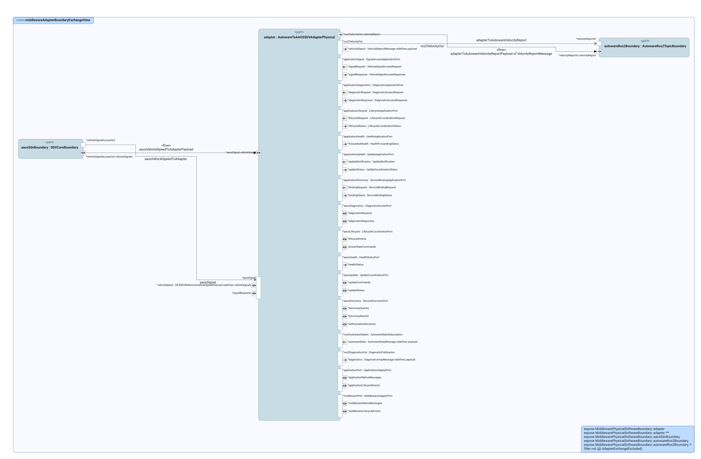

### `middlewareAAOSVehicleSpeedServiceBundleInternalExchangeView`

Which provider sends VehicleSpeedProviderMessage to which observer, through which owned ports and connector, and in which direction?

- **Source:** `middleware_physical_software_realization.sysml`
- **Viewpoint:** `selectedAAOSVehicleSpeedServiceBundleInternalExchangeViewpoint` (`PhysicalInternalExchangeViewpoint`)
- **Concern:** `vehicleSpeedServiceBundleInternalExchangeConcern`
- **Exposes:** `vehicleSpeedCampaignDeployment::vmA::cuttlefishGuest`, `vehicleSpeedCampaignDeployment::vmA::cuttlefishGuest::**`
- **Depth:** `-1`
- **Render:** `asInterconnectionDiagram`

- **Diagram status:** Published from the committed SysIDE SVG.

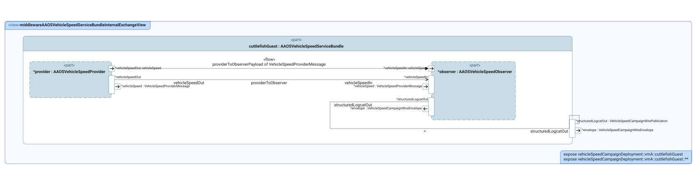

### `middlewareVehicleSpeedCampaignStructureView`

Supporting System 2 campaign-host breakdown, distinct from the System 1 product boundary.

- **Source:** `middleware_physical_software_realization.sysml`
- **Viewpoint:** `selectedVehicleSpeedCampaignStructureViewpoint` (`PhysicalStructureDefinitionViewpoint`)
- **Concern:** `vehicleSpeedCampaignStructureConcern`
- **Exposes:** `VehicleSpeedCampaignCommunicationDeployment`, `VehicleSpeedCampaignCommunicationDeployment::vmA`, `VehicleSpeedCampaignCommunicationDeployment::vmA::cuttlefishGuest`, `VehicleSpeedCampaignCommunicationDeployment::vmA::hostForwarder`, `VehicleSpeedCampaignCommunicationDeployment::privateTcpBoundary`, `VehicleSpeedCampaignCommunicationDeployment::vmB`, `VehicleSpeedCampaignCommunicationDeployment::vmB::ros2Ingress`, `VehicleSpeedCampaignCommunicationDeployment::vmB::independentObserver`
- **Render:** `asTreeDiagram`

- **Diagram status:** Published from the committed SysIDE SVG.

### `middlewareVehicleSpeedCampaignInterfaceView`

Supporting System 2 campaign transport contracts, distinct from the System 1 candidate interfaces.

- **Source:** `middleware_physical_software_realization.sysml`
- **Viewpoint:** `selectedVehicleSpeedCampaignInterfaceViewpoint` (`PhysicalInterfaceDefinitionViewpoint`)
- **Concern:** `vehicleSpeedCampaignInterfaceConcern`
- **Exposes:** `VehicleSpeedProviderPublication`, `VehicleSpeedProviderSubscription`, `VehicleSpeedCampaignWirePublication`, `VehicleSpeedCampaignWireSubscription`, `VelocityReportPublication`, `VelocityReportSubscription`
- **Render:** `asTreeDiagram`

- **Diagram status:** Published from the committed SysIDE SVG.

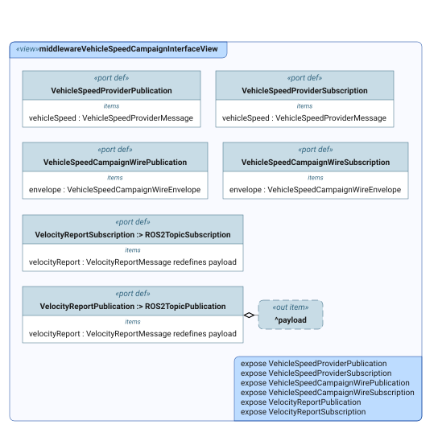

### `middlewarePhysicalLogicalMappingView`

Maps logical responsibilities to the physical elements selected to realize them.

- **Source:** `middleware_physical_software_realization.sysml`
- **Viewpoint:** `selectedPhysicalLogicalMappingViewpoint` (`PhysicalLogicalMappingViewpoint`)
- **View type:** `MVD::MatrixView`
- **Concern:** `physicalLogicalMappingConcern`
- **Exposes:** `system::signalTranslator`, `system::diagnosticProxy`, `system::lifecycleBridge`, `system::healthProxy`, `system::updateCoordinator`, `system::serviceBindingManager`, `physicalSoftware::signalAccessClient`, `physicalSoftware::diagnosticAccessClient`, `physicalSoftware::lifecycleClient`, `physicalSoftware::healthClient`, `physicalSoftware::updateClient`, `physicalSoftware::serviceDiscoveryClient`, `physicalSoftware::adapter::aaosSignal::vehicleSpeed`, `DE4SDV_MiddlewarePhysicalSoftwareRealization::*`

- **Diagram status:** Published from the committed SysIDE SVG.

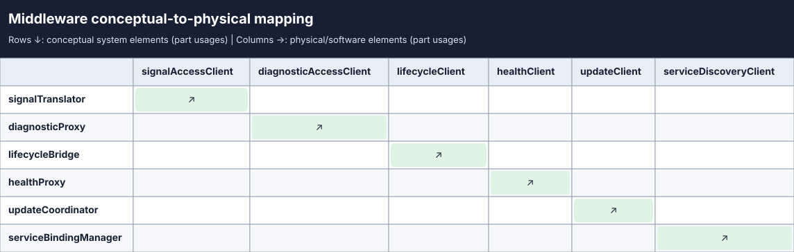

## `middleware_requirements.sysml`

### `middlewareSystemRequirementsView`

Shows the requirement set and its trace links to needs, behavior, or architecture.

- **Source:** `middleware_requirements.sysml`
- **Viewpoint:** `selectedSystemRequirementsViewpoint` (`SystemRequirementDefinitionViewpoint`)
- **View type:** `TVD::TableView`
- **Concern:** `requirementTraceConcern`
- **Exposes:** `System1Product::*`, `System2EngineeringAssurance::*`

- **Diagram status:** Published from the committed SysIDE SVG.

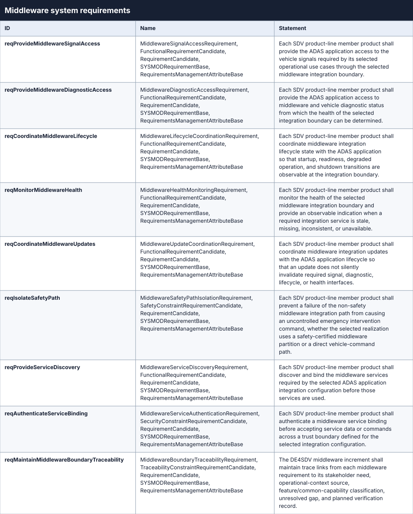

### `middlewareRequirementTraceView`

Shows the requirement set and its trace links to needs, behavior, or architecture.

- **Source:** `middleware_requirements.sysml`
- **Viewpoint:** `selectedRequirementTraceViewpoint` (`SystemRequirementTraceabilityViewpoint`)
- **View type:** `GeneralView`
- **Concern:** `requirementTraceConcern`
- **Exposes:** `System1Product::*`, `System2EngineeringAssurance::*`, `DE4SDV_MiddlewareOperationalContext::Features::Middleware::OperationalContext::'exchange vehicle signals'`, `DE4SDV_MiddlewareOperationalContext::Features::Middleware::OperationalContext::'access diagnostics'`, `DE4SDV_MiddlewareOperationalContext::Features::Middleware::OperationalContext::'coordinate lifecycle'`, `DE4SDV_MiddlewareOperationalContext::Features::Middleware::OperationalContext::'monitor service health'`, `DE4SDV_MiddlewareOperationalContext::Features::Middleware::OperationalContext::'coordinate software update'`, `DE4SDV_MiddlewareOperationalContext::Features::Middleware::OperationalContext::'emergency intervention via safety path'`, `DE4SDV_MiddlewareFunctionalArchitecture::Features::Middleware::FunctionalArchitecture::middlewareIntegrationFunctionalFlow`
- **Depth:** `1`

- **Diagram status:** Published from the committed SysIDE SVG.
- **Presentation note:** This is a dense review artifact; open the SVG at full size rather than reading it from the page thumbnail.

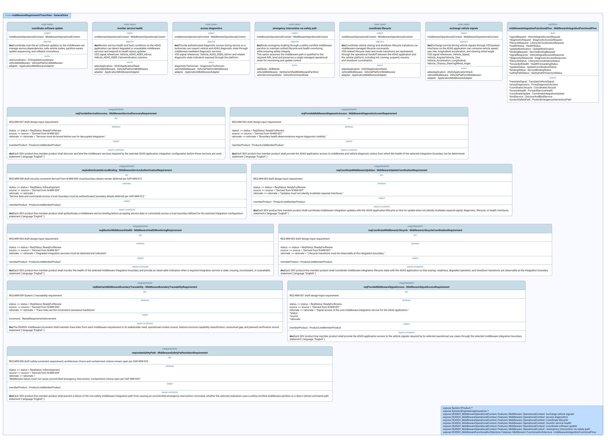

## `middleware_stakeholder_needs.sysml`

### `middlewareStakeholderNeedsView`

Reviewers need stakeholder needs for middleware integration separated from requirements, with traceability to the operational context and feature classification.

- **Source:** `middleware_stakeholder_needs.sysml`
- **Viewpoint:** `selectedStakeholderNeedsViewpoint` (`StakeholderRequirementDefinitionViewpoint`)
- **View type:** `TVD::TableView`
- **Concern:** `stakeholderNeedsConcern`
- **Exposes:** `System1Product::*`, `System2EngineeringAssurance::*`

- **Diagram status:** Published from the committed SysIDE SVG.

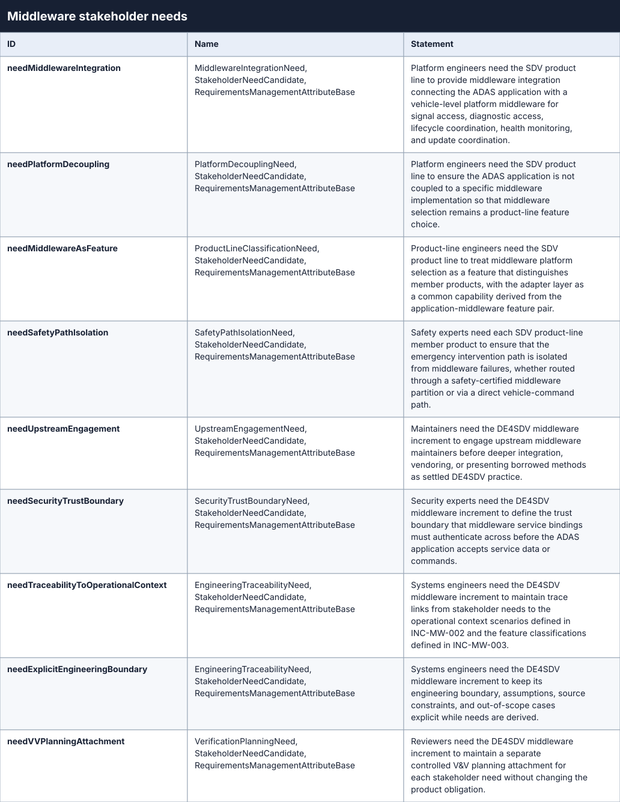

## `middleware_variability_configuration.sysml`

### `middlewareProductLineConfigurationView`

Review the selected feature variants in the deterministic generated platform-stack projection.

- **Source:** `middleware_variability_configuration.sysml`
- **Viewpoint:** `selectedProductLineConfigurationViewpoint` (`ProductLineConfigurationViewpoint`)
- **Concern:** `productLineConfigurationConcern`
- **Exposes:** `MiddlewareAutowareAAOSSDVReference`, `selectedVehicleApplication`, `selectedMiddleware`, `selectedOperatingSystem`, `selectedHypervisor`, `selectedApplicationMiddlewareAdapter`
- **Render:** `asTreeDiagram`

- **Diagram status:** Published from the committed SysIDE SVG.
- **Presentation note:** Long qualified labels overlap in the current SysIDE layout; use the source and exposure list above for exact names.

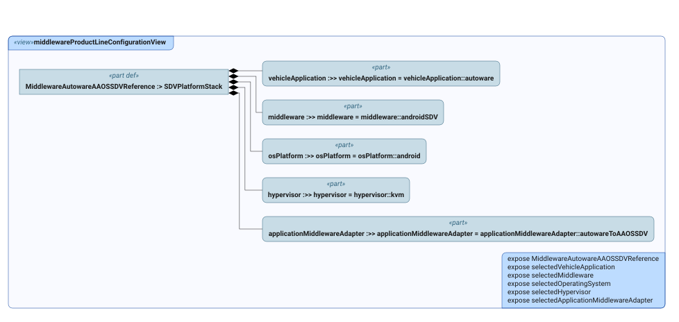

### `middlewareProductModelAssemblyView`

Review the resulting member-product composition: configured platform stack plus the middleware physical/software boundary.

- **Source:** `middleware_variability_configuration.sysml`
- **Viewpoint:** `selectedProductModelAssemblyViewpoint` (`ProductModelAssemblyViewpoint`)
- **Concern:** `productModelAssemblyConcern`
- **Exposes:** `MiddlewareAutowareAAOSSDVConfiguredMember`, `MiddlewareAutowareAAOSSDVConfiguredMember::platformStack`, `MiddlewareAutowareAAOSSDVConfiguredMember::middlewareBoundary`
- **Render:** `asTreeDiagram`

- **Diagram status:** Published from the committed SysIDE SVG.
- **Presentation note:** Long qualified labels overlap in the current SysIDE layout; use the source and exposure list above for exact names.

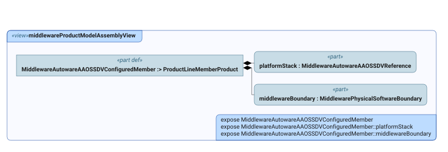

## `middleware_verification_evidence.sysml`

### `middlewareVerificationAssuranceView`

Evidence-based assurance claims, counterclaims, retained evidence, and the bounded baseline decision.

- **Source:** `middleware_verification_evidence.sysml`
- **Viewpoint:** `selectedArgumentationAssuranceViewpoint` (`ArgumentationAssuranceViewpoint`)
- **Concern:** `argumentationAssuranceConcern`
- **Exposes:** `boundedBaselineDecision010`, `successorIncrementDecision010`, `mw010ReferenceContractClaim`, `runtimeCampaignEvidence011`, `runtimeAdapterPathEvidence012`, `runtimeAutowareConsumerEvidence013`, `runtimeHealthDispositionEvidence014`, `signalTranslationArgument010`, `healthForwardingArgument010`, `vehicleStartupArgument010`, `faultDetectionArgument010`, `contractAndRehearsalEvidence010`, `boundedAAOSBootBaseline010`, `boundedClaimToBaselineDecision010`, `runtimeCampaignToBaselineDecision010`, `runtimeAdapterPathToBaselineDecision010`, `runtimeAutowareConsumerToBaselineDecision010`, `runtimeHealthDispositionToBaselineDecision010`, `successorIncrementToBaselineDecision010`
- **Render:** `asTreeDiagram`

- **Diagram status:** Published from the committed SysIDE SVG.

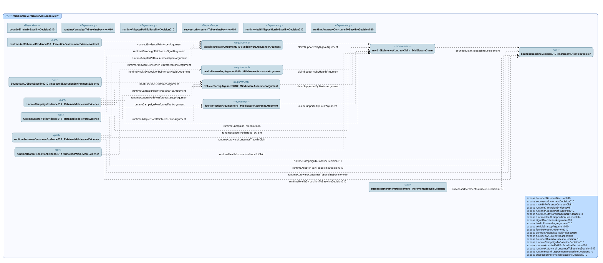

### `middlewareOpenCounterclaimAssuranceView`

Evidence-based assurance claims, counterclaims, retained evidence, and the bounded baseline decision.

- **Source:** `middleware_verification_evidence.sysml`
- **Viewpoint:** `selectedOpenCounterclaimAssuranceViewpoint` (`ArgumentationAssuranceViewpoint`)
- **Concern:** `argumentationAssuranceConcern`
- **Exposes:** `boundedBaselineDecision010`, `mw010ReferenceContractClaim`, `counterClaim010ProviderBinding`, `counterClaim010CrossDomainTransport`, `counterClaim010IndependentObservation`, `counterClaim010LifecycleUpdateFault`, `providerBindingEvidenceGap010`, `crossDomainTransportEvidenceGap010`, `independentAutowareObservationGap010`, `lifecycleUpdateFaultEvidenceGap010`, `counterClaimProviderBindingGapTrace`, `counterClaimTransportGapTrace`, `counterClaimObservationGapTrace`, `counterClaimLifecycleGapTrace`, `deferredProviderCounterclaimToBaselineDecision010`, `deferredTransportCounterclaimToBaselineDecision010`, `deferredObservationCounterclaimToBaselineDecision010`, `deferredLifecycleCounterclaimToBaselineDecision010`
- **Render:** `asTreeDiagram`

- **Diagram status:** Published from the committed SysIDE SVG.

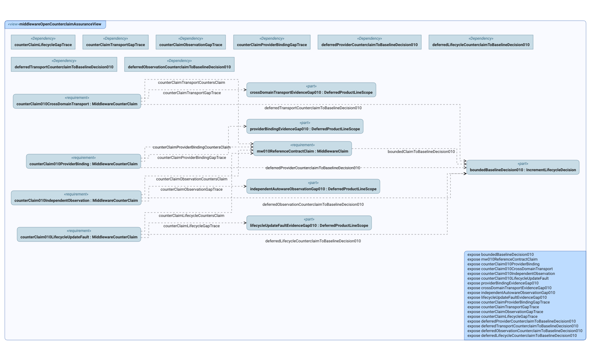
