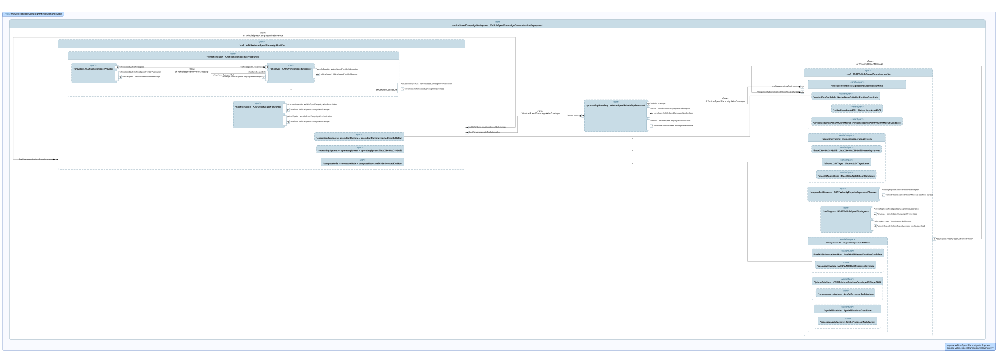

# Middleware Views

This index lists every SysML v2 `view` declared in the `.sysml` files of
this folder, with the diagram SysIDE renders from it (`syside viz view`,
run by the Privileged Syside Validation workflow). The SVGs live in
[`diagrams/`](diagrams/) beside the model files.

Generated by `scripts/generate_view_index.py` — do not edit by hand.

**10 files, 23 views.**

## `mw_conceptual_architecture.sysml`

### `mwSystemStructureView`

- **Source:** `mw_conceptual_architecture.sysml`
- **Viewpoint:** `selectedSystemStructureViewpoint` (`SystemStructureDefinitionViewpoint`)
- **Concern:** `conceptualStructureConcern`
- **Exposes:** `system`, `system::*`
- **Depth:** `1`
- **Render:** `asTreeDiagram`

### `mwSystemInternalExchangeView`

- **Source:** `mw_conceptual_architecture.sysml`
- **Viewpoint:** `selectedSystemInternalExchangeViewpoint` (`SystemInternalExchangeViewpoint`)
- **Concern:** `conceptualInternalExchangeConcern`
- **Exposes:** `system`, `system::**`
- **Depth:** `-1`
- **Render:** `asInterconnectionDiagram`

### `mwSystemFunctionMappingView`

- **Source:** `mw_conceptual_architecture.sysml`
- **Viewpoint:** `selectedSystemFunctionMappingViewpoint` (`SystemFunctionMappingViewpoint`)
- **View type:** `MVD::MatrixView`
- **Concern:** `conceptualFunctionMappingConcern`
- **Exposes:** `functionalFlow::translateSignal`, `functionalFlow::proxyDiagnostics`, `functionalFlow::coordinateLifecycle`, `functionalFlow::forwardHealth`, `functionalFlow::coordinateUpdate`, `functionalFlow::bindService`, `functionalFlow::protectSafetyPath`, `system::signalTranslator`, `system::diagnosticProxy`, `system::lifecycleBridge`, `system::healthProxy`, `system::updateCoordinator`, `system::serviceBindingManager`, `DE4SDV_MWConceptualArchitecture::*`

## `mw_feature_classification.sysml`

### `mwProductLineClassificationView`

- **Source:** `mw_feature_classification.sysml`
- **Viewpoint:** `selectedProductLineClassificationViewpoint` (`ProductLineClassificationViewpoint`)
- **Concern:** `productLineCapabilityClassificationConcern`
- **Exposes:** `FeatureClassification::*`
- **Render:** `asTreeDiagram`

## `mw_functional_architecture.sysml`

### `mwFunctionalBehaviorView`

- **Source:** `mw_functional_architecture.sysml`
- **Viewpoint:** `selectedFunctionalBehaviorViewpoint` (`SystemFunctionalBreakdownStructureViewpoint`)
- **Concern:** `functionalBehaviorConcern`
- **Exposes:** `MiddlewareIntegrationFunctionalFlow`
- **Render:** `asTreeDiagram`

### `mwFunctionalInterfaceView`

- **Source:** `mw_functional_architecture.sysml`
- **Viewpoint:** `selectedFunctionalInterfaceViewpoint` (`SystemInterfaceDefinitionViewpoint`)
- **Concern:** `functionalInterfaceConcern`
- **Exposes:** `FunctionalArchitecture::VehicleSignalAccessRequest`, `FunctionalArchitecture::VehicleSignalAccessResponse`, `FunctionalArchitecture::DiagnosticAccessRequest`, `FunctionalArchitecture::DiagnosticAccessResponse`, `FunctionalArchitecture::LifecycleCoordinationRequest`, `FunctionalArchitecture::LifecycleCoordinationStatus`, `FunctionalArchitecture::HealthForwardingStatus`, `FunctionalArchitecture::UpdateCoordinationRequest`, `FunctionalArchitecture::UpdateCoordinationStatus`, `FunctionalArchitecture::ServiceBindingRequest`, `FunctionalArchitecture::ServiceBindingStatus`, `FunctionalArchitecture::SafetyPathProtectionStatus`, `FunctionalArchitecture::VehicleSignalAccessInbound`, `FunctionalArchitecture::VehicleSignalAccessOutbound`, `FunctionalArchitecture::DiagnosticAccessInbound`, `FunctionalArchitecture::DiagnosticAccessOutbound`, `FunctionalArchitecture::LifecycleCoordinationInbound`, `FunctionalArchitecture::LifecycleCoordinationOutbound`, `FunctionalArchitecture::HealthStatusInbound`, `FunctionalArchitecture::HealthStatusOutbound`, `FunctionalArchitecture::UpdateCoordinationInbound`, `FunctionalArchitecture::UpdateCoordinationOutbound`, `FunctionalArchitecture::ServiceBindingInbound`, `FunctionalArchitecture::ServiceBindingOutbound`, `FunctionalArchitecture::SafetyPathStatusOutbound`
- **Render:** `asTreeDiagram`

### `mwFunctionalProcessView`

- **Source:** `mw_functional_architecture.sysml`
- **Viewpoint:** `selectedFunctionalProcessViewpoint` (`SystemProcessViewpoint`)
- **View type:** `ActionFlowView`
- **Concern:** `functionalProcessConcern`
- **Exposes:** `middlewareIntegrationFunctionalFlow`

## `mw_increment_framing.sysml`

### `mwIncrementAssuranceView`

- **Source:** `mw_increment_framing.sysml`
- **Viewpoint:** `selectedIncrementAssuranceViewpoint` (`ArgumentationAssuranceViewpoint`)
- **Concern:** `mwIncrementAssuranceConcern`
- **Exposes:** `IncrementFraming::*`
- **Render:** `asTreeDiagram`

## `mw_operational_context.sysml`

### `mwOperationalContextView`

- **Source:** `mw_operational_context.sysml`
- **Viewpoint:** `selectedOperationalContextViewpoint` (`OperationalContextDefinitionViewpoint`)
- **Concern:** `operationalContextConcern`
- **Exposes:** `OperationalContext::'integrate ADAS with vehicle platform'`
- **Depth:** `1`
- **Render:** `asTreeDiagram`

### `mwOperationalStoryView`

- **Source:** `mw_operational_context.sysml`
- **Viewpoint:** `selectedOperationalStoryViewpoint` (`OperationalStoryViewpoint`)
- **View type:** `ActionFlowView`
- **Concern:** `operationalStoryConcern`
- **Exposes:** `OperationalContext::'integrate ADAS with vehicle platform'`

### `mwOperationalCapabilityView`

- **Source:** `mw_operational_context.sysml`
- **Viewpoint:** `selectedOperationalCapabilityViewpoint` (`OperationalCapabilityDefinitionViewpoint`)
- **Concern:** `operationalCapabilityConcern`
- **Exposes:** `OperationalContext::'integrate ADAS with vehicle platform'`
- **Depth:** `1`
- **Render:** `asTreeDiagram`

## `mw_physical_software_realization.sysml`

### `mwPhysicalStructureView`

- **Source:** `mw_physical_software_realization.sysml`
- **Viewpoint:** `selectedPhysicalStructureViewpoint` (`PhysicalStructureDefinitionViewpoint`)
- **Concern:** `physicalStructureConcern`
- **Exposes:** `physicalSoftware`, `physicalSoftware::*`
- **Depth:** `2`
- **Render:** `asTreeDiagram`

### `mwPhysicalInterfaceView`

- **Source:** `mw_physical_software_realization.sysml`
- **Viewpoint:** `selectedPhysicalInterfaceViewpoint` (`PhysicalInterfaceDefinitionViewpoint`)
- **Concern:** `physicalInterfaceConcern`
- **Exposes:** `DE4SDV_MWPhysicalSoftwareRealization::DE4SDVReferenceVehicleSpeedPayload`, `DE4SDV_MWPhysicalSoftwareRealization::DE4SDVReferenceVehicleSpeedAccessPort`, `DE4SDV_MWPhysicalSoftwareRealization::VelocityReportPublication`, `DE4SDV_MWPhysicalSoftwareRealization::VehicleSpeedProviderMessage`, `DE4SDV_MWPhysicalSoftwareRealization::VehicleSpeedProviderPublication`, `DE4SDV_MWPhysicalSoftwareRealization::VehicleSpeedProviderSubscription`, `DE4SDV_MWPhysicalSoftwareRealization::VehicleSpeedCampaignWireEnvelope`, `DE4SDV_MWPhysicalSoftwareRealization::VehicleSpeedCampaignWirePublication`, `DE4SDV_MWPhysicalSoftwareRealization::VehicleSpeedCampaignWireSubscription`
- **Render:** `asTreeDiagram`

### `mwVehicleSpeedCampaignInternalExchangeView`

- **Source:** `mw_physical_software_realization.sysml`
- **Viewpoint:** `selectedVehicleSpeedCampaignInternalExchangeViewpoint` (`PhysicalInternalExchangeViewpoint`)
- **Concern:** `vehicleSpeedCampaignInternalExchangeConcern`
- **Exposes:** `vehicleSpeedCampaignDeployment`, `vehicleSpeedCampaignDeployment::**`
- **Depth:** `-1`
- **Render:** `asInterconnectionDiagram`

### `mwVehicleSpeedCampaignStructureView`

- **Source:** `mw_physical_software_realization.sysml`
- **Viewpoint:** `selectedVehicleSpeedCampaignStructureViewpoint` (`PhysicalStructureDefinitionViewpoint`)
- **Concern:** `vehicleSpeedCampaignStructureConcern`
- **Exposes:** `vehicleSpeedCampaignDeployment`, `vehicleSpeedCampaignDeployment::vmA::*`, `vehicleSpeedCampaignDeployment::vmB::*`, `vehicleSpeedCampaignDeployment::privateTcpBoundary`
- **Render:** `asTreeDiagram`

### `mwVehicleSpeedCampaignInterfaceView`

- **Source:** `mw_physical_software_realization.sysml`
- **Viewpoint:** `selectedVehicleSpeedCampaignInterfaceViewpoint` (`PhysicalInterfaceDefinitionViewpoint`)
- **Concern:** `vehicleSpeedCampaignInterfaceConcern`
- **Exposes:** `VehicleSpeedProviderMessage`, `VehicleSpeedProviderPublication`, `VehicleSpeedProviderSubscription`, `VehicleSpeedCampaignQuality`, `DE4SDVReferenceVehicleSpeedPayload`, `VehicleSpeedCampaignWireEnvelope`, `VehicleSpeedCampaignWirePublication`, `VehicleSpeedCampaignWireSubscription`, `VelocityReportMessage`, `VelocityReportPublication`, `VelocityReportSubscription`
- **Render:** `asTreeDiagram`

### `mwPhysicalLogicalMappingView`

- **Source:** `mw_physical_software_realization.sysml`
- **Viewpoint:** `selectedPhysicalLogicalMappingViewpoint` (`PhysicalLogicalMappingViewpoint`)
- **View type:** `MVD::MatrixView`
- **Concern:** `physicalLogicalMappingConcern`
- **Exposes:** `system::signalTranslator`, `system::diagnosticProxy`, `system::lifecycleBridge`, `system::healthProxy`, `system::updateCoordinator`, `system::serviceBindingManager`, `physicalSoftware::signalAccessClient`, `physicalSoftware::diagnosticAccessClient`, `physicalSoftware::lifecycleClient`, `physicalSoftware::healthClient`, `physicalSoftware::updateClient`, `physicalSoftware::serviceDiscoveryClient`, `physicalSoftware::adapter::aaosSignal::vehicleSpeed`, `DE4SDV_MWPhysicalSoftwareRealization::*`

## `mw_requirements.sysml`

### `mwSystemRequirementsView`

- **Source:** `mw_requirements.sysml`
- **Viewpoint:** `selectedSystemRequirementsViewpoint` (`SystemRequirementDefinitionViewpoint`)
- **View type:** `TVD::TableView`
- **Concern:** `requirementTraceConcern`
- **Exposes:** `System1Product::*`, `System2EngineeringAssurance::*`

### `mwRequirementTraceView`

- **Source:** `mw_requirements.sysml`
- **Viewpoint:** `selectedRequirementTraceViewpoint` (`SystemRequirementTraceabilityViewpoint`)
- **View type:** `GeneralView`
- **Concern:** `requirementTraceConcern`
- **Exposes:** `System1Product::*`, `System2EngineeringAssurance::*`, `DE4SDV_MWOperationalContext::Features::Middleware::OperationalContext::'exchange vehicle signals'`, `DE4SDV_MWOperationalContext::Features::Middleware::OperationalContext::'access diagnostics'`, `DE4SDV_MWOperationalContext::Features::Middleware::OperationalContext::'coordinate lifecycle'`, `DE4SDV_MWOperationalContext::Features::Middleware::OperationalContext::'monitor service health'`, `DE4SDV_MWOperationalContext::Features::Middleware::OperationalContext::'coordinate software update'`, `DE4SDV_MWOperationalContext::Features::Middleware::OperationalContext::'emergency intervention via safety path'`, `DE4SDV_MWFunctionalArchitecture::Features::Middleware::FunctionalArchitecture::middlewareIntegrationFunctionalFlow`
- **Depth:** `1`

## `mw_stakeholder_needs.sysml`

### `mwStakeholderNeedsView`

- **Source:** `mw_stakeholder_needs.sysml`
- **Viewpoint:** `selectedStakeholderNeedsViewpoint` (`StakeholderRequirementDefinitionViewpoint`)
- **View type:** `TVD::TableView`
- **Concern:** `stakeholderNeedsConcern`
- **Exposes:** `System1Product::*`, `System2EngineeringAssurance::*`

## `mw_variability_configuration.sysml`

### `mwProductLineConfigurationView`

- **Source:** `mw_variability_configuration.sysml`
- **Viewpoint:** `selectedProductLineConfigurationViewpoint` (`ProductLineConfigurationViewpoint`)
- **Concern:** `productLineConfigurationConcern`
- **Exposes:** `DE4SDV_MWVariabilityConfiguration::*`, `DE4SDV_SDVPlatformStack::*`
- **Render:** `asTreeDiagram`

### `mwProductModelAssemblyView`

- **Source:** `mw_variability_configuration.sysml`
- **Viewpoint:** `selectedProductModelAssemblyViewpoint` (`ProductModelAssemblyViewpoint`)
- **Concern:** `productModelAssemblyConcern`
- **Exposes:** `DE4SDV_MWVariabilityConfiguration::*`
- **Render:** `asTreeDiagram`

## `mw_verification_evidence.sysml`

### `mw010VerificationAssuranceView`

- **Source:** `mw_verification_evidence.sysml`
- **Viewpoint:** `selectedArgumentationAssuranceViewpoint` (`ArgumentationAssuranceViewpoint`)
- **Concern:** `argumentationAssuranceConcern`
- **Exposes:** `DE4SDV_MW010VerificationEvidence::*`, `DE4SDV_MWVariabilityConfiguration::*`, `DE4SDV_MWPhysicalSoftwareRealization::*`
- **Render:** `asTreeDiagram`

