# Middleware Views

This index lists every SysML v2 `view` declared in the `.sysml` files of
this folder, with the diagram SysIDE renders from it (`syside viz view`,
run by the Privileged Syside Validation workflow). The SVGs live in
[`diagrams/`](diagrams/) beside the model files.

Generated by `scripts/generate_view_index.py` — do not edit by hand.

**10 files, 25 views.**

## `mw_feature_classification.sysml`

### `mwProductLineClassificationView`

- **Source:** `mw_feature_classification.sysml`
- **Viewpoint:** `selectedProductLineClassificationViewpoint` (`ProductLineClassificationViewpoint`)
- **Concern:** `productLineCapabilityClassificationConcern`
- **Exposes:** `FeatureClassification::*`
- **Render:** `asTreeDiagram`

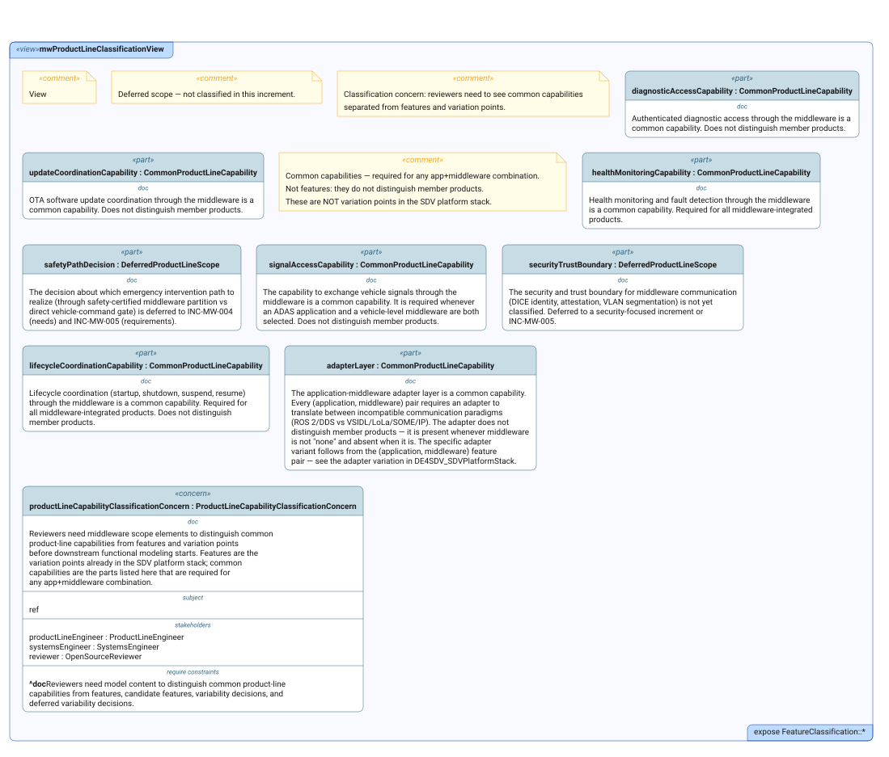

## `mw_functional_architecture.sysml`

### `mwFunctionalBehaviorView`

- **Source:** `mw_functional_architecture.sysml`
- **Viewpoint:** `selectedFunctionalBehaviorViewpoint` (`SystemFunctionalBreakdownStructureViewpoint`)
- **Concern:** `functionalBehaviorConcern`
- **Exposes:** `FunctionalArchitecture::*`
- **Render:** `asTreeDiagram`

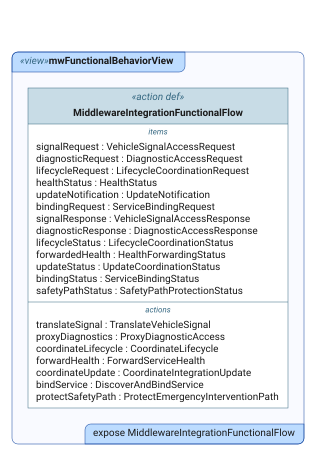

### `mwFunctionalInterfaceView`

- **Source:** `mw_functional_architecture.sysml`
- **Viewpoint:** `selectedFunctionalInterfaceViewpoint` (`SystemInterfaceDefinitionViewpoint`)
- **Concern:** `functionalInterfaceConcern`
- **Exposes:** `FunctionalArchitecture::*`
- **Render:** `asTreeDiagram`

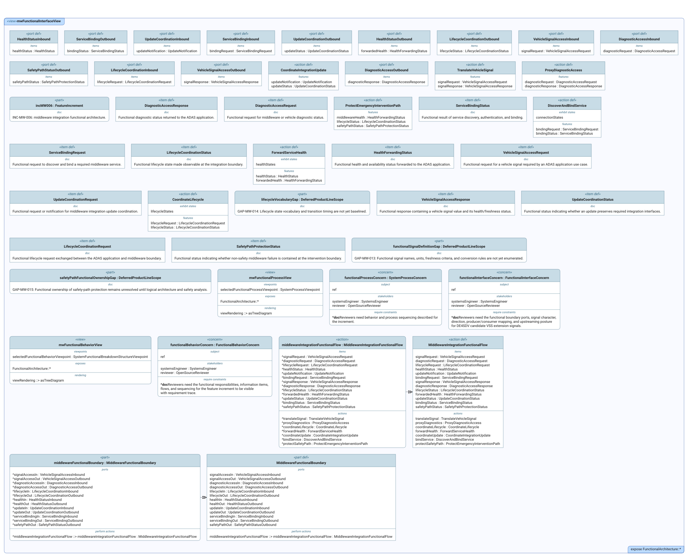

### `mwFunctionalProcessView`

- **Source:** `mw_functional_architecture.sysml`
- **Viewpoint:** `selectedFunctionalProcessViewpoint` (`SystemProcessViewpoint`)
- **Concern:** `functionalProcessConcern`
- **Exposes:** `FunctionalArchitecture::*`
- **Render:** `asTreeDiagram`

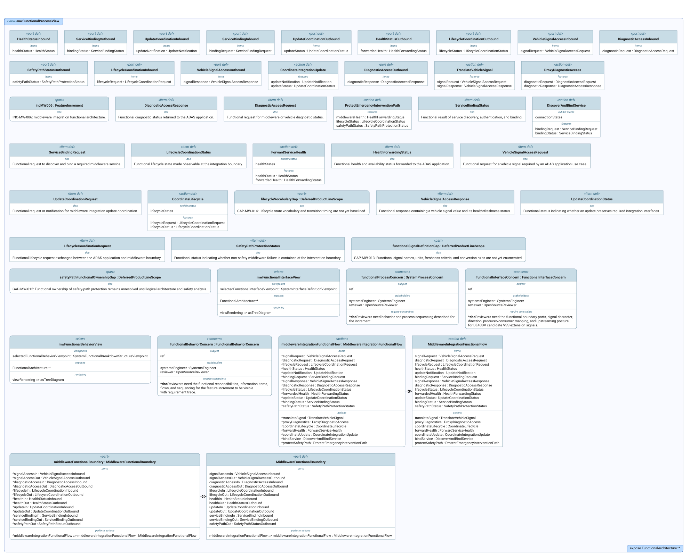

## `mw_increment_framing.sysml`

### `mwIncrementAssuranceView`

- **Source:** `mw_increment_framing.sysml`
- **Viewpoint:** `selectedIncrementAssuranceViewpoint` (`ArgumentationAssuranceViewpoint`)
- **Concern:** `mwIncrementAssuranceConcern`
- **Exposes:** `IncrementFraming::*`
- **Render:** `asTreeDiagram`

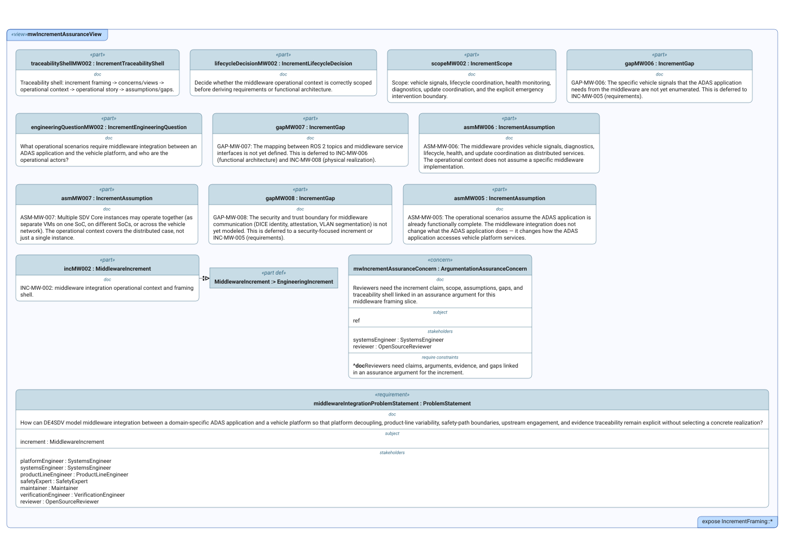

## `mw_operational_context.sysml`

### `mwOperationalContextView`

- **Source:** `mw_operational_context.sysml`
- **Viewpoint:** `selectedOperationalContextViewpoint` (`OperationalContextDefinitionViewpoint`)
- **Concern:** `operationalContextConcern`
- **Exposes:** `OperationalContext::*`
- **Render:** `asTreeDiagram`

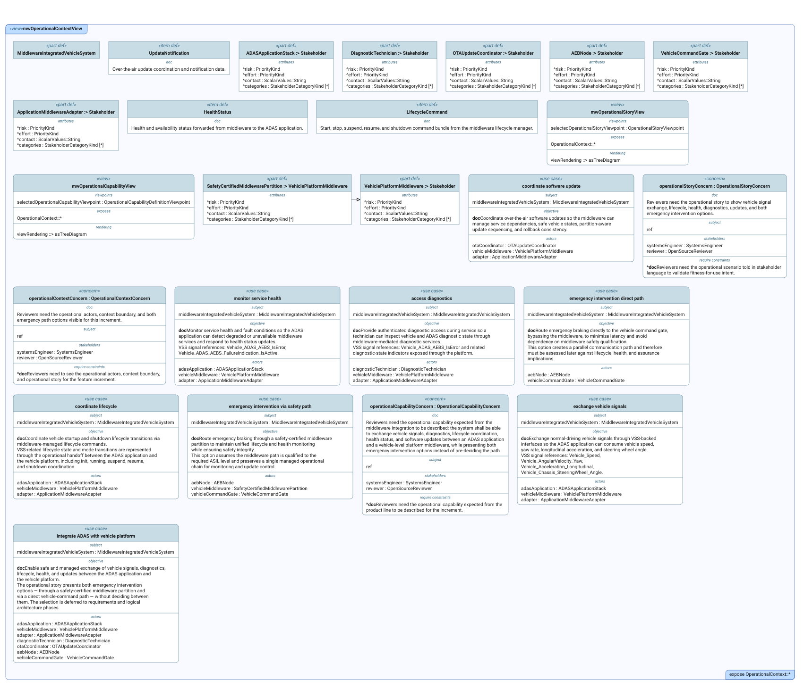

### `mwOperationalStoryView`

- **Source:** `mw_operational_context.sysml`
- **Viewpoint:** `selectedOperationalStoryViewpoint` (`OperationalStoryViewpoint`)
- **Concern:** `operationalStoryConcern`
- **Exposes:** `OperationalContext::*`
- **Render:** `asTreeDiagram`

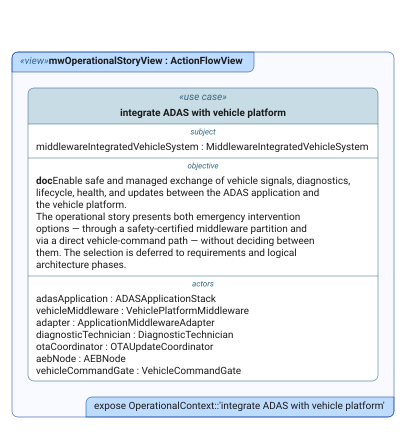

### `mwOperationalCapabilityView`

- **Source:** `mw_operational_context.sysml`
- **Viewpoint:** `selectedOperationalCapabilityViewpoint` (`OperationalCapabilityDefinitionViewpoint`)
- **Concern:** `operationalCapabilityConcern`
- **Exposes:** `OperationalContext::*`
- **Render:** `asTreeDiagram`

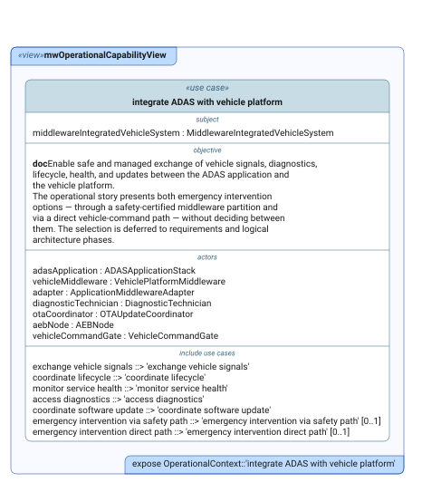

## `mw_physical_software_realization.sysml`

### `mwPhysicalStructureView`

- **Source:** `mw_physical_software_realization.sysml`
- **Viewpoint:** `selectedPhysicalStructureViewpoint` (`PhysicalStructureDefinitionViewpoint`)
- **Concern:** `physicalStructureConcern`
- **Exposes:** `DE4SDV_MWPhysicalSoftwareRealization::*`
- **Render:** `asTreeDiagram`

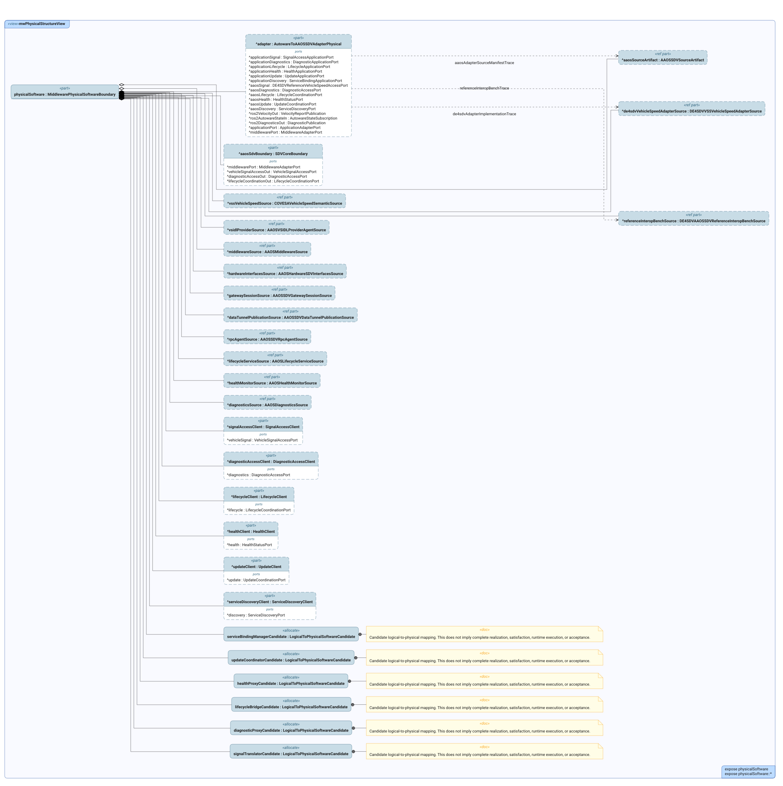

### `mwPhysicalInterfaceView`

- **Source:** `mw_physical_software_realization.sysml`
- **Viewpoint:** `selectedPhysicalInterfaceViewpoint` (`PhysicalInterfaceDefinitionViewpoint`)
- **Concern:** `physicalInterfaceConcern`
- **Exposes:** `DE4SDV_MWPhysicalSoftwareRealization::*`
- **Render:** `asTreeDiagram`

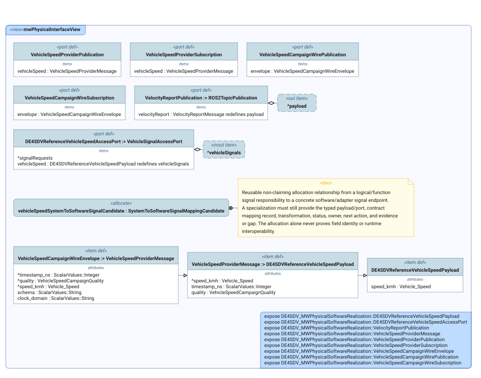

### `mwVehicleSpeedCampaignContextExchangeView`

- **Source:** `mw_physical_software_realization.sysml`
- **Viewpoint:** `selectedVehicleSpeedCampaignContextExchangeViewpoint` (`PhysicalContextExchangeViewpoint`)
- **Concern:** `vehicleSpeedCampaignContextExchangeConcern`
- **Exposes:** `vehicleSpeedCampaignDeployment::vmA`, `vehicleSpeedCampaignDeployment::vmB`
- **Render:** `asTreeDiagram`

_Diagram not present: `diagrams/diagram-mwVehicleSpeedCampaignContextExchangeView.svg` (regenerate via the Privileged Syside Validation workflow)._

### `mwVehicleSpeedCampaignInternalExchangeView`

- **Source:** `mw_physical_software_realization.sysml`
- **Viewpoint:** `selectedVehicleSpeedCampaignInternalExchangeViewpoint` (`PhysicalInternalExchangeViewpoint`)
- **Concern:** `vehicleSpeedCampaignInternalExchangeConcern`
- **Exposes:** `vehicleSpeedCampaignDeployment`, `vehicleSpeedCampaignDeployment::**`
- **Depth:** `-1`
- **Render:** `asInterconnectionDiagram`

_Diagram not present: `diagrams/diagram-mwVehicleSpeedCampaignInternalExchangeView.svg` (regenerate via the Privileged Syside Validation workflow)._

### `mwVehicleSpeedCampaignStructureView`

- **Source:** `mw_physical_software_realization.sysml`
- **Viewpoint:** `selectedVehicleSpeedCampaignStructureViewpoint` (`PhysicalStructureDefinitionViewpoint`)
- **Concern:** `vehicleSpeedCampaignStructureConcern`
- **Exposes:** `vehicleSpeedCampaignDeployment`, `vehicleSpeedCampaignDeployment::vmA::*`, `vehicleSpeedCampaignDeployment::vmB::*`, `vehicleSpeedCampaignDeployment::privateTcpBoundary`
- **Render:** `asTreeDiagram`

_Diagram not present: `diagrams/diagram-mwVehicleSpeedCampaignStructureView.svg` (regenerate via the Privileged Syside Validation workflow)._

### `mwVehicleSpeedCampaignInterfaceView`

- **Source:** `mw_physical_software_realization.sysml`
- **Viewpoint:** `selectedVehicleSpeedCampaignInterfaceViewpoint` (`PhysicalInterfaceDefinitionViewpoint`)
- **Concern:** `vehicleSpeedCampaignInterfaceConcern`
- **Exposes:** `VehicleSpeedProviderMessage`, `VehicleSpeedProviderPublication`, `VehicleSpeedProviderSubscription`, `VehicleSpeedCampaignQuality`, `DE4SDVReferenceVehicleSpeedPayload`, `VehicleSpeedCampaignWireEnvelope`, `VehicleSpeedCampaignWirePublication`, `VehicleSpeedCampaignWireSubscription`, `VelocityReportMessage`, `VelocityReportPublication`, `VelocityReportSubscription`
- **Render:** `asTreeDiagram`

_Diagram not present: `diagrams/diagram-mwVehicleSpeedCampaignInterfaceView.svg` (regenerate via the Privileged Syside Validation workflow)._

### `mwPhysicalFunctionalMappingView`

- **Source:** `mw_physical_software_realization.sysml`
- **Viewpoint:** `selectedPhysicalFunctionalMappingViewpoint` (`PhysicalFunctionalMappingViewpoint`)
- **Concern:** `physicalFunctionalMappingConcern`
- **Exposes:** `DE4SDV_MWPhysicalSoftwareRealization::*`
- **Render:** `asTreeDiagram`

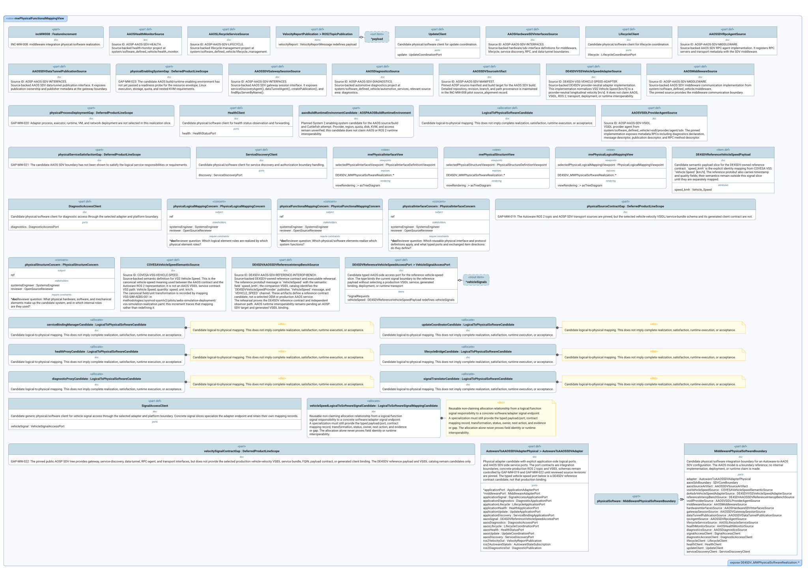

### `mwPhysicalLogicalMappingView`

- **Source:** `mw_physical_software_realization.sysml`
- **Viewpoint:** `selectedPhysicalLogicalMappingViewpoint` (`PhysicalLogicalMappingViewpoint`)
- **Concern:** `physicalLogicalMappingConcern`
- **Exposes:** `DE4SDV_MWPhysicalSoftwareRealization::*`
- **Render:** `asTreeDiagram`

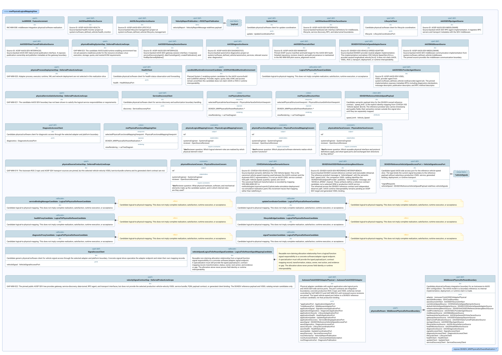

## `mw_requirements.sysml`

### `mwSystemRequirementsView`

- **Source:** `mw_requirements.sysml`
- **Viewpoint:** `selectedSystemRequirementsViewpoint` (`SystemRequirementDefinitionViewpoint`)
- **Concern:** `requirementTraceConcern`
- **Exposes:** `System1Product::*`, `System2EngineeringAssurance::*`
- **Render:** `asTreeDiagram`

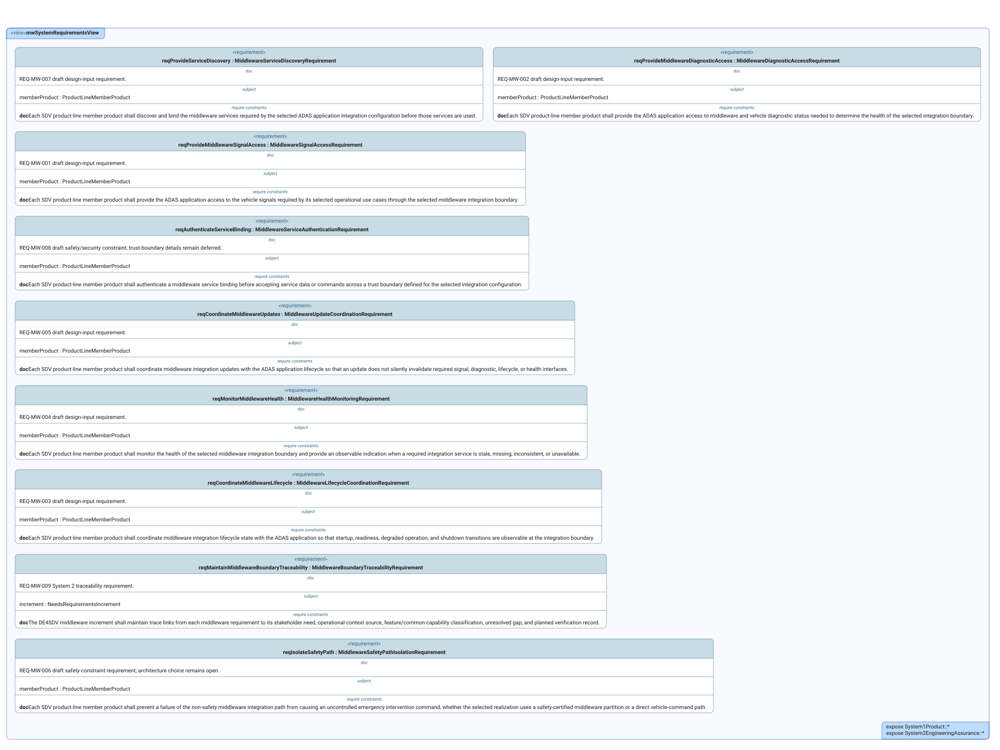

### `mwRequirementTraceView`

- **Source:** `mw_requirements.sysml`
- **Viewpoint:** `selectedRequirementTraceViewpoint` (`SystemRequirementTraceabilityViewpoint`)
- **Concern:** `requirementTraceConcern`
- **Exposes:** `System1Product::*`, `System2EngineeringAssurance::*`
- **Render:** `asTreeDiagram`

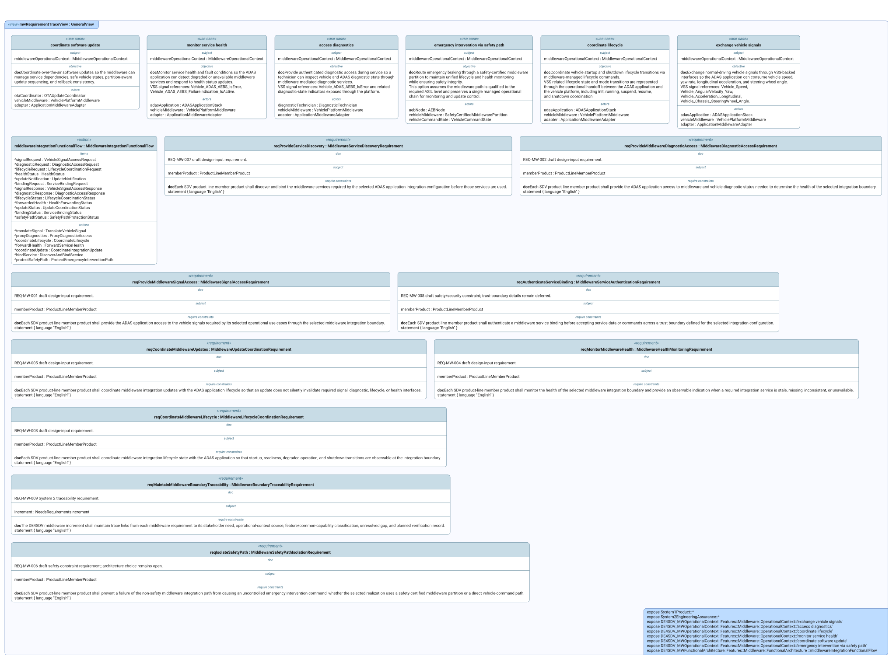

## `mw_stakeholder_needs.sysml`

### `mwStakeholderNeedsView`

- **Source:** `mw_stakeholder_needs.sysml`
- **Viewpoint:** `selectedStakeholderNeedsViewpoint` (`StakeholderRequirementDefinitionViewpoint`)
- **Concern:** `stakeholderNeedsConcern`
- **Exposes:** `System1Product::*`, `System2EngineeringAssurance::*`
- **Render:** `asTreeDiagram`

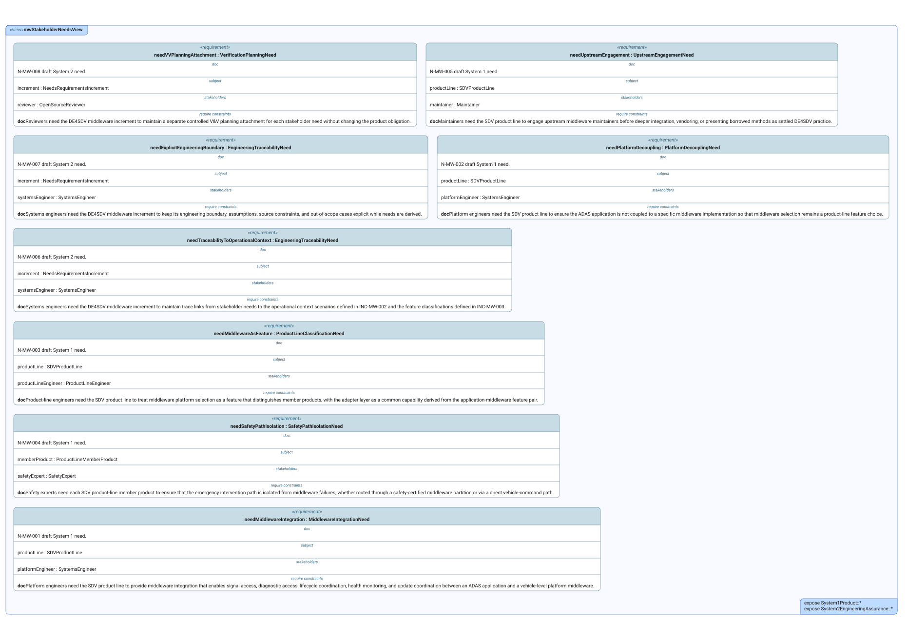

## `mw_system_architecture.sysml`

### `mwSystemStructureView`

- **Source:** `mw_system_architecture.sysml`
- **Viewpoint:** `selectedSystemStructureViewpoint` (`SystemStructureDefinitionViewpoint`)
- **Concern:** `systemStructureConcern`
- **Exposes:** `DE4SDV_MWSystemArchitecture::*`
- **Render:** `asTreeDiagram`

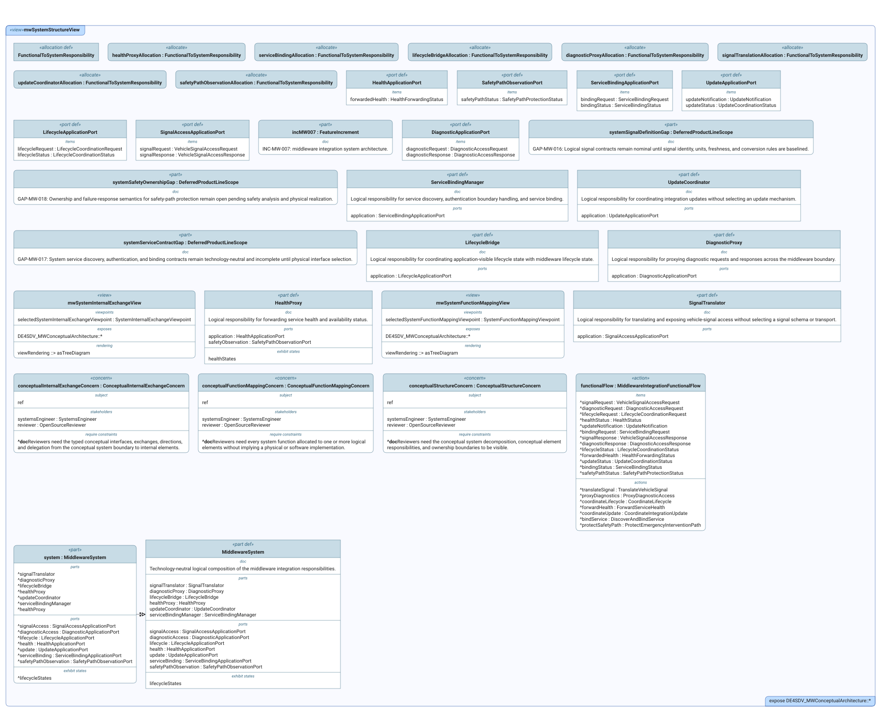

### `mwSystemInternalExchangeView`

- **Source:** `mw_system_architecture.sysml`
- **Viewpoint:** `selectedSystemInternalExchangeViewpoint` (`SystemInternalExchangeViewpoint`)
- **Concern:** `systemInternalExchangeConcern`
- **Exposes:** `DE4SDV_MWSystemArchitecture::*`
- **Render:** `asTreeDiagram`

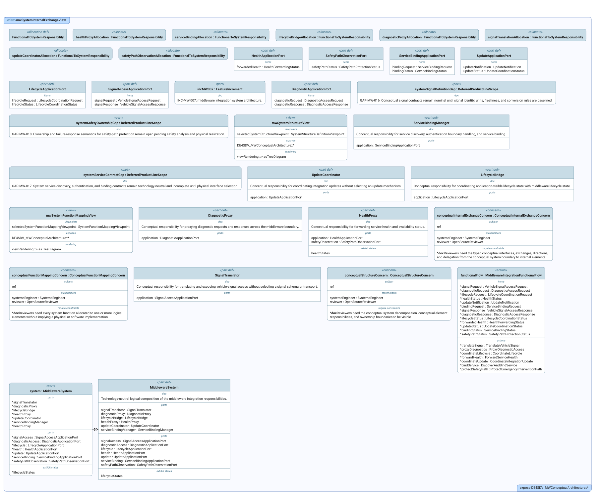

### `mwSystemFunctionMappingView`

- **Source:** `mw_system_architecture.sysml`
- **Viewpoint:** `selectedSystemFunctionMappingViewpoint` (`SystemFunctionMappingViewpoint`)
- **Concern:** `systemFunctionMappingConcern`
- **Exposes:** `DE4SDV_MWSystemArchitecture::*`
- **Render:** `asTreeDiagram`

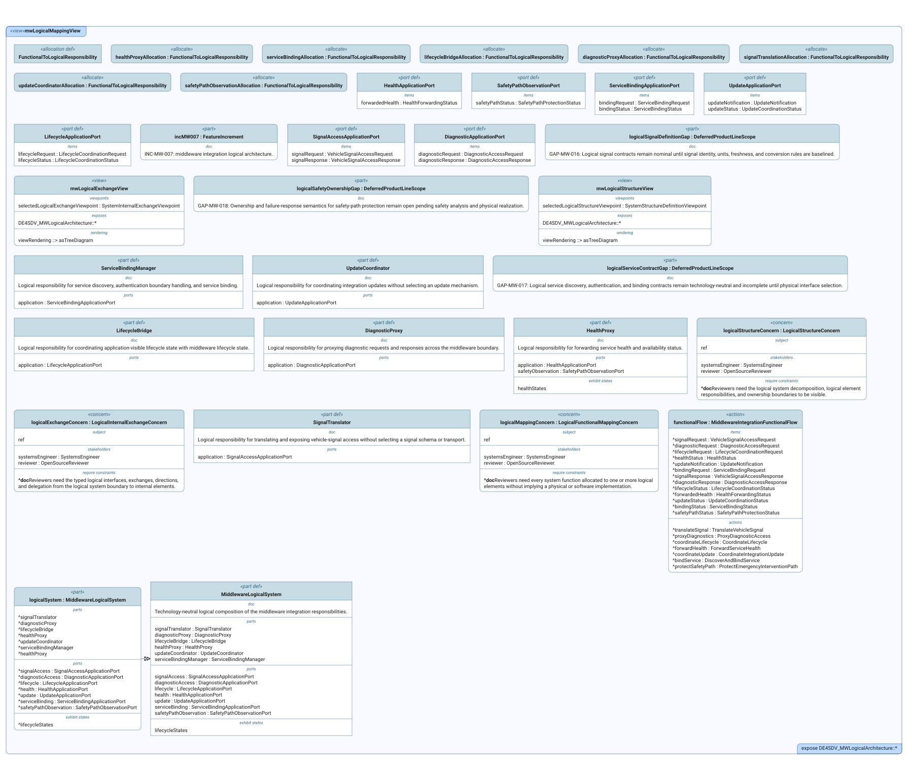

## `mw_variability_configuration.sysml`

### `mwProductLineConfigurationView`

- **Source:** `mw_variability_configuration.sysml`
- **Viewpoint:** `selectedProductLineConfigurationViewpoint` (`ProductLineConfigurationViewpoint`)
- **Concern:** `productLineConfigurationConcern`
- **Exposes:** `DE4SDV_MWVariabilityConfiguration::*`, `DE4SDV_SDVPlatformStack::*`
- **Render:** `asTreeDiagram`

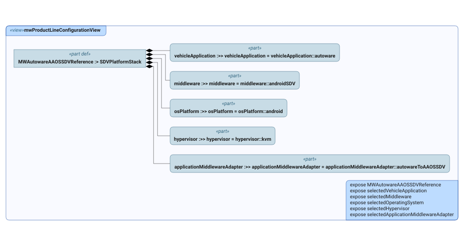

### `mwProductModelAssemblyView`

- **Source:** `mw_variability_configuration.sysml`
- **Viewpoint:** `selectedProductModelAssemblyViewpoint` (`ProductModelAssemblyViewpoint`)
- **Concern:** `productModelAssemblyConcern`
- **Exposes:** `DE4SDV_MWVariabilityConfiguration::*`
- **Render:** `asTreeDiagram`

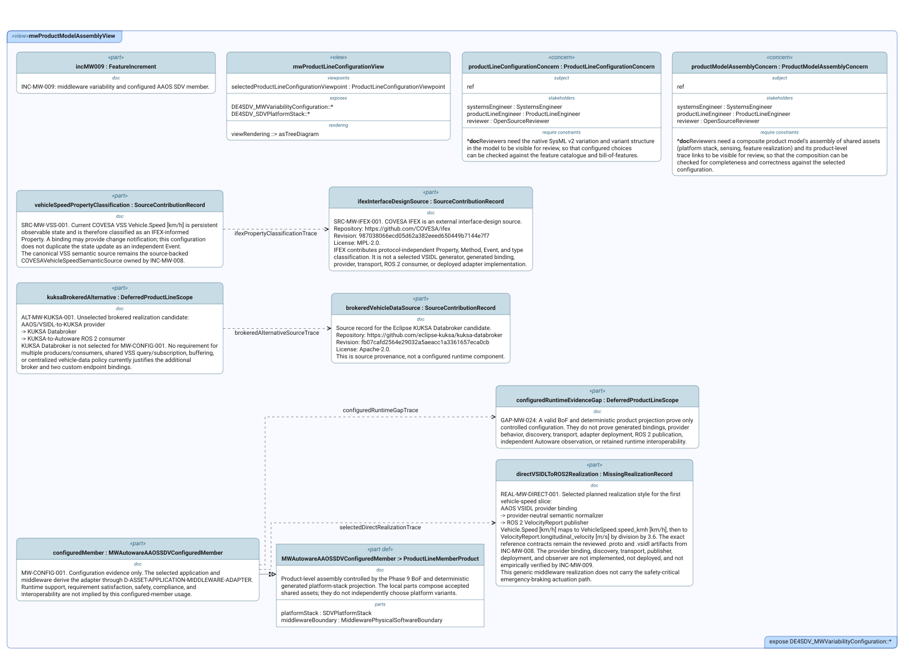

## `mw_verification_evidence.sysml`

### `mw010VerificationAssuranceView`

- **Source:** `mw_verification_evidence.sysml`
- **Viewpoint:** `selectedArgumentationAssuranceViewpoint` (`ArgumentationAssuranceViewpoint`)
- **Concern:** `argumentationAssuranceConcern`
- **Exposes:** `DE4SDV_MW010VerificationEvidence::*`, `DE4SDV_MWVariabilityConfiguration::*`, `DE4SDV_MWPhysicalSoftwareRealization::*`
- **Render:** `asTreeDiagram`

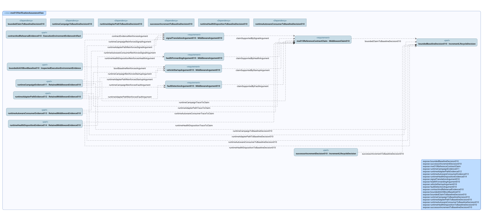
