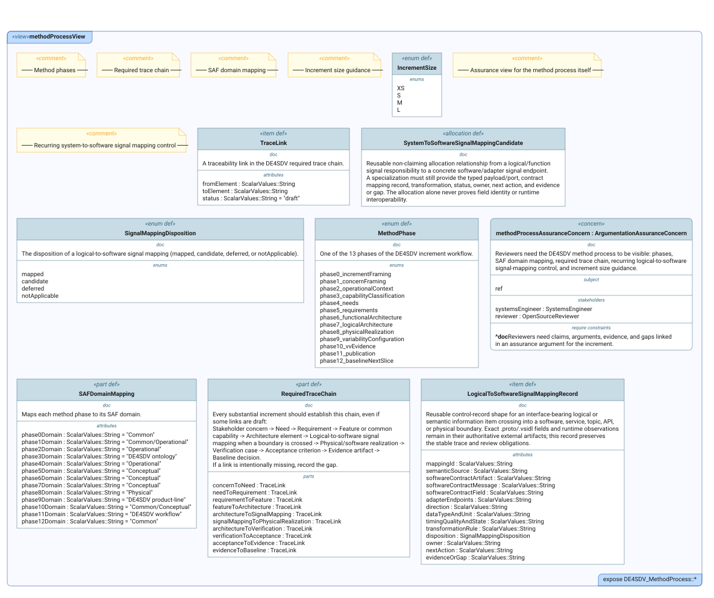

# DE4SDV Method Views

This index lists every SysML v2 `view` declared in the `.sysml` files of
this first-level model area. Each entry explains the reviewer question in
plain language and embeds the committed diagram SysIDE renders from the
view (`syside viz view`, run by the Privileged Syside Validation workflow).
The SVGs live in [`diagrams/`](diagrams/) beside the model files.

Generated by `scripts/generate_view_index.py` — do not edit by hand.

**1 file, 1 view, 1 published diagram.**

## `de4sdv_method_process.sysml`

### `methodProcessView`

Reviewers need the DE4SDV method process to be visible: phases, SAF domain mapping, required trace chain, recurring logical-to-software signal-mapping control, and increment size guidance.

- **Source:** `de4sdv_method_process.sysml`
- **Viewpoint:** `selectedMethodProcessAssuranceViewpoint` (`ArgumentationAssuranceViewpoint`)
- **Concern:** `methodProcessAssuranceConcern`
- **Exposes:** `DE4SDV_MethodProcess::*`
- **Render:** `asTreeDiagram`

- **Diagram status:** Published from the committed SysIDE SVG.
- **Presentation note:** This is a dense review artifact; open the SVG at full size rather than reading it from the page thumbnail.
- **Presentation note:** This render contains 6 anonymous «comment» boxes; the renderer does not attach them to the elements they annotate, so treat each comment as a section note for the declarations that follow it in the source file.

